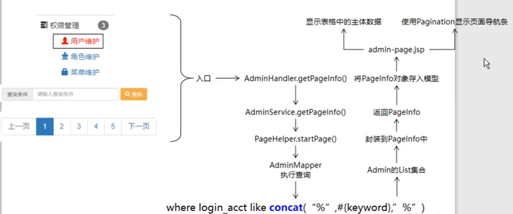
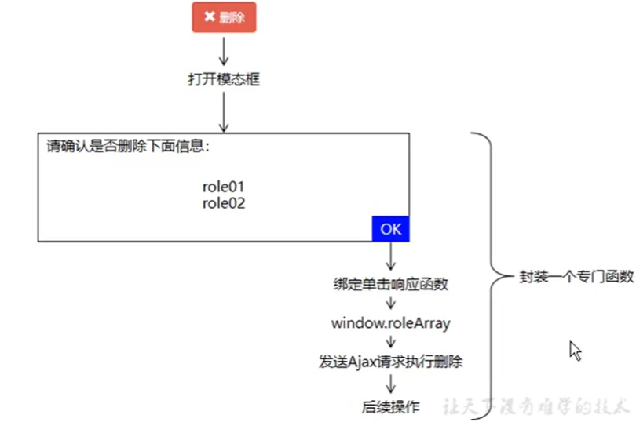
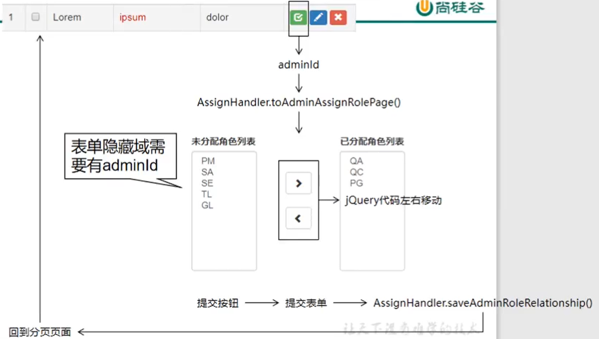
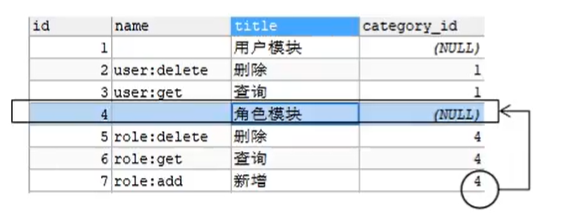

# 众筹项目-后台管理系统

## 创建工程—分模块

父工程  `crowfunding`

web工程（war） `crowfunding01-admin-webui`

component `crowfunding02-admin-component`

entity `crowfunding03-admin-entity`

公共部分：

- `util` `crowfunding04-common-util`

- `reverse` `crowfunding05-common-reverse`

```java
//webui 依赖 component
//component 依赖 util 和 reverse
```

## 创建数据库

### 创建数据库—`t_admin`

```sql
use corwfunding;
create table if not exists t_admin(
	id int not null auto_increment,
    login_acct varchar(255) not null,
    user_pswd char(32) not null,
    user_name varchar(255) not null,
    email varchar(255) not null,
    create_time char(19),
    primary key(id)
);
```

## 逆向工程—reserve

maven命令： `mybatis-generator:generate`

```xml
<dependencies>
    <dependency>
        <groupId>org.mybatis</groupId>
        <artifactId>mybatis</artifactId>
        <version>3.2.8</version>
    </dependency>
</dependencies>
<!--控制maven在构建过程中相关配置-->
<build>
    <!--构建过程中用到的插件-->
    <plugins>
        <!--具体插件，逆向工程的操作是以构建过程中插件形式出现的-->
        <plugin>
            <groupId>org.mybatis.generator</groupId>
            <artifactId>mybatis-generator-maven-plugin</artifactId>
            <version>1.3.2</version>
            <configuration>
                <verbose>true</verbose>
                <overwrite>true</overwrite>
            </configuration>
            <!--插件的依赖-->
            <dependencies>
                <!--逆向工程的核心依赖-->
                <dependency>
                    <groupId>org.mybatis.generator</groupId>
                    <artifactId>mybatis-generator-core</artifactId>
                    <version>1.3.5</version>
                </dependency>
                <!--数据库连接池-->
                <dependency>
                    <groupId>com.mchange</groupId>
                    <artifactId>c3p0</artifactId>
                    <version>0.9.2</version>
                </dependency>
                <dependency>
                    <groupId>mysql</groupId>
                    <artifactId>mysql-connector-java</artifactId>
                    <version>5.1.49</version>
                </dependency>
            </dependencies>
        </plugin>
    </plugins>
</build>
```

```xml
<generatorConfiguration>
    <!--
		targetRuntime="MyBatis3Simple":生成简单版的CRUD
		MyBatis3:豪华版

	 -->
    <context id="DB2Tables" targetRuntime="MyBatis3">
        <!-- jdbcConnection：指定如何连接到目标数据库 -->
        <jdbcConnection driverClass="com.mysql.jdbc.Driver"
                        connectionURL="jdbc:mysql://localhost:3306/crowfunding?allowMultiQueries=true"
                        userId="root"
                        password="root">
        </jdbcConnection>

        <javaTypeResolver >
            <property name="forceBigDecimals" value="false" />
        </javaTypeResolver>
        <!-- javaModelGenerator：指定javaBean的生成策略
            targetPackage="test.model"：目标包名
            targetProject="\MBGTestProject\src"：目标工程
            -->
        <javaModelGenerator targetPackage="com.it.crowd.entity" targetProject=".\src\main\java">
            <property name="enableSubPackages" value="true" />
            <property name="trimStrings" value="true" />
        </javaModelGenerator>

        <!-- sqlMapGenerator：sql映射生成策略： -->
        <sqlMapGenerator targetPackage="com.it.crowd.dao.mapper"  targetProject=".\src\main\java">
            <property name="enableSubPackages" value="true" />
        </sqlMapGenerator>

        <!-- javaClientGenerator:指定mapper接口所在的位置 -->
        <javaClientGenerator type="XMLMAPPER" targetPackage="com.it.crowd.dao"
                             targetProject=".\src\main\java">
            <property name="enableSubPackages" value="true" />
        </javaClientGenerator>

        <!-- 指定要逆向分析哪些表：根据表要创建javaBean -->
        <table tableName="t_admin" domainObjectName="Admin"></table>
    </context>
</generatorConfiguration>
```

### 父工程版本声明和依赖管理

```xml
<!--版本声明-->
<properties>
    <!--声明属性，对Spring的版本进行统一管理-->
    <crow.spring.version>4.3.20.RELEASE</crow.spring.version>
    <!--声明属性，对SpringSecurity的版本进行统一管理-->
    <crow.spring.security.version>4.2.10.RELEASE</crow.spring.security.version>
</properties>
<!--依赖管理-->
<dependencyManagement>
    <dependencies>
        <!--Spring依赖-->
        <dependency>
            <groupId>org.springframework</groupId>
            <artifactId>spring-orm</artifactId>
            <version>${crow.spring.version}</version>
        </dependency>
        <!--spring security依赖-->
        <dependency>
            <groupId>org.springframework</groupId>
            <artifactId>spring-webmvc</artifactId>
            <version>${crow.spring.version}</version>
        </dependency>
        <dependency>
            <groupId>org.springframework</groupId>
            <artifactId>spring-test</artifactId>
            <version>${crow.spring.version}</version>
        </dependency>
        <!--aop依赖包-->
        <dependency>
            <groupId>org.aspectj</groupId>
            <artifactId>aspectjweaver</artifactId>
            <version>1.9.2</version>
        </dependency>
        <dependency>
            <groupId>cglib</groupId>
            <artifactId>cglib</artifactId>
            <version>2.2</version>
        </dependency>
        <!--mysql-->
        <dependency>
            <groupId>mysql</groupId>
            <artifactId>mysql-connector-java</artifactId>
            <version>5.1.43</version>
        </dependency>
        <!--数据源-->
        <dependency>
            <groupId>com.alibaba</groupId>
            <artifactId>druid</artifactId>
            <version>1.0.31</version>
        </dependency>
        <dependency>
            <groupId>org.mybatis</groupId>
            <artifactId>mybatis</artifactId>
            <version>3.2.8</version>
        </dependency>
        <!--mybatis + spring-->
        <dependency>
            <groupId>org.mybatis</groupId>
            <artifactId>mybatis-spring</artifactId>
            <version>1.2.2</version>
        </dependency>
        <!--分页插件-->
        <dependency>
            <groupId>com.github.pagehelper</groupId>
            <artifactId>pagehelper</artifactId>
            <version>4.0.0</version>
        </dependency>
        <!--日志-->
        <dependency>
            <groupId>org.slf4j</groupId>
            <artifactId>slf4j-api</artifactId>
            <version>1.7.7</version>
        </dependency>
        <dependency>
            <groupId>ch.qos.logback</groupId>
            <artifactId>logback-classic</artifactId>
            <version>1.2.3</version>
        </dependency>
        <!--其他日志框架的中间装换包-->
        <dependency>
            <groupId>org.slf4j</groupId>
            <artifactId>jcl-over-slf4j</artifactId>
            <version>1.7.25</version>
        </dependency>
        <dependency>
            <groupId>org.slf4j</groupId>
            <artifactId>jul-to-slf4j</artifactId>
            <version>1.7.25</version>
        </dependency>
        <!--Spring进行JSON数据转换依赖-->
        <dependency>
            <groupId>com.fastxml.jackson.core</groupId>
            <artifactId>jackson-core</artifactId>
            <version>2.9.8</version>
        </dependency>
        <dependency>
            <groupId>com.fastxml.jackson.core</groupId>
            <artifactId>jackson-databind</artifactId>
            <version>2.9.8</version>
        </dependency>
        <!--jstl标签库-->
        <dependency>
            <groupId>jstl</groupId>
            <artifactId>jstl</artifactId>
            <version>1.2</version>
        </dependency>
        <!--junit-->
        <dependency>
            <groupId>junit</groupId>
            <artifactId>junit</artifactId>
            <version>4.12</version>
            <scope>test</scope>
        </dependency>

        <!--引入servlet容器中相关依赖-->
        <dependency>
            <groupId>javax.servlet</groupId>
            <artifactId>servlet-api</artifactId>
            <version>2.5</version>
            <scope>provided</scope>
        </dependency>
        <!--JSP页面使用的依赖-->
        <dependency>
            <groupId>javax.servlet.jsp</groupId>
            <artifactId>jsp-api</artifactId>
            <version>2.1.3-b06</version>
            <scope>provided</scope>
        </dependency>

        <dependency>
            <groupId>com.google.code.gson</groupId>
            <artifactId>gson</artifactId>
            <version>2.8.5</version>
        </dependency>
        <!--Spring Security对web应用进行权限管理-->
        <dependency>
            <groupId>org.springframework.security</groupId>
            <artifactId>spring-security-web</artifactId>
            <version>4.2.10.RELEASE</version>
        </dependency>
        <!--Spring Security 标签库-->
        <dependency>
            <groupId>org.springframework.security</groupId>
            <artifactId>spring-security-taglibs</artifactId>
            <version>4.2.10.RELEASE</version>
        </dependency>
    </dependencies>
</dependencyManagement>
```

## Spring + MyBatis整合

### 思路


### 操作清单
#### 在子工程中加入搭建环境所需要的的具体依赖

选择component工程，具体依赖和component相关

```xml
<!--Spring依赖-->
<dependency>
    <groupId>org.springframework</groupId>
    <artifactId>spring-orm</artifactId>
    <version>${crow.spring.version}</version>
</dependency>
<!--spring security依赖-->
<dependency>
    <groupId>org.springframework</groupId>
    <artifactId>spring-webmvc</artifactId>
    <version>${crow.spring.version}</version>
</dependency>
<!--aop依赖包-->
<dependency>
    <groupId>org.aspectj</groupId>
    <artifactId>aspectjweaver</artifactId>
    <version>1.9.2</version>
</dependency>
<dependency>
    <groupId>cglib</groupId>
    <artifactId>cglib</artifactId>
    <version>2.2</version>
</dependency>
<!--mysql-->
<dependency>
    <groupId>mysql</groupId>
    <artifactId>mysql-connector-java</artifactId>
    <version>5.1.43</version>
</dependency>
<!--数据源-->
<dependency>
    <groupId>com.alibaba</groupId>
    <artifactId>druid</artifactId>
    <version>1.0.31</version>
</dependency>
<dependency>
    <groupId>org.mybatis</groupId>
    <artifactId>mybatis</artifactId>
    <version>3.2.8</version>
</dependency>
<!--mybatis + spring-->
<dependency>
    <groupId>org.mybatis</groupId>
    <artifactId>mybatis-spring</artifactId>
    <version>1.2.2</version>
</dependency>
<!--分页插件-->
<dependency>
    <groupId>com.github.pagehelper</groupId>
    <artifactId>pagehelper</artifactId>
    <version>4.0.0</version>
</dependency>
<!--Spring进行JSON数据转换依赖-->
<dependency>
    <groupId>com.fastxml.jackson.core</groupId>
    <artifactId>jackson-core</artifactId>
    <version>2.9.8</version>
</dependency>
<dependency>
    <groupId>com.fastxml.jackson.core</groupId>
    <artifactId>jackson-databind</artifactId>
    <version>2.9.8</version>
</dependency>
<!--jstl标签库-->
<dependency>
    <groupId>jstl</groupId>
    <artifactId>jstl</artifactId>
    <version>1.2</version>
</dependency>
<dependency>
    <groupId>com.google.code.gson</groupId>
    <artifactId>gson</artifactId>
    <version>2.8.5</version>
</dependency>
```

#### 准备jdbc.properties

```properties
jdbc.user=root
jdbc.password=root
jdbc.url=jdbc:mysql://localhost:3306/crowfunding?useUnicode=true&characterEncoding=UTF-8
jdbc.driver=com.mysql.jdbc.Driver
```

#### 创建Spring配置文件专门配置Spring和MyBatis整合相关

```xml
<beans xmlns="http://www.springframework.org/schema/beans"
       xmlns:xsi="http://www.w3.org/2001/XMLSchema-instance"
       xmlns:context="http://www.springframework.org/schema/context"
       xmlns:mybatis-spring="http://mybatis.org/schema/mybatis-spring"
       xmlns:tx="http://www.springframework.org/schema/tx"
       xsi:schemaLocation="http://www.springframework.org/schema/beans http://www.springframework.org/schema/beans/spring-beans.xsd
		http://mybatis.org/schema/mybatis-spring http://mybatis.org/schema/mybatis-spring-1.2.xsd
		http://www.springframework.org/schema/tx http://www.springframework.org/schema/tx/spring-tx-4.0.xsd
		http://www.springframework.org/schema/context http://www.springframework.org/schema/context/spring-context-4.0.xsd">
</beans>
```

#### 在Spring的配置文件中加载jdbc.properties属性文件

```xml
<!--加载外部属性文件-->
<context:property-placeholder location="classpath:jdbc.properties"/>
```

#### 配置数据源

```xml
<!--配置数据源-->
<bean id="dataSource" class="com.alibaba.druid.pool.DruidDataSource">
    <property name="username" value="${jdbc.user}"></property>
    <property name="password" value="${jdbc.password}"></property>
    <property name="url" value="${jdbc.url}"></property>
    <property name="driverClassName" value="${jdbc.driver}"></property>
</bean>
```

#### 测试从数据源中获取数据库连接

```java
@Test
public void testDataSource() throws SQLException
{
    Connection connection = dataSource.getConnection();
    System.out.println(connection);
}
```

#### 配置SqlSessionFactoryBean

​	装配数据源

​	指定XxxMapper.xml配置文件的位置

​	指定MyBatis全局配置文件的位置（可选）

```xml
<!--配置sqlSessionFactoryBean整合mybatis-->
<bean id="sqlSessionFactoryBean" class="org.mybatis.spring.SqlSessionFactoryBean">
    <!--指定mybatis全局配置文件位置-->
    <property name="configLocation" value="classpath:mybatis/mybatis-config.xml"/>

    <!--指定mapper.xml配置文件的位置-->
    <property name="mapperLocations" value="classpath:mybatis/mapper/*.xml"/>

    <!--装配数据源-->
    <property name="dataSource" ref="dataSource"/>
</bean>
```

#### 配置MapperScannerConfigurer

```xml
<!--配置mapperScannerConfigurer来扫描mapper接口所在的包-->
<bean id="mapperScannerConfigurer" class="org.mybatis.spring.mapper.MapperScannerConfigurer">
    <property name="basePackage" value="com.it.crowd.dao"/>
</bean>
```

#### 测试是否可以装配XxxMapper接口并通过这个接口操作数据库

```java
@Test
public void testMapper()
{
    Admin admin = new Admin(null, "tom", "123123", "汤姆", "tom@qq.com", null);
    int insert = adminMapper.insert(admin);
    System.out.println(insert);
}
```

## 日志系统

Spring日志默认使用的是common-logging，转化为slf4j

```xml
<!--日志-->
<dependency>
    <groupId>org.slf4j</groupId>
    <artifactId>slf4j-api</artifactId>
    <version>1.7.7</version>
</dependency>
<dependency>
    <groupId>ch.qos.logback</groupId>
    <artifactId>logback-classic</artifactId>
    <version>1.2.3</version>
</dependency>
```

#### 更换日志框架

```xml
<dependency>
    <groupId>org.springframework</groupId>
    <artifactId>spring-orm</artifactId>
    <version>${crow.spring.version}</version>
    <exclusions>
        <exclusion>
            <artifactId>commons-logging</artifactId>
            <groupId>commons-logging</groupId>
        </exclusion>
    </exclusions>
</dependency>
<dependency>
    <groupId>org.slf4j</groupId>
    <artifactId>slf4j-api</artifactId>
    <version>1.7.7</version>
</dependency>
<dependency>
    <groupId>org.slf4j</groupId>
    <artifactId>jcl-over-slf4j</artifactId>
    <version>1.7.25</version>
</dependency>
```

#### 自定义日志格式logback

测试的时候全局是info，局部是debug

```xml
<?xml version="1.0" encoding="UTF-8"?>
<configuration debug="true">
    <!--指定日志输出位置-->
    <appender name="STDOUT" class="ch.qos.logback.core.ConsoleAppender">
        <encoder>
            <!--日志输入格式-->
            <!--按照顺序分别是：时间、日志级别、线程名称、打印日志的类、日志主体内容、换行-->
            <pattern>[%d{HH:mm:ss.SSS}] [%-5level] [%thread] [%logger] [%msg]%n</pattern>
        </encoder>
    </appender>

    <!--设置全局日志级别、日志级别按顺序是：DEBUG INFO WARN ERROR-->
    <!--指定任何一个日志级别都只打印当前级别和后面级别的日志-->
    <root level="INFO">
        <!--指定打印日志的appender，这里通过“STDOUT”引用了前面的appender-->
        <appender-ref ref="STDOUT"/>
    </root>

    <!--根据需求指定局部日志级别-->
    <logger name="com.it.crowd.dao" level="DEBUG"/>
</configuration>
```

## 声明式事务（业务逻辑层）

### 目标

在框架环境下通过一系列的配置由Spring来管理通用的事务操作，然后让我们写的代码可以享受框架提供的服务。

```java
try{
    //开启事务（关闭自动提交）
    connection.setAutoCommit(false);
    //核心操作
    adminService.saveAdmin(admin);
    //提交事务
    connection.commit();
}catch(Exception e){
    //回滚
    connection.rollBack();
}finally{
    //释放数据库连接
    connection.close();
}
```

### 思路

1、@Transactional注解

2、基于xml


### 操作

#### 配置事务管理器

```xml
<!--配置事务管理器-->
<bean id="txManager" class="org.springframework.jdbc.datasource.DataSourceTransactionManager">
    <!--装配数据源-->
    <property name="dataSource" ref="dataSource"/>
</bean>
```

#### 配置AOP

```xml
<!--配置事务切面-->
<aop:config>
    <!--考虑到后面整合SpringSecurity，避免把UserDetailService加入事务控制，让切入点表达式定位到ServiceImpl-->
    <aop:pointcut id="txPointcut" expression="execution(* *..*ServiceImpl.*(..))"/>

    <!--将切入点表达式和事务通知关联起来-->
    <aop:advisor advice-ref="txAdvice" pointcut-ref="txPointcut"/>
</aop:config>
<!--
格式：execution(modifiers-pattern? ret-type-pattern declaring-type-pattern? name-pattern(param-pattern)throws-pattern?) 
其中后面跟着“?”的是可选项
括号中各个pattern分别表示：
	修饰符匹配（modifier-pattern?）
	返回值匹配（ret-type-pattern）：   可以为*表示任何返回值, 全路径的类名等
	类路径匹配（declaring-type-pattern?）
	方法名匹配（name-pattern）：可以指定方法名 或者 *代表所有, set* 代表以set开头的所有方法
	参数匹配（(param-pattern)）：可以指定具体的参数类型，多个参数间用“,”隔开，各个参数也可以用"*" 来表示匹配任意类型的参数，".."表示零个或多个任意参数。
如(String)表示匹配一个String参数的方法；(*,String) 表示匹配有两个参数的方法，第一个参数可以是任意类型，而第二个参数是String类型。
	异常类型匹配（throws-pattern?）-->
```

```java
/*例如：
- 任意公共方法的执行：execution(public * *(..))
- 任何一个以“set”开始的方法的执行：execution(* set*(..))
- AccountService 接口的任意方法的执行：execution(* com.xyz.service.AccountService.*(..))
- 定义在service包里的任意方法的执行： execution(* com.xyz.service.*.*(..))
- 定义在service包和所有子包里的任意类的任意方法的执行：execution(* com.xyz.service..*.*(..))
第一个*表示匹配任意的方法返回值， ..(两个点)表示零个或多个，第一个..表示service包及其子包,第二个*表示所有类, 第三个*表示所有方法，第二个..表示方法的任意参数个数
- 定义在pointcutexp包和所有子包里的JoinPointObjP2类的任意方法的执行：
execution(* com.test.spring.aop.pointcutexp..JoinPointObjP2.*(..))")
- pointcutexp包里的任意类： within(com.test.spring.aop.pointcutexp.*)
- pointcutexp包和所有子包里的任意类：within(com.test.spring.aop.pointcutexp..*)
- 实现了Intf接口的所有类,如果Intf不是接口,限定Intf单个类：				     
		this(com.test.spring.aop.pointcutexp.Intf)
当一个实现了接口的类被AOP的时候,用getBean方法必须cast为接口类型,不能为该类的类型
- 带有@Transactional标注的所有类的任意方法： 
  - @within(org.springframework.transaction.annotation.Transactional)
  - @target(org.springframework.transaction.annotation.Transactional)
- 带有@Transactional标注的任意方法：		
  - @annotation(org.springframework.transaction.annotation.Transactional)
  - @within和@target针对类的注解,@annotation是针对方法的注解
- 参数带有@Transactional标注的方法：
  				@args(org.springframework.transaction.annotation.Transactional)
- 参数为String类型(运行是决定)的方法： args(String)
*/
```

#### 配置事务属性

```xml
<!--配置事务通知-->
<tx:advice id="txAdvice" transaction-manager="txManager">
    <!--配置事务的属性-->
    <tx:attributes>
        <!--查询方法：配置只读属性，让数据库知道这是一个查询操作，能够进行一定的优化-->
        <tx:method name="get*" read-only="true"/>
        <tx:method name="find*" read-only="true"/>
        <tx:method name="query*" read-only="true"/>
        <tx:method name="count*" read-only="true"/>

        <!--增删改方法：配置事务的传播行为和回滚异常-->
        <!--propagation默认值：REQUIRED表示当前方法必须工作在事务中，如果当前线程上没有已经开启的事务，则自己开新事物。如果已经有了，那我们就不用
                顾虑：用别人的事务有可能被回滚
                REQUIRES_NEW:建议使用，表示不管当前线程上有没有事务都要自己开事务，在自己的事务中运行-->
        <!--rollback-for:配置事务方法针对什么样的异常回滚  默认是运行时异常回滚  建议：编译时异常和运行时异常都回滚-->
        <tx:method name="save*" propagation="REQUIRES_NEW" rollback-for="java.lang.Exception"/>
        <tx:method name="update*" propagation="REQUIRES_NEW" rollback-for="java.lang.Exception"/>
        <tx:method name="remove*" propagation="REQUIRES_NEW" rollback-for="java.lang.Exception"/>
        <tx:method name="batch*" propagation="REQUIRES_NEW" rollback-for="java.lang.Exception"/>
    </tx:attributes>
</tx:advice>
```

#### 测试

```java
public interface AdminService {
    void saveAdmin(Admin admin);
}
```

```java
@Service
public class AdminServiceImpl implements AdminService {

    @Autowired
    private AdminMapper adminMapper;

    public void saveAdmin(Admin admin) {
        adminMapper.insert(admin);
    }
}
```

```java
@ContextConfiguration(locations = {"classpath:spring-persist-mybatis.xml","classpath:spring-persisit-tx.xml"})
@Test
public void testTx(){
    Admin admin = new Admin(null, "jerry", "123456", "杰瑞", "jerry@qq.com", null);
    adminService.saveAdmin(admin);
}
```

#### 注意

在基于xml的声明式事务中，事务属性的tx:method是必须配置的，如果某个方法没有配置对应的tx:method，那么事务对这个方法就不生效！

## 表述层配置

### 目标

目标一：handler（controller）装配service

目标二：页面能够访问到handler

### web.xml和spring配置文件的关系（思路）


#### web.xml配置

##### 配置ContextLoaderListener

```xml
<context-param>
  <param-name>contextConfigLocation</param-name>
  <param-value>classpath:spring-persisit-*.xml</param-value>
</context-param>
<listener>
  <listener-class>org.springframework.web.context.ContextLoaderListener</listener-class>
</listener>
```

##### 配置CharacterEncodingFilter

```xml
<filter>
  <filter-name>characterEncodingFilter</filter-name>
  <filter-class>org.springframework.web.filter.CharacterEncodingFilter</filter-class>
  <!--指定字符集-->
  <init-param>
    <param-name>encoding</param-name>
    <param-value>UTF-8</param-value>
  </init-param>
  <!--强制请求设置字符集-->
  <init-param>
    <param-name>forceRequestEncoding</param-name>
    <param-value>true</param-value>
  </init-param>
  <!--强制响应设置字符集-->
  <init-param>
    <param-name>forceResponseEncoding</param-name>
    <param-value>true</param-value>
  </init-param>
</filter>
<!--这个Filter执行的顺序要在其他Filter前面-->
<!--原因如下：-->
<!--request.setCharacterEncoding(encoding)必须在request.getParameter()前面-->
<!--response.setCharacterEncoding(encoding)必须在response.getParameter()前面-->
<filter-mapping>
  <filter-name>characterEncodingFilter</filter-name>
  <url-pattern>/*</url-pattern>
</filter-mapping>
```

##### 配置DispatcherServlet

```xml
<servlet>
  <servlet-name>dispatcherServlet</servlet-name>
  <servlet-class>org.springframework.web.servlet.DispatcherServlet</servlet-class>
  <init-param>
    <param-name>contextConfigLocation</param-name>
    <param-value>classpath:spring-web-mvc.xml</param-value>
  </init-param>
  <!--servlet默认生命周期中创建对象是在第一次接收到请求时-->
  <!--而DispatcherServlet创建对象后有大量的框架初始化的工作，不适合在第一次请求时来做-->
  <!--设置load-on-startup，就是为了让DispatcherServlet在web应用启动时创建对象、初始化-->
  <load-on-startup>1</load-on-startup>
</servlet>
<servlet-mapping>
  <servlet-name>dispatcherServlet</servlet-name>
  <!--配置方式2：配置请求扩展名-->
  <!--优点1：静态资源完全不经过SpringMVC，不需要特殊处理-->
  <!--优点2：可以实现伪静态效果。表面上看起来是访问一个HTML文件这样的静态资源，但是实际上是JAVA代码运算后的结果-->
  <!--伪静态作用：1、给黑客入侵增加难度  2、有利于SEO的优化（让百度、谷歌这样的搜索引擎更容易找到我们的项目）-->
  <!--缺点：不符合RESTFul风格-->
  <url-pattern>*.html</url-pattern>
  <!--配置方式1：表示拦截所有请求-->
  <!--<url-pattern>/</url-pattern>-->
</servlet-mapping>
```

错误400：参数错误或数据校验错误


```xml
<!--解决406错误：-->
<servlet-mapping>
    <servlet-name>dispatcherServlet</servlet-name>
    <url-pattern>*.html</url-pattern>
    <url-pattern>*.json</url-pattern>
    <!--为什么加*.json：如果一个Ajax请求扩展名是html，但是实际服务器给浏览器返回的是json数据，二者就不匹配会出现406错误
      为了让Ajax请求能够顺利拿到JSON格式的响应数据，我们另外配置json扩展名-->
</servlet-mapping>
```

#### SpringMVC的配置

```XML
<?xml version="1.0" encoding="UTF-8"?>
<beans xmlns="http://www.springframework.org/schema/beans"
       xmlns:xsi="http://www.w3.org/2001/XMLSchema-instance"
       xmlns:mvc="http://www.springframework.org/schema/mvc"
       xmlns:context="http://www.springframework.org/schema/context"
       xsi:schemaLocation="http://www.springframework.org/schema/beans http://www.springframework.org/schema/beans/spring-beans.xsd
      http://www.springframework.org/schema/mvc  http://www.springframework.org/schema/context/spring-mvc-4.0.xsd
        http://www.springframework.org/schema/context  http://www.springframework.org/schema/context/spring-context-4.0.xsd">
    <!--配置自动扫描包:扫描handler(controller)-->
    <context:component-scan base-package="com.it.crowd.mvc"/>
    
    <!--配置mvc的注解驱动-->
    <mvc:annotation-driven/>
    
    <!--配置视图解析器-->
    <bean id="viewResolver" class="org.springframework.web.servlet.view.InternalResourceViewResolver">
        <property name="prefix" value="/WEB-INF/"/>
        <property name="suffix" value="jsp"/>
    </bean>
</beans>
```

### SSM整合测试

#### 在webui加入依赖

```xml
<!--引入servlet容器中相关依赖-->
<dependency>
    <groupId>javax.servlet</groupId>
    <artifactId>servlet-api</artifactId>
    <version>2.5</version>
    <scope>provided</scope>
</dependency>
<!--JSP页面使用的依赖-->
<dependency>
    <groupId>javax.servlet.jsp</groupId>
    <artifactId>jsp-api</artifactId>
    <version>2.1.3-b06</version>
    <scope>provided</scope>
</dependency>
```

#### 创建index.jsp

```jsp
<a href="${pageContext.request.contextPath}/test/ssm.html">SSM整合环境测试</a>
```

#### 创建Controller

```java
@Controller
public class TestController {

    @Autowired
    private AdminService service;

    @RequestMapping("/test/ssm.html")
    public String testSSM(Model model){
        List<Admin> list = service.getAll();
        model.addAttribute("list",list);
        return "success";
    }
}
```

#### 编写success页面

```jsp
<html>
<head>
    <title>Success</title>
</head>
<body>
    <h1>Success</h1>
    ${requestScope.list}

</body>
</html>
```

#### 查错

```java
//1、一直报错无法注入mapper，解决是因为spring-persist-tx(mybatis).xml自己手误打错了
//2、源服务器未能找到目标资源的表示或者是不愿公开一个已经存在的资源表示：自己的web.xml和视频上的头文件不对，所以造成报错，修改之后将两个<url-pattern></url-pattern>放在同一个servlet-mapping中解决，完成SSM测试
```

```xml
<?xml version="1.0" encoding="UTF-8"?>
<web-app xmlns:xsi="http://www.w3.org/2001/XMLSchema-instance"
         xmlns="http://java.sun.com/xml/ns/javaee"
         xsi:schemaLocation="http://java.sun.com/xml/ns/javaee http://java.sun.com/xml/ns/javaee/web-app_2_5.xsd"
         version="2.5">
    <servlet-mapping>
        <servlet-name>dispatcherServlet</servlet-name>
        <url-pattern>*.html</url-pattern>
        <url-pattern>*.json</url-pattern>
    </servlet-mapping> 
```

#### 引入base标签

```jsp
<%@ page language="java" contentType="text/html; charset=UTF-8"
         pageEncoding="UTF-8"%>
<html>
<head>
    <meta charset="UTF-8">
    <base href="http://${pageContext.request.serverName}:${pageContext.request.serverPort}crowfunding01_admin_webui_war/"/>
</head>
<body>
    <a href="test/ssm.html">SSM整合环境测试</a>
</body>
</html>
```

注意：

- 端口号前面的冒号不能省略

- contextPath前面不能写 /

- contextPath后面必须写 /

- 页面上所有参照base标签的标签都必须放在base标签后面

- 页面上所有参照base标签的标签的路径都不能以 / 开头

## SpringMVC环境下的Ajax请求


### 常用注解


@RequestBody和@ResponseBody要想正常工作必须有jackson的支持，请确认当前环境引入了如下依赖：

```xml
<dependency>
    <groupId>com.fasterxml.jackson.core</groupId>
    <artifactId>jackson-core</artifactId>
    <version>2.9.8</version>
</dependency>
<dependency>
    <groupId>com.fasterxml.jackson.core</groupId>
    <artifactId>jackson-databind</artifactId>
    <version>2.9.8</version>
</dependency>
```

同时必须配置了mvc:annotation-driven

### @RequestBody的使用

引入JQuery

```jsp
<script type="text/javascript" src="jquery/jquery-2.1.1.min.js"></script>
```

#### 发送数组到服务器方案一：

```jsp
<script type="text/javascript">
    $(function () {
        $("#bth1").click(function () {
            $.ajax({
                "url": "send/array.html",   // 请求目标资源的地址
                "type": "post",             // 请求方式
                "data":  {
                    "array": [5,8,12]
                },                          // 要发送的请求参数
                "dataType": "text",         // 如何对待服务器端返回的数据
                "success": function (response) { // 服务器端成功请求后调用的回调函数，response是响应体
                    alert(response);
                },
                "error": function (response) {   // 服务器端请求失败后调用的回调函数
                    alert(response);
                }
            });
        });
    });
</script>
<button id="bth1">Test RequestBody Send [5,8,12] One</button>
```

```java
@ResponseBody
@RequestMapping("/send/array.html")
public String testReceiveArrayOne(@RequestParam("array[]") List<Integer> array)
{
    array.forEach(System.out::println);
    return "success";
}
```

缺陷：controller方法中接收数据时需要在请求参数名字后面多写一组 []

#### 发送数组到服务器方案二：

```js
$(function () {
        $("#bth2").click(function () {
            $.ajax({
                "url": "send/array/two.html",   // 请求目标资源的地址
                "type": "post",             // 请求方式
                "data":  {
                    "array[0]": 5,
                    "array[1]": 8,
                    "array[2]": 12
                },                          // 要发送的请求参数
                "dataType": "text",         // 如何对待服务器端返回的数据
                "success": function (response) { // 服务器端成功请求后调用的回调函数，response是响应体
                    alert(response);
                },
                "error": function (response) {   // 服务器端请求失败后调用的回调函数
                    alert(response);
                }
            });
        });
    });
```

```java
@ResponseBody
@RequestMapping("/send/array/two.html")
public String testReceiveArrayTwo(ParamData paramData) {
    List<Integer> array = paramData.getArray();
    array.forEach(System.out::println);
    return "success";
}
```

```java
@Data
public class ParamData {

    private List<Integer> array;
}
```

```jsp
<button id="bth2">Test RequestBody Send [5,8,12] One</button>
```

浏览器开发者模式看到的：


#### 发送数据到服务器最终方案：

```js
$(function () {
    $("#bth3").click(function () {
        // 准备好要发送到服务器的数组
        var array = [5,8,12];
        console.log(array.length);
        // 将JSON数据转换为JSON字符串
        var requestBody = JSON.stringify(array);
        // "['5','8','12']"
        console.log(requestBody.length);
        $.ajax({
            "url": "send/array/three.html",   // 请求目标资源的地址
            "type": "post",             // 请求方式
            "data":  requestBody,       // 要发送的请求体
            "contentType": "application/json;charset=UTF-8",//请求体的内容类型，告诉服务端本次请求的请求体是JSON数据
            "dataType": "text",         // 如何对待服务器端返回的数据
            "success": function (response) { // 服务器端成功请求后调用的回调函数，response是响应体
                alert(response);
            },
            "error": function (response) {   // 服务器端请求失败后调用的回调函数
                alert(response);
            }
        });
    });
});
```

```java
@ResponseBody
@RequestMapping("/send/array/three.html")
public String testReceiveArrayThree(@RequestBody List<Integer> array) {
    Logger logger = LoggerFactory.getLogger(TestController.class);
    for (Integer number: array)
        logger.info("number = " + number);
    return "success";
}
```

浏览器开发者模式看到的：


#### 发送复杂对象的方法：

```js
$("#bth4").click(function () {
    // 准备好要发送到服务器的数组
    var student = {
        "stuId": 5,
        "stuName": "tom",
        "address": {
            "province":"广东",
            "city":"深圳",
            "street":"后瑞"
        },
        "subjectList": [
            {
                "subjectName": "JavaSE",
                "subjectScore": 100
            }, {
                "subjectName": "SSM",
                "subjectScore": 99
            }
        ],
        "map": {
            "k1": "v1",
            "k2": "v2"
        }
    };
    // 将JSON数据转换为JSON字符串
    var requestBody = JSON.stringify(student);
    $.ajax({
        "url": "send/complex/object.html",   // 请求目标资源的地址
        "type": "post",             // 请求方式
        "data":  requestBody,       // 要发送的请求体
        "contentType": "application/json;charset=UTF-8",//请求体的内容类型，告诉服务端本次请求的请求体是JSON数据
        "dataType": "text",         // 如何对待服务器端返回的数据
        "success": function (response) { // 服务器端成功请求后调用的回调函数，response是响应体
            alert(response);
        },
        "error": function (response) {   // 服务器端请求失败后调用的回调函数
            alert(response);
        }
    });
});
```

```java
@ResponseBody
@RequestMapping("/send/complex/object.html")
public String testReceiveComplexObject(@RequestBody Student student) {
    logger.info(student.toString());
    return "success";
}
```

浏览器开发者模式看到的：


###  对Ajax请求的返回进行规范

```java
/**
 * @author wyj
 * @description 统一整个项目Ajax请求放回的结果（未来也可以用于分布式架构各个模块间调用时统一返回的类型）
 * @create 2020-12-07
 */
@Data
@AllArgsConstructor
@NoArgsConstructor
public class ResultEntity<T> {
    public static final String SUCCESS = "SUCCESS";
    public static final String FAILED = "FAILED";
    // 封装当前请求处理的结果是失败还是成功
    private String result;
    // 请求处理失败时返回的错误消息
    private String message;
    // 返回的数据
    private T data;
    /**
     * 请求处理成功且不需要返回数据时使用的工具方法
     * @param <Type>
     * @return
     */
    public static <Type> ResultEntity<Type> successWithoutData(){
        return new ResultEntity<Type>(SUCCESS,null,null);
    }
    /**
     * 请求处理成功且需要返回数据时使用的工具方法
     * @param data
     * @param <Type>
     * @return
     */
    public static <Type> ResultEntity<Type> successWithData(Type data){
        return new ResultEntity<Type>(SUCCESS,null,data);
    }
    /**
     * 请求处理失败后使用的工具方法
     * @param message
     * @param <Type>
     * @return
     */
    public static <Type> ResultEntity<Type> fail(String message){
        return new ResultEntity<Type>(FAILED,message,null);
    }
}
```

```js
$("#bth4").click(function () {
    // 准备好要发送到服务器的数组
    var student = {
        "stuId": 5,
        "stuName": "tom",
        "address": {
            "province":"广东",
            "city":"深圳",
            "street":"后瑞"
        },
        "subjectList": [
            {
                "subjectName": "JavaSE",
                "subjectScore": 100
            }, {
                "subjectName": "SSM",
                "subjectScore": 99
            }
        ],
        "map": {
            "k1": "v1",
            "k2": "v2"
        }
    };
    // 将JSON数据转换为JSON字符串
    var requestBody = JSON.stringify(student);
    $.ajax({
        "url": "send/complex/object.json",   // 请求目标资源的地址
        "type": "post",             // 请求方式
        "data":  requestBody,       // 要发送的请求体
        "contentType": "application/json;charset=UTF-8",//请求体的内容类型，告诉服务端本次请求的请求体是JSON数据
        "dataType": "json",         // 如何对待服务器端返回的数据
        "success": function (response) { // 服务器端成功请求后调用的回调函数，response是响应体
            console.log(response);
        },
        "error": function (response) {   // 服务器端请求失败后调用的回调函数
            console.log(response);
        }
    });
});
```

```java
@ResponseBody
@RequestMapping("/send/complex/object.json")
public ResultEntity<Student> testReceiveComplexObject(@RequestBody Student student) {
    logger.info(student.toString());
    return ResultEntity.successWithData(student);
}
```

## 异常映射

### 目标

使用异常映射机制将整个项目的异常和错误进行统一管理

### 思路


注意：SpringMVC提供了基于XML和基于注解两种异常映射机制

```xml
<!--
@RequestMapping("/xxx/xxx.html")
public String xxx(){
    return "success";
}
-->
<mvc:view-controller path="/xxx/xxx.html" view-name="success"/>
```


### 实现

#### 基于XML（在SpringMVC的配置文件中配置）

```xml
<!--基于xml的异常映射-->
<bean id="simpleMappingExceptionResolver" class="org.springframework.web.servlet.handler.SimpleMappingExceptionResolver">
    <!--配置异常类型和具体视图页面的对应关系-->
    <property name="exceptionMappings">
        <props>
            <!--key:指定异常全类名-->
            <!--标签体中写对应的视图（这个值要拼前后缀得到具体路径）-->
            <prop key="java.lang.Exception">system-error</prop>
        </props>
    </property>
</bean>
```

#### 基于注解

##### 判断请求类型的工具方法

###### 加入依赖

```xml
<!--引入servlet容器中相关依赖-->
<dependency>
    <groupId>javax.servlet</groupId>
    <artifactId>servlet-api</artifactId>
    <scope>provided</scope>
</dependency>
```

###### 请求类型的判断依据


###### 实现

```java
public class CrowdUtil {

    /**
     * 判断当前请求是否是Ajax请求
     * @param request
     * @return true 是  false  否
     */
    public static boolean judgeRequestType(HttpServletRequest request){
        // 获取请求消息头
        String acceptHeader = request.getHeader("Accept");
        String xRequestHeader = request.getHeader("X-Requested-With");

        return (acceptHeader != null && acceptHeader.contains("application/json"))
                || (xRequestHeader != null && xRequestHeader.contains("XMLHttpRequest"));
    }
}
```

#### 基于注解的实现

```java
@ControllerAdvice // 表示当前类是一个基于注解的异常处理器类
public class CrowdExceptionResolver {

    /**
     * 控制值处理异常类
     * @param exception
     * @return
     *
     * @ExceptionHandler 将一个具体的异常类型和一个方法关联起来
     */
    @ExceptionHandler(value = NullPointerException.class)
    public ModelAndView resolveNullPointerException(NullPointerException exception,
                                                    HttpServletRequest request,
                                                    HttpServletResponse response) throws IOException {
        String viewName = "system-error";
        return commonResolver(viewName,exception,request,response);
    }

    /**
     * 通用的异常
     * @param viewName  异常处理完成后要去的地方
     * @param exception 实际捕获到的异常类型
     * @param request   当前请求对象
     * @param response  当前响应对象
     * @return
     * @throws IOException
     */
    private ModelAndView commonResolver(String viewName,
                                        Exception exception,
                                        HttpServletRequest request,
                                        HttpServletResponse response) throws IOException {
        //0判断当前请求类型
        boolean judgeRequestType = CrowdUtil.judgeRequestType(request);

        //1 如果是Ajax请求
        if (judgeRequestType) {
            //2 创建ResultEntity对象
            ResultEntity<Object> resultEntity = ResultEntity.fail(exception.getMessage());
            //3 创建GSON
            Gson gson = new Gson();
            //4 将ResultEntity对象转换为JSON字符串
            String json = gson.toJson(resultEntity);
            //5 将json字符串作为响应体返回给浏览器
            response.getWriter().write(json);
            //6 由于上面已经通过原生的response对象返回了响应，所以不提供ModelAndView对象
            return null;
        }
        //7 如果不是Ajax请求则创建ModelAndView对象
        ModelAndView modelAndView = new ModelAndView();

        //8 将exception对象存入模型
        modelAndView.addObject("exception",exception);
        // 9 设置对应的视图名称
        modelAndView.setViewName(viewName);
        // 10 返回ModelAndView对象
        return modelAndView;
    }
}
```

### 通用异常处理页面

```jsp
<%@ page contentType="text/html;charset=UTF-8" language="java" %>
<!DOCTYPE html>
<html lang="zh-CN">
<head>
    <meta charset="UTF-8">
    <meta http-equiv="X-UA-Compatible" content="IE=edge">
    <meta name="viewport" content="width=device-width, initial-scale=1">
    <meta name="description" content="">
    <meta name="keys" content="">
    <meta name="author" content="">
    <base href="http://${pageContext.request.serverName}:${pageContext.request.serverPort}${pageContext.request.contextPath}/">
    <link rel="stylesheet" href="bootstrap/css/bootstrap.min.css">
    <link rel="stylesheet" href="css/font-awesome.min.css">
    <link rel="stylesheet" href="css/login.css">
    <script type="text/javascript" src="jquery/jquery-2.1.1.min.js"></script>
    <script type="text/javascript" src="bootstrap/js/bootstrap.min.js"></script>
    <script type="text/javascript">
        $(function () {
            $("button").click(function () {
                //相当于浏览器的后退按钮
                window.history.back();
            });
        });
    </script>
    <style>

    </style>
</head>
<body>
<nav class="navbar navbar-inverse navbar-fixed-top" role="navigation">
    <div class="container">
        <div class="navbar-header">
            <div><a class="navbar-brand" href="index.html" style="font-size:32px;">尚筹网-创意产品众筹平台</a></div>
        </div>
    </div>
</nav>

<div class="container">
    <h2 class="form-signin-heading" style="text-align: center;">
        <i class="glyphicon glyphicon-log-in"></i> 尚筹网系统消息
    </h2>
    <h3 style="text-align: center;">
        <!--
        requestScope：对应存放request域数据的map
        requestScope.exception:相当于request.getAttribute("exception")
        requestScope.exception.message:相当于exception.getMessage()
        -->
        ${requestScope.exception.message}
    </h3>
    <button style="width: 150px;margin: 50px auto 0px auto;" class="btn btn-lg btn-success btn-block">点我返回上一步</button>
</div>

</body>
</html>
```

## 声明一个管理常量的类

```java
public class CrowdConstant {

    public static final String MESSAGE_LOGIN_FAILED = "抱歉！账号密码错误！请重新输入";

    public static final String MESSAGE_LOGIN_ACCT_ALREADY_IN_USE = "抱歉！这个账号已经被使用了！";

    public static final String MESSAGE_ACCESS_FORBIDEN = "请登录以后再访问！";

    public static final String ATTR_NAME_EXCEPTION = "exception";

}
```

## 引入前端静态资源


## 创建后台管理员登录页面(后台首页)

jsp页面在src/main/webapp/WEB-INF/pages/admin-login.jsp内

### 跳转到登录页面

```xml
<!--配置view-controller，直接把请求地址和视图名称关联起来，不用写controller方法-->
<mvc:view-controller path="/admin/to/login/page.html" view-name="admin-login"/>
```

## 使用layer弹层组件


### 在页面上引入layer的环境

```jsp
<!--如果一个技术基于另一个技术，则这个技术必须在其后面-->
<script type="text/javascript" src="layer/layer.js"></script>
```

```js
$("#bth5").click(function () {
    layer.msg("Layer的弹框");
});
```

## 后台管理系统

### 管理员登录

#### 目标

识别操作系统的人的身份，控制他的行为

#### 思路


#### 实现

##### 创建MD5加密的工具方法

```java
/**
 * 对铭文字符串进行MD5加密
 * @param source 明文密码
 * @return 加密的结果
 */
public static String MD5(String source){
    // 1.判断source是不是有效的字符串
    if (source == null || source.length() == 0){
        // 2.如果不是有效的字符串，抛出异常
        throw new RuntimeException(CrowdConstant.MESSAGE_STRING_INVALIDATE);
    }

    try {
        // 3.获取MessageDigest对象
        String algorithm = "md5";
        MessageDigest messageDigest = MessageDigest.getInstance(algorithm);
        // 4.获取明文字符串对应的字节数据
        byte[] input = source.getBytes();
        // 5.执行加密
        byte[] output = messageDigest.digest(input);
        // 6.创建bigInteger对象
        int signum = 1;
        BigInteger bigInteger = new BigInteger(signum, output);
        // 7.按照16进制将bigInteger的值转化为字符串
        int radix = 16;
        String encoded = bigInteger.toString(radix).toUpperCase();
        return encoded;
    } catch (NoSuchAlgorithmException e) {
        e.printStackTrace();
    }
    return null;
}
```

==出现错误：Error:java: Compilation failed: internal java compiler error==

==需要去Java Complier修改jdk版本==

##### 自定义登录失败异常处理类

```java
public class LoginFailedException extends RuntimeException{

    private static final long serialVersionUID = 1L;

    public LoginFailedException() {
    }

    public LoginFailedException(String message) {
        super(message);
    }

    public LoginFailedException(String message, Throwable cause) {
        super(message, cause);
    }

    public LoginFailedException(Throwable cause) {
        super(cause);
    }

    public LoginFailedException(String message, Throwable cause, boolean enableSuppression, boolean writableStackTrace) {
        super(message, cause, enableSuppression, writableStackTrace);
    }
}
```

##### 在异常处理器中声明对应的处理方法

```java
/**
 * 登陆失败处理异常类
 * @param exception
 * @return
 *
 * @ExceptionHandler 将一个具体的异常类型和一个方法关联起来
 */
@ExceptionHandler(value = LoginFailedException.class)
public ModelAndView resolveLoginFailedException(LoginFailedException exception,
                                                HttpServletRequest request,
                                                HttpServletResponse response) throws IOException {
    String viewName = "admin-login";
    return commonResolver(viewName,exception,request,response);
}
```

##### 在登录页面显示异常消息 admin-login

```jsp
<h2 class="form-signin-heading">
    <i class="glyphicon glyphicon-log-in"></i> 管理员登录
</h2>
<p>${requestScope.exception.message}</p>
```

##### controller方法

```java
@Controller
public class AdminController {

    @Autowired
    private AdminService service;

    @RequestMapping("/admin/do/login.html")
    public String doLogin(@RequestParam("loginAcct")String loginAcct,
                          @RequestParam("userPswd") String userPswd,
                          HttpSession session){
        // 调用service方法执行登陆检查
        // 这个方法如果能够返回admin对象说明登陆成功，如果账号、密码登陆不正确则会抛出异常
        Admin admin = service.getAdminByLoginAcct(loginAcct,userPswd);

        // 将登陆成功返回的Admin对象存入session域
        session.setAttribute(CrowdConstant.ATTR_NAME_LOGIN_ADMIN,admin);
        
        return "admin-main";
    }
}
```

##### service方法

```java
@Override
public Admin getAdminByLoginAcct(String loginAcct, String userPswd) {
    // 1.根据登陆账号查询Admin对象
    // 1)创建AdminExample对象
    AdminExample adminExample = new AdminExample();
    // 2)创建Criteria对象
    AdminExample.Criteria criteria = adminExample.createCriteria();
    // 3)在Criteria对象中封装查询条件
    criteria.andLoginAcctEqualTo(loginAcct);
    // 4)调用AdminMapper的方法执行查询
    List<Admin> list = adminMapper.selectByExample(adminExample);
    // 2.判断Admin对象是否为空
    if (list == null || list.size() == 0)
        throw new LoginFailedException(CrowdConstant.MESSAGE_LOGIN_FAILED);
    if (list.size() > 1)
        throw new RuntimeException(CrowdConstant.MESSAGE_SYSTEM_ERROR_LOGINACCT_NOT_UNIQUE);
    // 3.如果Admin对象为空，抛出异常
    Admin admin = list.get(0);
    if (admin == null) {
        throw new LoginFailedException(CrowdConstant.MESSAGE_LOGIN_FAILED);
    }
    // 4.如果Admin对象不为空，则将数据库密码从Admin对象中取出
    String userPswdDB = admin.getUserPswd();
    // 5.将表单提交的明文密码进行加密
    String userPswdForm = CrowdUtil.MD5(userPswd);
    // 6.对密码进行比较
    if (!Objects.equals(userPswdDB,userPswdForm))
        // 7.如果比较结果是不一致则抛出异常
        throw new LoginFailedException(CrowdConstant.MESSAGE_LOGIN_FAILED);
    // 8.如果一致则返回Admin对象
    return admin;
}
```

**测试链接：**[登录测试链接](http://localhost:8080/crowfunding01_admin_webui_war/admin/to/login/page.html)

##### 补充：

###### 前往后台主页面的方式调整

###### 为了避免跳转到后台主页面再刷新浏览器导致重复提交登录表单，重定向到目标页面

###### 所以controller方法需要做响应修改

```java
@RequestMapping("/admin/do/login.html")
public String doLogin(@RequestParam(value = "loginAcct") String loginAcct,
                      @RequestParam(value = "userPswd") String userPswd,
                      HttpSession session){
    // 调用service方法执行登陆检查
    // 这个方法如果能够返回admin对象说明登陆成功，如果账号、密码登陆不正确则会抛出异常
    Admin admin = service.getAdminByLoginAcct(loginAcct,userPswd);

    // 将登陆成功返回的Admin对象存入session域
    session.setAttribute(CrowdConstant.ATTR_NAME_LOGIN_ADMIN,admin);

    return "redirect:/admin/to/main/page.html";
}
```

需要给目标地址配置一个 view-controller

```xml
<mvc:view-controller path="/admin/to/main/page.html" view-name="admin-main"/>
```

###### 退出登录

```jsp
<li><a href="admin/do/logout.html"><i class="glyphicon glyphicon-off"></i> 退出系统</a></li>
```

```java
@RequestMapping("/admin/do/logout.html")
public String doLogout(HttpSession session){
    // 强制session失效
    session.invalidate();
    return "redirect:/admin/to/login/page.html";
}
```

main页面抽取


创建jsp模板

```jsp
<%@ page contentType="text/html;charset=UTF-8" language="java" isELIgnored="false" %>
<!DOCTYPE html>
<html lang="zh-CN">
<%@ include file="/WEB-INF/include/include-header.jsp" %>
    <body>
    <%@ include file="/WEB-INF/include/include-nav.jsp" %>
        <div class="container-fluid">
            <div class="row">
                <%@ include file="/WEB-INF/include/include-sidebar.jsp" %>
                <div class="col-sm-9 col-sm-offset-3 col-md-10 col-md-offset-2 main">
                    。。。。
                </div>
            </div>
        </div>
    </body>
</html>
```

### 登录检查

#### 目标

将部分资源保护起来，让没有登录的请求不能访问

#### 思路


#### 实现

##### 创建自定义异常  

```java
/**
 * @author wyj
 * @description 表示用户没有登陆就访问受保护资源时抛出的异常
 * @create 2020-12-08
 */
public class AccessForbiddenException extends RuntimeException{

    private static final long serialVersionUID = 1L;

    public AccessForbiddenException() {
        super();
    }

    public AccessForbiddenException(String message) {
        super(message);
    }

    public AccessForbiddenException(String message, Throwable cause) {
        super(message, cause);
    }

    public AccessForbiddenException(Throwable cause) {
        super(cause);
    }

    public AccessForbiddenException(String message, Throwable cause, boolean enableSuppression, boolean writableStackTrace) {
        super(message, cause, enableSuppression, writableStackTrace);
    }
}
```

##### 创建拦截器类-LoginInterceptor

```java
public class LoginInterceptor extends HandlerInterceptorAdapter {

    /**
     * 登陆检查拦截器
     * @param request
     * @param response
     * @param o
     * @return
     * @throws Exception
     */
    @Override
    public boolean preHandle(HttpServletRequest request, HttpServletResponse response,
                             Object o) throws Exception {
        // 1.通过request对象获取Session对象
        HttpSession session = request.getSession();
        // 2.尝试从Session域中获取Admin对象
        Admin admin = (Admin) session.getAttribute(CrowdConstant.ATTR_NAME_LOGIN_ADMIN);

        // 3.判断admin是否为空
        if (admin == null)
            // 4.抛出异常
            throw new AccessForbiddenException(CrowdConstant.MESSAGE_ACCESS_FORBIDDEN);
        // 5.如果Admin对象不为null，则返回true放行
        return true;
    }

}
```

##### 注册拦截器类-spring-web-mvc.xml

```xml
<!--注册拦截器-->
<mvc:interceptors>
    <mvc:interceptor>
        <!--mvc:mapping 要拦截的资源  /*:对应一层路径，比如/aaa  /**: 对应多层路径，比如/aaa/bbb或/aaa/bbb/ccc-->
        <mvc:mapping path="/**"/>
        <!--配置不拦截的资源-->
        <mvc:exclude-mapping path="/admin/to/login/page.html"/>
        <mvc:exclude-mapping path="/admin/do/login.html"/>
        <mvc:exclude-mapping path="/admin/do/logout.html"/>
        <!--拦截器的类-->
        <bean class="com.it.crowd.mvc.interceptor.LoginInterceptor"/>
    </mvc:interceptor>
</mvc:interceptors>
```

### 管理员维护

#### 任务

- 分页显示Admin数据
  - 不带关键词分页
  - 带关键词分页
- 新增Admin
- 更新Admin
- 单条删除Admin

#### 分页

##### 目标

将数据库中的Admin数据在页面上以分页形式显示，在后端将“带关键词”和“不带关键词”合并为同一套代码

##### 思路



##### 实现

###### 确认是否引入PageHelper依赖

```xml
<!--MyBtis分页插件-->
<dependency>
    <groupId>com.github.pagehelper</groupId>
    <artifactId>pagehelper</artifactId>
</dependency>
```

###### 在SqlSessionFactoryBean中配置PageHelper

```xml
<!--配置sqlSessionFactoryBean整合mybatis-->
<bean id="sqlSessionFactoryBean" class="org.mybatis.spring.SqlSessionFactoryBean">
    <!--指定mybatis全局配置文件位置-->
    <property name="configLocation" value="classpath:mybatis/mybatis-config.xml"/>

    <!--指定mapper.xml配置文件的位置-->
    <property name="mapperLocations" value="classpath:mybatis/mapper/*.xml"/>

    <!--装配数据源-->
    <property name="dataSource" ref="dataSource"/>

    <!--配置插件-->
    <property name="plugins">
        <array>
            <!--配置pagehelper插件-->
            <bean class="com.github.pagehelper.PageHelper">
                <property name="properties">
                    <props>
                        <!--配置数据库方言，告诉PageHelper当前使用的数据库-->
                        <prop key="dialect">mysql</prop>
                        <!--配置页码的合理化修正，在1~总页数之间修正页码-->
                        <prop key="reasonable">true</prop>
                    </props>
                </property>
            </bean>
        </array>
    </property>
</bean>
```

###### AdminMapper中编写sql

```xml
<select id="selectAdminByKeyword" resultMap="BaseResultMap">
  select id, login_acct, user_pswd, user_name, email, create_time
  from t_admin
  where
      login_acct like concat("%",#{keyword},"%")
      or user_name like concat("%",#{keyword},"%")
      or email like concat("%",#{keyword},"%")
</select>
```

```java
List<Admin> selectAdminByKeyword(String keyword);
```

###### AdminService

```java
PageInfo<Admin> getPageInfo(String keyword,Integer pageNum,Integer pageSize);
```

```java
@Override
public PageInfo<Admin> getPageInfo(String keyword, Integer pageNum, Integer pageSize) {
    // 1.调用PageHelper的静态方式开启分页功能
    // 这里就体现了PageHelper的“非侵入式”设计：原本要做的查询不必有任何修改
    PageHelper.startPage(pageNum,pageSize);
    // 2.执行查询
    List<Admin> adminList = adminMapper.selectAdminByKeyword(keyword);
    // 3.封装到PageInfo对象中
    return new PageInfo<>(adminList);
}
```

###### AdminController

```java
@RequestMapping("/admin/get/page.html")
// 使用@RequestParam注解的defaultValue属性，指定默认值，在请求汇总没有携带对应参数时使用默认值
// keyword 默认值使用空字符串，和SQL语句配合实现，两种情况适配
public String getPageInfo(@RequestParam(value = "keyword",defaultValue = "") String keyword,
                          @RequestParam(value = "pageNum",defaultValue = "1") Integer pageNum,
                          @RequestParam(value = "pageSize",defaultValue = "5") Integer pageSize,
                          Model model){
    // 调用service方法获取PageInfo对象
    PageInfo<Admin> pageInfo = service.getPageInfo(keyword, pageNum, pageSize);
    // 将PageInfo对象存入模型
    model.addAttribute(CrowdConstant.ATTR_NAME_PAGE_INFO,pageInfo);
    return "admin-page";
}
```

###### 页面显示主体-admin-page.jsp

```jsp
<%@ page contentType="text/html;charset=UTF-8" language="java" isELIgnored="false" %>
<%@taglib uri="http://java.sun.com/jsp/jstl/core" prefix="c"%>
<!DOCTYPE html>
<html lang="zh-CN">
<%@ include file="/WEB-INF/include/include-header.jsp" %>

<body>

<%@ include file="/WEB-INF/include/include-nav.jsp" %>
<div class="container-fluid">
    <div class="row">
        <%@ include file="/WEB-INF/include/include-sidebar.jsp" %>
        <div class="col-sm-9 col-sm-offset-3 col-md-10 col-md-offset-2 main">
            <div class="panel panel-default">
                <div class="panel-heading">
                    <h3 class="panel-title"><i class="glyphicon glyphicon-th"></i> 数据列表</h3>
                </div>
                <div class="panel-body">
                    <form action="admin/get/page.html" class="form-inline" role="form" style="float:left;">
                        <div class="form-group has-feedback">
                            <div class="input-group">
                                <div class="input-group-addon">查询条件</div>
                                <input name="keyword" class="form-control has-success" type="text" placeholder="请输入查询条件">
                            </div>
                        </div>
                        <button type="submit" class="btn btn-warning"><i class="glyphicon glyphicon-search"></i> 查询
                        </button>
                    </form>
                    <button type="button" class="btn btn-danger" style="float:right;margin-left:10px;"><i
                            class=" glyphicon glyphicon-remove"></i> 删除
                    </button>
                    <a style="float: right;" href="admin/to/add/page.html" class="btn btn-primary"><i class="glyphicon glyphicon-plus"></i> 新增
                    </a>
                    <br>
                    <hr style="clear:both;">
                    <div class="table-responsive">
                        <table class="table  table-bordered">
                            <thead>
                            <tr>
                                <th width="30">#</th>
                                <th width="30"><input type="checkbox"></th>
                                <th>账号</th>
                                <th>名称</th>
                                <th>邮箱地址</th>
                                <th width="100">操作</th>
                            </tr>
                            </thead>
                            <tbody>
                            <c:if test="${empty requestScope.pageInfo.list }">
                                <td colspan="6" align="center">抱歉！没有查询到您要的数据！</td>
                            </c:if>
                            <c:if test="${!empty requestScope.pageInfo.list }">
                                <c:forEach items="${requestScope.pageInfo.list }" var="admin" varStatus="myStatus">
                                    <tr>
                                        <!--循环计数-->
                                        <td>${myStatus.count }</td>
                                        <td><input type="checkbox"></td>
                                        <td>${admin.loginAcct }</td>
                                        <td>${admin.userName }</td>
                                        <td>${admin.email }</td>
                                        <td>
                                            <a href="assign/to/assign/role/page.html?adminId=${admin.id }&pageNum=${requestScope.pageInfo.pageNum }&keyword=${param.keyword }" class="btn btn-success btn-xs"><i class="glyphicon glyphicon-check"></i></a>
                                            <a href="admin/to/edit/page.html?adminId=${admin.id }&pageNum=${requestScope.pageInfo.pageNum }&keyword=${param.keyword }" class="btn btn-primary btn-xs"><i class=" glyphicon glyphicon-pencil"></i></a>
                                            <a href="admin/remove/${admin.id }/${requestScope.pageInfo.pageNum}/${param.keyword }.html" class="btn btn-danger btn-xs"><i class=" glyphicon glyphicon-remove"></i></a>
                                        </td>
                                    </tr>
                                </c:forEach>
                            </c:if>
                            </tbody>
                            <tfoot>
                            <tr>
                                <td colspan="6" align="center">
                                    <div id="Pagination" class="pagination"><!-- 这里显示分页 --></div>
                                </td>
                            </tr>
                            </tfoot>
                        </table>
                    </div>
                </div>
            </div>
        </div>
        </div>
    </div>
</div>
</body>
</html>
```

###### include-sidebar.jsp

```jsp
<a href="admin/get/page.html"><i class="glyphicon glyphicon-user"></i> 用户维护</a>
```

#### 在页面使用Pagination实现页码导航条

##### 加入Pagination的环境


##### 在有需要的页面进行引入

注意先后顺序：Pagination 要在 jQuery 后面

```jsp
<%@ include file="/WEB-INF/include/include-header.jsp" %>
<link rel="stylesheet" href="css/pagination.css"/>
<script type="text/javascript" src="jquery/jquery.pagination.js"></script>
```

##### HTML代码所需的准备

使用Pagination要求的div标签去替换原有的页码部分

```jsp
<tfoot>
    <tr>
        <td colspan="6" align="center">
            <div id="Pagination" class="pagination"><!-- 这里显示分页 --></div>
        </td>
    </tr>
</tfoot>
```

##### 编写js

```js
<script type="text/javascript">
    $(function () {
        //调用后面声明的函数，对页码导航条进行初始化操作
        initPagination();
    });

    //生成页码导航条
    function initPagination() {
        // 获取总记录数
        var totalRecord = ${requestScope.pageInfo.total };
        // 声明一个JSON对象存储Pagination要设置的属性
        var properties = {
            num_edge_entries: 3, //边缘页数
            num_display_entries: 6, //主体页数
            callback: pageSelectCallBack,// 指定用户点击 翻页 的按钮时回调的函数
            items_per_page:${requestScope.pageInfo.pageSize }, //每页要显示的数据的数量
            current_page: ${requestScope.pageInfo.pageNum - 1 }, //Pagination内部使用使用pageIndex来管理页码，pageIndex从0开始，pageNum从1开始
            prex_text: "上一页",
            next_text: "下一页"
        };
        // 生成页码导航条
        $("#Pagination").pagination(totalRecord, properties);
    }

    // 回调函数的含义：声明出来以后不是自己调用，而是交给系统或框架调用
    // 用户点击上一页,下一页,1,2,3这样的页码时调用这个函数实现页面跳转
    // pageIndex是Pagination传给我们的那个从0开始的页码
    function pageSelectCallBack(pageIndex,jQuery) {
        //根据pageIndex计算得到pageNum
        var pageNum = pageIndex + 1;
        //跳转页面
        window.location.href = "admin/get/page.html?pageNum="+pageNum;
        //由于每一个页码按钮都是超链接，所以我们要在这里取消超链接的默认行为
        return false;
    }
</script>
```

库函数的问题：jquery.pagination.js


修改配置文件的内容：


#### 关键词查询

##### 在页面上调整查询表单

```jsp
<form action="admin/get/page.html" method="post" class="form-inline" role="form" style="float:left;">
    <div class="form-group has-feedback">
        <div class="input-group">
            <div class="input-group-addon">查询条件</div>
            <input name="keyword" class="form-control has-success" type="text" placeholder="请输入查询条件">
        </div>
    </div>
    <button type="submit" class="btn btn-warning"><i class="glyphicon glyphicon-search"></i> 查询
    </button>
</form>
```

##### 在翻页时保持关键词查询条件


```js
window.location.href = "admin/get/page.html?pageNum="+pageNum + "&keyword=${param.keyword}";
```

#### 单条删除

##### 目标

在页面上点击单条删除按钮，实现Admin对应记录的删除

##### 思路


##### 实现

###### 调整删除按钮

```jsp
<!--旧代码-->
<button type="button" class="btn btn-danger" >
<i class=" glyphicon glyphicon-remove"></i>
</button>
```

```jsp
<!--新代码-->
<a href="admin/remove/${admin.id }/${requestScope.pageInfo.pageNum}/${param.keyword }.html" class="btn btn-danger btn-xs"><i class=" glyphicon glyphicon-remove"></i></a>
```

###### AdminContoller.remove()

```java
@RequestMapping("/admin/remove/{adminId}/{pageNum}/{keyword}.html")
public String remove(@PathVariable("adminId") Integer adminId,
                    @PathVariable("pageNum") Integer pageNum,
                     @PathVariable("keyword") String keyword){
    service.remove(adminId);
    // 页面跳转: 回到分页页面
    // 尝试方案一：直接转发到admin-page.jsp会无法显示分页数据  return "admin-page";
    // 尝试方案二：转发到/admin/get/page.html地址，一旦刷新页面会重复执行删除浪费资源 return "forward:/admin/get/page.html";
    // 尝试方案三：重定向到/admin/get/page.html地址，同时为了保持原来所在页面和查询关键词在附加pageNum和keyword参数
    return "redirect://admin/get/page.html?pageNum=" + pageNum + "&keyword=" + keyword;
}
```

###### AdminServiceImpl

```java
void remove(Integer adminId);
@Override
public void remove(Integer adminId) {
    adminMapper.deleteByPrimaryKey(adminId);
}
```

#### 新增

##### 目标

将表单提交的Admin对象保存到数据库中

要求1：loginAcct不能重复

要求2：密码需要加密

##### 思路


##### 实现

###### 给t_admin表中的login_acct字段加唯一约束

```sql
ALTER TABLE t_admin ADD UNIQUE INDEX(login_acct);
```

###### 调整新增按钮

```jsp
<a style="float: right;" href="admin/to/add/page.html" class="btn btn-primary"><i class="glyphicon glyphicon-plus"></i> 新增
</a>
```

###### 配置view-controller

```xml
<mvc:view-controller path="/admin/to/add/page.html" view-name="admin-add"/>
```

###### 准备表单页面

```jsp
<form action="admin/save.html" method="post" role="form">
    <!--报异常的消息-->
    <p>${requestScope.exception.message }</p>
    <div class="form-group">
        <label for="exampleInputPassword1">登录账号</label>
        <input name="loginAcct" type="text" class="form-control" id="exampleInputPassword1" placeholder="请输入登录账号">
    </div>
    <div class="form-group">
        <label for="exampleInputPassword1">登录密码</label>
        <input name="userPswd" type="text" class="form-control" id="exampleInputPassword2" placeholder="请输入登录密码">
    </div>
    <div class="form-group">
        <label for="exampleInputPassword1">用户昵称</label>
        <input name="userName" type="text" class="form-control" id="exampleInputPassword3" placeholder="请输入用户名称">
    </div>
    <div class="form-group">
        <label for="exampleInputEmail1">邮箱地址</label>
        <input name="email" type="email" class="form-control" id="exampleInputEmail1" placeholder="请输入邮箱地址">
        <p class="help-block label label-warning">请输入合法的邮箱地址, 格式为： xxxx@xxxx.com</p>
    </div>
    <button type="submit" class="btn btn-success"><i class="glyphicon glyphicon-plus"></i> 新增</button>
    <button type="reset" class="btn btn-danger"><i class="glyphicon glyphicon-refresh"></i> 重置</button>
</form>
```

###### Controller方法

```java
@RequestMapping("/admin/save.html")
public String save(Admin admin){
    service.saveAdmin(admin);
    return "redirect:/admin/get/page.html?pageNum=" + Integer.MAX_VALUE;
}
```

###### Service方法

```java
public void saveAdmin(Admin admin) {
    // 密码加密
    String userPswd = admin.getUserPswd();
    userPswd = CrowdUtil.MD5(userPswd);
    admin.setUserPswd(userPswd);

    // 生成创建时间
    Date date = new Date();
    SimpleDateFormat simpleDateFormat = new SimpleDateFormat("yyyy-MM-dd HH:mm:ss");
    String createTime = simpleDateFormat.format(date);
    admin.setCreateTime(createTime);
    // 执行保存
    adminMapper.insert(admin);
}
```

##### 处理唯一约束异常

###### 创建自定义异常类

```java
public class LoginAcctAlreadyInUseException extends RuntimeException{
    private static final long serialVersionUID = 1L;

    public LoginAcctAlreadyInUseException() {
        super();
    }

    public LoginAcctAlreadyInUseException(String message) {
        super(message);
    }

    public LoginAcctAlreadyInUseException(String message, Throwable cause) {
        super(message, cause);
    }

    public LoginAcctAlreadyInUseException(Throwable cause) {
        super(cause);
    }

    protected LoginAcctAlreadyInUseException(String message, Throwable cause,
                               boolean enableSuppression,
                               boolean writableStackTrace) {
        super(message, cause, enableSuppression, writableStackTrace);
    }

}
```

###### 在异常处理器中声明对应的处理方法

```java
/**
 * 增加用户，昵称违反唯一主键处理异常类
 * @param exception
 * @return
 *
 * @ExceptionHandler 将一个具体的异常类型和一个方法关联起来
 */
@ExceptionHandler(value = LoginAcctAlreadyInUseException.class)
public ModelAndView resolveLoginAcctAlreadyInUseException(LoginAcctAlreadyInUseException exception,
                                                          HttpServletRequest request,
                                                          HttpServletResponse response) throws IOException {
    String viewName = "admin-add";
    return commonResolver(viewName,exception,request,response);
}
```

###### 修改Service方法

```java
public void saveAdmin(Admin admin) {
    // 密码加密
    String userPswd = admin.getUserPswd();
    userPswd = CrowdUtil.MD5(userPswd);
    admin.setUserPswd(userPswd);

    // 生成创建时间
    Date date = new Date();
    SimpleDateFormat simpleDateFormat = new SimpleDateFormat("yyyy-MM-dd HH:mm:ss");
    String createTime = simpleDateFormat.format(date);
    admin.setCreateTime(createTime);
    // 执行保存
    try {
        adminMapper.insert(admin);
    } catch (Exception e) {
        e.printStackTrace();
        // 获取重复异常
        logger.info("异常全类名 = " + e.getClass().getName());
        if (e instanceof DuplicateKeyException){
            throw new LoginAcctAlreadyInUseException(CrowdConstant.MESSAGE_LOGIN_ACCT_ALREADY_IN_USE);
        }
    }
}
```

#### 更新

##### 目标

修改现有Admin的数据。不修改密码，不修改创建时间

##### 思路


##### 实现

###### 调整铅笔按钮

```jsp
<!--旧代码-->
<button type="button" class="btn btn-primary btn-xs">
    <i class="glyphicon glyphicon-pencil"></i>
</button>
<!--新代码-->
<a href="admin/to/edit/page.html?adminId=${admin.id }&pageNum=${requestScope.pageInfo.pageNum }&keyword=${param.keyword }" class="btn btn-primary btn-xs"><i class=" glyphicon glyphicon-pencil"></i></a>
```

###### 回显用户信息

**Controller**

```java
@RequestMapping("/admin/to/edit/page.html")
public String toEditPage(@RequestParam("adminId") Integer adminId,
                         @RequestParam("pageNum") Integer pageNum,
                         @RequestParam("keyword") String keyword,
                         Model model){
    // 根据adminId查询Admin对象
    Admin admin = service.getAdminById(adminId);
    // 将Admin对象存入模型
    model.addAttribute("admin",admin);

    return "admin-edit";
}
```

**Service**

```java
Admin getAdminById(Integer adminId);
@Override
public Admin getAdminById(Integer adminId) {
    Admin admin = adminMapper.selectByPrimaryKey(adminId);
    return admin;
}
```

###### 新增修改用户昵称违反唯一主键约束异常类

之所以新建一个异常类，是为了在出现问题时（账号重复）不跳转到Admin新增页面

```java
public class LoginAcctAlreadyInUseForUpdateException extends RuntimeException{
    private static final long serialVersionUID = 1L;

    public LoginAcctAlreadyInUseForUpdateException() {
        super();
    }

    public LoginAcctAlreadyInUseForUpdateException(String message) {
        super(message);
    }

    public LoginAcctAlreadyInUseForUpdateException(String message, Throwable cause) {
        super(message, cause);
    }

    public LoginAcctAlreadyInUseForUpdateException(Throwable cause) {
        super(cause);
    }

    protected LoginAcctAlreadyInUseForUpdateException(String message, Throwable cause,
                                                      boolean enableSuppression,
                                                      boolean writableStackTrace) {
        super(message, cause, enableSuppression, writableStackTrace);
    }

}
```

###### 在异常处理器中声明对应的处理方法

不回到更新的表单页面，是因为没有携带能够回显表单的数据

```java
/**
 * 更新用户昵称违反唯一主键处理异常类
 * @param exception
 * @return
 *
 * @ExceptionHandler 将一个具体的异常类型和一个方法关联起来
 */
@ExceptionHandler(value = LoginAcctAlreadyInUseForUpdateException.class)
public ModelAndView resolveLoginAcctAlreadyInUseForUpdateException(LoginAcctAlreadyInUseForUpdateException exception,
                                                HttpServletRequest request,
                                                HttpServletResponse response) throws IOException {
    String viewName = "system-error";
    return commonResolver(viewName,exception,request,response);
}
```

###### Controller

```java
@RequestMapping("/admin/update.html")
public String update(Admin admin,
                     @RequestParam("pageNum") Integer pageNum,
                     @RequestParam("keyword") String keyword){
    service.update(admin);
    return "redirect:/admin/get/page.html?pageNum=" + pageNum + "&keyword=" + keyword;
}
```

###### 整理表单页面-admin-edit.jsp

```jsp
<ol class="breadcrumb">
    <li><a href="/admin/to/login/page.html">首页</a></li>
    <li><a href="/admin/get/page.html">数据列表</a></li>
    <li class="active">更新</li>
</ol>
<div class="panel panel-default">
    <div class="panel-heading">表单数据<div style="float:right;cursor:pointer;" data-toggle="modal" data-target="#myModal"><i class="glyphicon glyphicon-question-sign"></i></div></div>
    <div class="panel-body">
        <form action="admin/update.html" method="post" role="form">
            <input type="hidden" name="id" value="${requestScope.admin.id}">
            <input type="hidden" name="pageNum" value="${param.pageNum }">
            <input type="hidden" name="keyword" value="${param.keyword }">
            <p>${requestScope.exception.message }</p>
            <div class="form-group">
                <label for="exampleInputPassword1">登陆账号</label>
                <input value="${requestScope.admin.loginAcct }" name="loginAcct" type="text" class="form-control" id="exampleInputPassword1" placeholder="请输入登陆账号">
            </div>
            <div class="form-group">
                <label for="exampleInputPassword1">用户名称</label>
                <input value="${requestScope.admin.userName }" name="userName" type="text" class="form-control" id="exampleInputPassword3" placeholder="请输入用户名称">
            </div>
            <div class="form-group">
                <label for="exampleInputEmail1">邮箱地址</label>
                <input value="${requestScope.admin.email }" name="email" type="email" class="form-control" id="exampleInputEmail1" placeholder="请输入邮箱地址">
                <p class="help-block label label-warning">请输入合法的邮箱地址, 格式为： xxxx@xxxx.com</p>
            </div>
            <button type="submit" class="btn btn-success"><i class="glyphicon glyphicon-edit"></i> 更新</button>
            <button type="reset" class="btn btn-danger"><i class="glyphicon glyphicon-refresh"></i> 重置</button>
        </form>
    </div>
</div>
```

###### Service

```java
@Override
public void update(Admin admin) {
    // 表示有选择的更新，null值不更新
    try {
        adminMapper.updateByPrimaryKeySelective(admin);
    } catch (Exception e) {
        e.printStackTrace();
        // 获取重复异常
        logger.info("异常全类名 = " + e.getClass().getName());
        if (e instanceof DuplicateKeyException){
            throw new LoginAcctAlreadyInUseForUpdateException(CrowdConstant.MESSAGE_LOGIN_ACCT_ALREADY_IN_USE);
        }
    }
}
```

## 角色维护

### 建议关联关系

**权限->资源：单向多对多**

​	Java类之间单向：从权限实体类可以获取到资源对象的集合，但是通过资源获取不到权限

​	数据库表之间多对多：

​		一个权限可以包含多个资源

​		一个资源可以被分配给多个不同权限

**角色->权限：单向多对多**

​	Java类之间单向：从角色实体类可以获取到权限对象的集合，但是通过权限获取不到角色

​	数据库表之间多对多：

​		一个角色可以包含多个权限

​		一个权限可以被分配给多个不同角色

**用户->角色：双向多对多**

​	Java类之间双向：可以通过用户获取它具备的角色，也可以看一个角色下包含哪些用户

​	数据库表之间：

​		一个角色可以包含多个用户

​		一个用户可以身兼数职

### 多对多关联关系在数据库中的表示

#### 没有中间表的情况


如果只能在一个外键列上存储关联关系数据，那么现在这个情况无法使用sql语句进行关联查询

#### 有中间表


```sql
select t_student.id,t_student.name
from t_student 
left join t_inner on t_student.id = t_inner.student_id 
left join t_subject on t_inner.subject_id=t_suject.id = 1
```

#### 中间表的主键生成方式

##### 方式一：另外设置字段作为主键


##### 方式二：使用联合主键


组成起来不能重复即可！

### Ajax的同步和异步请求

#### 异步工作方式

##### 图解


##### 代码

```java
@ResponseBody
@RequestMapping("/test/ajax/async.html")
public String testAsync(){
    try {
        Thread.sleep(2000);
    } catch (InterruptedException e) {
        e.printStackTrace();
    }
    return "success";
}
```

```jsp
<script type="text/javascript">
    $(function () {
        $("#asyncBtn").click(function () {
            $.ajax({
                "url": "test/ajax/async.html",
                "type": "post",
                "dataType": "text",
                "success": function (response) {
                    // success是接收到服务器端响应后执行
                    console.log("ajax函数内部的success函数" + response);
                }
            });
            // $.ajax()执行完成后执行，不等待success()函数
            console.log("ajax函数之后");
        });
    });
</script>
```

##### 打印结果


#### 同步的工作方式

##### 图解


##### 代码

```js
<script type="text/javascript">
    $(function () {
        $("#asyncBtn").click(function () {
            console.log("ajax函数之前");
            $.ajax({
                "url": "test/ajax/async.html",
                "type": "post",
                "dataType": "text",
                "async": false,// 关闭异步工作模式，使用同步方式工作，此时：所有操作在同一个线程内按顺序完成
                "success": function (response) {
                    // success是接收到服务器端响应后执行
                    console.log("ajax函数内部的success函数" + response);
                }
            });

        });
            // 在$.ajax()执行完成后执行，不等待success()函数
            console.log("ajax函数之后");
    });
</script>
```

##### 打印效果


#### 本质

同步：同一个线程内部按顺序执行

异步：多个线程同时并行执行，谁也不等谁

### Centos的Tomcat主页访问不了

```powershell
systemctl stop firewalld.service
systemctl disable firewalld.service
```

### 分页

#### 目标

将角色数据进行分页显示

#### 思路


#### 实现

##### 后端

###### 创建数据库表 t_role

```sql
CREATE TABLE `t_role` (
  `id` int(11) NOT NULL AUTO_INCREMENT,
  `name` varchar(100) DEFAULT NULL,
  PRIMARY KEY (`id`)
) ENGINE=InnoDB DEFAULT CHARSET=utf8;
```

###### 逆向生成相关资源

###### 各归其位，并建立业务逻辑和接口文件

###### xml文件

```xml
<select id="selectRoleByKeyword" resultMap="BaseResultMap">
  select id,name
  from t_role
  where
      name like concat("%",#{keyword},"%")
</select>
```

###### 接口

```java
List<Role> selectRoleByKeyword(String keyword);
```

###### Service接口和实现

```java
PageInfo<Role> getPageInfo(Integer pageNum,Integer pageSize,String keyword);

@Override
    public PageInfo<Role> getPageInfo(Integer pageNum, Integer pageSize, String keyword) {
        // 开启分页功能
        PageHelper.startPage(pageNum,pageSize);
        // 执行查询
        List<Role> list = roleMapper.selectRoleByKeyword(keyword);
        // 封装为pageInfo对象返回

        return new PageInfo<>(list);
    }
```

###### Controller

```java
@ResponseBody
@RequestMapping("/role/get/page/info.json")
public ResultEntity<PageInfo<Role>> getPageInfo(
        @RequestParam(value = "pageNum",defaultValue = "1") Integer pageNum,
        @RequestParam(value = "pageSize",defaultValue = "5") Integer pageSize,
        @RequestParam(value = "keyword",defaultValue = "") String keyword ){

    // 调用service防范获取分页数据
    PageInfo<Role> pageInfo =  roleService.getPageInfo(pageNum, pageSize, keyword);
    // 封装到ResultEntity对象中返回（如果上面的操作抛出异常，交给异常映射机制处理）
    return ResultEntity.successWithData(pageInfo);
}
```

###### 配置view-controller

```xml
<mvc:view-controller path="/role/to/page.html" view-name="role-page"/>
```

##### 前端-完善role-page.jsp

###### 修改include-sidebar.jsp

```jsp
<a href="role/to/page.html"><i class="glyphicon glyphicon-king"></i> 角色维护</a>
```

###### 初始化分页数据

```js
<script type="text/javascript">
    $(function () {
        //1.为分页操作准备初始化数据
        window.pageNum = 1;
        window.pageSize = 5;
        window.keyword = "";
        // 2.调用执行分页的函数
        generatePage();
    });
</script>
```

###### 创建外部js文件-my-role.js

在role-page.jsp中引入外部的my-role.js文件

```js
<script type="text/javascript" src="crowd/my-role.js"></script>
```

###### 外部函数一

```js
// 执行分页，生成页面效果，任何时候调用这个函数都会重新加载页面
function generatePage() {
    // 1.获取分页数据
    var pageInfo = getPageInfoRemote();
    // 2.填充表格
    fillTableBody(pageInfo);
}
```

###### 外部函数二

```js
// 远程访问服务器端程序获取pageInfo数据
function getPageInfoRemote() {
    // $.ajax()函数发送请求并接受$.ajax函数的返回值
    var ajaxResult = $.ajax({
       "url": "role/get/page/info.json",
       "type": "post",
       "data": {
           "pageNum": window.pageNum,
           "pageSize": window.pageSize,
           "keyword": window.keyword
       },
        "async": false,
        "dataType": "json"
    });
    // 判断当前响应状态码是否为200
    var statusCode = ajaxResult.status;
    // 如果当前响应状态码不是200，说明发生了错误或其他意外情况，显示提示消息，让当前函数停止执行
    if (statusCode != 200){
        layer.msg("服务器端程序调用失败！响应状态码= " + statusCode + " 说明信息= " + ajaxResult.statusText);
        return null;
    }
    // 如果响应状态码为200，说明处理成功，获取pageInfo
    var resultEntity = ajaxResult.responseJSON;

    // 从resultEntity中获取result属性
    var result = resultEntity.result;
    // 判断result是否成功
    if (result == "FAILED"){
        layer.msg(resultEntity.message);
        return null;
    }
    // 确认result为成功后获取pageInfo
    var pageInfo = resultEntity.data;
    // 返回pageInfo
    return pageInfo;
}
```

###### 外部函数三

```js
// 填充表格
function fillTableBody(pageInfo) {
    // 清楚以前tbody中的旧的数据
    $("#rolePageBody").empty();
    // 为了搜索没有结果时不显示页码
    $("#Pagination").empty();

    // 判断pageInfo是否有效
    if (pageInfo == null || pageInfo == undefined || pageInfo.list == null || pageInfo.list.length == 0){
        $("#rolePageBody").append("<tr><td colspan='4'>抱歉，没有查询到您搜索的数据</td></tr>");
        return;
    }

    // 使用pageInfo的list填充tbody
    for (var i = 0; i < pageInfo.list.length; i++) {
        var role = pageInfo.list[i];

        var roleId = role.id;
        var roleName = role.name;

        var numberTd = "<td>" + (i+1) + "</td>";
        var checkboxTd = "<td><input id='" + roleId + "' class='itemBox' type='checkbox'></td>";
        var roleNameTd = "<td>" + roleName + "</td>";
        // 通过button标签的id属性把roleId值传递到button按钮的单击响应函数中
        var checkBtn = "<button id='" + roleId + "' type='button' class='btn btn-success btn-xs checkBtn'><i class=' glyphicon glyphicon-check'></i></button>";
        var pencilBtn = "<button id='" + roleId + "' type='button' class='btn btn-primary btn-xs pencilBtn'><i class='glyphicon glyphicon-pencil'></i></button>";
        var removeBtn = "<button id='" + roleId + "' type='button' class='btn btn-danger btn-xs removeBtn'><i class='glyphicon glyphicon-remove'></i></button>";
        var buttonTd = "<td>" + checkBtn + " " + pencilBtn + " " + removeBtn + "</td>";
        var tr = "<tr>" + numberTd + checkboxTd + roleNameTd + buttonTd + "</tr>";
        $("#rolePageBody").append(tr);
    }
    // 生成分页导航条
    generateNavigator(pageInfo);
}
```

###### 外部函数四

```js
// 生成分页页码导航条
function generateNavigator(pageInfo) {
    // 获取总记录数
    var totalRecord = pageInfo.total;
    // 声明相关属性
    var properties = {
        num_edge_entries: 3, //边缘页数
        num_display_entries: 6, //主体页数
        callback: paginationCallBack,// 指定用户点击 翻页 的按钮时回调的函数
        items_per_page: pageInfo.pageSize, //每页要显示的数据的数量
        current_page: pageInfo.pageNum - 1, //Pagination内部使用使用pageIndex来管理页码，pageIndex从0开始，pageNum从1开始
        prev_text: "上一页",
        next_text: "下一页"
    };
    // 调用pagination()函数
    $("#Pagination").pagination(totalRecord,properties);
}
```

###### 外部函数五

```js
// 翻页时的回调函数
function paginationCallBack(pageIndex, jQuery) {
    //根据pageIndex修改window对象pageNum属性
    window.pageNum = pageIndex + 1;
    // 调用分页函数
    generatePage();
    //由于每一个页码按钮都是超链接，所以我们要在这里取消超链接的默认行为
    return false;
}
```

### 角色查询操作

#### 目标

把页面上的查询表单和已经封装好的执行分页的函数连起来即可

#### 思路


#### 实现

##### **HTML代码中给button设置id**

```jsp
<button id="searchBtn" type="button" class="btn btn-warning"><i
        class="glyphicon glyphicon-search"></i> 查询
</button>
```

##### **jQuery代码**

```js
// 3.给查询按钮绑定查询参数
$("#searchBtn").click(function () {
    // 获取关键词数据赋值给对应的全局变量
    window.keyword = $("#keywordInput").val();
    // 调用分页函数刷新页面
    generatePage();
});
```

### 新增

#### 目标

通过在打开的模态框中输入角色名称执行对新角色的保存

#### 思路


#### 实现

##### **建立模态框页面**

```jsp
<%@ page contentType="text/html;charset=UTF-8" language="java" isELIgnored="false" pageEncoding="UTF-8" %>
<!DOCTYPE html>
<head>
    <title>Title</title>
</head>
<body>
<div id="addModal" class="modal fade" tabindex="-1" role="dialog">
    <div class="modal-dialog" role="document">
        <div class="modal-content">
            <div class="modal-header">
                <button type="button" class="close" data-dismiss="modal" aria-label="Close"><span aria-hidden="true">&times;</span></button>
                <h4 class="modal-title">尚筹网系统弹窗</h4>
            </div>
            <div class="modal-body">
                <form action="admin/do/login.html" method="post" class="form-signin" role="form">
                    <div class="form-group has-success has-feedback">
                        <input type="text" name="roleName" class="form-control"  placeholder="请输入角色名称" autofocus>
                    </div>
                </form>
            </div>
            <div class="modal-footer">
                <button id="saveRoleBtn" type="button" class="btn btn-primary">保存</button>
            </div>
        </div><!-- /.modal-content -->
    </div><!-- /.modal-dialog -->
</div><!-- /.modal -->
</body>
</html>
```

##### **在role-page.jsp页面引入模态框**

```jsp
<%@ include file="/WEB-INF/model/model-role-add.jsp"%>
```

模态框默认情况下是隐藏的，为了页面整洁，统一放在最后的位置

##### **打开模态框**

==修改新增按钮==

```jsp
<button id="showAddModelBtn" type="button" class="btn btn-primary" style="float:right;"><i
        class="glyphicon glyphicon-plus"></i> 新增
</button>
```

==给新增按钮绑定单机响应函数==

```js
// 点击新增按钮打开模态框
$("#showAddModelBtn").click(function () {
    $("#addModal").modal("show");
});
```

##### **执行保存**

###### 前端代码

```js
// 给新增模态框中的保存按钮绑定单击响应函数
$("#saveRoleBtn").click(function () {
    // 1.获取用户在文本框中输入的角色名称
    // #addModal表示找到整个模态框
    // 空格表示在后台元素中继续找
    // [name=roleName]匹配name属性等于roleName的元素
    var roleName = $.trim(("#addModal [name=roleName]").val());
    // 发送Ajax请求
    $.ajax({
        "url": "role/save.json",
        "type": "post",
        "data": {
            "name": roleName
        },
        "dataType": "json",
        "success": function (response) {
            var result = response.result;
            if (result == "SUCCESS") {
                layer.msg("操作成功");
                // 将页码定位到最后一页
                window.pageNum = 999999;
                // 重新加载分页数据
                generatePage();
            }
            if (result == "FAILED")
                layer.msg("操作失败！" + response.message);
        },
        "error": function (response) {
            layer.msg(response.status + " " + response.statusText)
        }
    });

    // 关闭模态框
    $("#addModal").modal("hide");
    // 清理模态框
    $("#addModal [name=roleName]").val("");
});
```

###### 后端代码

**Controller**

```java
@ResponseBody
@RequestMapping("/role/save.json")
public ResultEntity<String> saveRole(Role role){
    roleService.saveRole(role);
    return ResultEntity.successWithoutData();
}
```

**Service**

```java
@Override
public void saveRole(Role role) {
    roleMapper.insert(role);
}
```

### **角色更新**

#### 目标

修改角色信息

#### 思路


#### 实现

##### 页面引入模态框

1、创建jsp文件-modal-role-edit.jsp

2、引入外部jsp文件

```jsp
<%@ include file="/WEB-INF/modal/modal-role-edit.jsp"%>
```

3、打开模态框（回显）

​	1）、修改铅笔按钮

​		my-role.js

```js
var pencilBtn = "<button id='" + roleId + "' type='button' class='btn btn-primary btn-xs pencilBtn'><i class='glyphicon glyphicon-pencil'></i></button>";
```

​	2）、给按钮绑定单击响应函数


```js
// 使用jQuery对象的on()函数可以解决上面的问题
// 1.首先找到所有动态生成的元素所附着的“静态”元素
// on第一个参数是事件类型 第二个参数是找到真正要绑定事件的元素的选择器
// 第三个参数是事件的响应函数
$("#rolePageBody").on("click",".pencilBtn",function () {
    // 打开模态框
    $("#editModal").modal("show");
    // 获取表格中当前行中的角色名称
    var roleName = $(this).parent().prev().text();

    // 获取当前角色的id,依据<button id='" + roleId + "'这段代码把roleId设置了id
    // 为了让直行更新的按钮能够获取到这个值，把它放在全局变量上
    window.roleId = this.id;

    // 使用roleName值设置模态框中的文本框
    $("#editModal [name=roleName]").val(roleName);
});
```

##### 执行更新

###### 前端

```js
// 给更新的模态框中的更新按钮绑定单击响应函数
$("#updateRoleBtn").click(function () {
    // 1. 从文本框中获取角色名称
    var roleName = $("#editModal [name=roleName]").val();
    $.ajax({
        "url": "role/update.json",
        "type": "post",
        "data": {
            "id": window.roleId,
            "name": roleName
        },
        "dataType": "json",
        "success": function (response) {
            var result = response.result;
            if (result == "SUCCESS") {
                layer.msg("操作成功!");
                // 重新加载分页数据
                generatePage();
            }
            if (result == "FAILED") {
                layer.msg("操作失败！" + response.message)
            }
        },
        "error": function (response) {
            layer.msg(response.status + " " + response.statusText);
        }

    });
    // 关闭模态框
    $("#editModal").modal("hide");
});
```

###### 后端

**Controller**

```java
@ResponseBody
@RequestMapping("/role/update.json")
public ResultEntity<String> updateRole(Role role){
    roleService.updateRole(role);
    return ResultEntity.successWithoutData();
}
```

**Service**

```java
@Override
public void updateRole(Role role) {
    roleMapper.updateByPrimaryKey(role);
}
```

### 删除

#### 目标

前端的单条删除和批量删除在后端合并为同一套操作。合并的依据是：单条删除时，id也放在数组中，后端完全根据id的数组进行删除

#### 思路



#### 实现

#### 前端-公共部分

##### 声明一个函数打开模态框-my-role.js


```js
// 声明专门的函数显示确认模态框
function showConfirmModel(roleArray) {
    // 打开模态框
    $("#confirmModal").modal("show");
    // 清除旧数据
    $("#roleNameDiv").empty();
    // 在全局变量范围内创建数组来存放角色id
    window.roleIdArray = [];
    // 遍历roleArray数组
    for (var i = 0; i < roleArray.length; i++) {
        var role = roleArray[i];
        var roleName = role.roleName;
        $("#roleNameDiv").append(roleName + "<br />");
        var roleId = role.roleId;
        window.roleIdArray.push(roleId);
    }
}
```

##### 给确认模态框中的确认删除按钮绑定单击响应函数

```js
// 8.点击确认模态框中的确认删除按钮执行删除
$("#removeRoleBtn").click(function () {
    // 从全局变量范围获取roleIdArray,转换为json字符串
    var requestBody = JSON.stringify(window.roleIdArray);
    $.ajax({
        "url": "role/delete/by/role/id/array.json",
        "type": "post",
        "data": requestBody,
        "contentType": "application/json;charset=UTF-8",
        "dataType": "json",
        "success": function (response) {
            var result = response.result;
            if (result == "SUCCESS") {
                layer.msg("操作成功!");
                // 重新加载分页数据
                generatePage();
            }
            if (result == "FAILED") {
                layer.msg("操作失败！" + response.message)
            }
        },
        "error": function (response) {
            layer.msg(response.status + " " + response.statusText);
        }
    });
    // 关闭模态框
    $("#confirmModal").modal("hide");
});
```

#### 前端-特定部分

##### 给单条删除按钮绑定单击响应函数

###### 修改my-role.js中的删除按钮

```js
var removeBtn = "<button id='" + roleId + "' type='button' class='btn btn-danger btn-xs removeBtn'><i class='glyphicon glyphicon-remove'></i></button>";
```

###### 绑定单击响应删除

```js
// 9、给单条删除的按钮绑定单击响应函数
$("#rolePageBody").on("click",".removeBtn",function () {
    // 从当前按钮出发获取角色名称
    var roleName = $(this).parent().prev().text();
    // 创建role对象存入数组
    var roleArray = [{
        roleId: this.id,
        roleName: roleName
    }];
    // 调用专门的函数打开模态框
    showConfirmModal(roleArray);
});
```

##### 批量删除

###### 全选和全不选

```js
// 10.给总的checkBox绑定单击响应函数
$("#summaryBox").click(function () {
    // 获取当前多选框自身的状态
    var currentStatus = this.checked;
    // 用当前多选框的状态设置其他多选框
    $(".itemBox").prop("checked", currentStatus);
});
// 11.全选、全不选的反向操作
$("#rolePageBody").on("click",".itemBox",function () {
    // 获取当前已经选中的itemBox的数量
    var checktBoxCount = $(".itemBox:checked").length;
    // 获取全部.itemBox的数量
    var totalBoxCount = $(".itemBox").length;
    // 使用二者的比较结果设置总得checkbox
    $("#summaryBox").prop("checked",checktBoxCount == totalBoxCount);
});
```

###### 给批量删除的按钮绑定单击响应函数

设置HTML标签的id

```jsp
<button id="batchRemoveBtn" type="button" class="btn btn-danger"
        style="float:right;margin-left:10px;"><i
        class=" glyphicon glyphicon-remove"></i> 删除
</button>
```

```js
// 12.给批量删除的按钮绑定单击响应函数
$("#batchRemoveBtn").click(function () {
    // 创建一个数组对象，用来存放后面获取到的角色对象
    var roleArray = [];
    // 遍历当前选中的多选框
    $(".itemBox:checked").each(function () {
        // 使用this引用当前遍历得到的多选框
        var roleId = this.id;
        // 通过DOM操作获取角色名称
        var roleName = $(this).parent().next().text();
        roleArray.push({
            "roleId": roleId,
            "roleName": roleName
        });
    });

    // 检查roleArray的长度是否为0
    if (roleArray.length == 0){
        layer.msg("请至少选择一个执行删除");
        return ;
    }
    // 调用专门的函数打开模态框
    showConfirmModal(roleArray);

});
```

#### 后端

##### Controller

```java
@ResponseBody
@RequestMapping("/role/delete/by/role/id/array.json")
public ResultEntity<String> removeByRoleIdArray(@RequestBody List<Integer> roleIds){
    roleService.removeRole(roleIds);
    return ResultEntity.successWithoutData();
}
```

##### Service

```java
@Override
public void removeRole(List<Integer> roleIds) {
    RoleExample roleExample = new RoleExample();
    RoleExample.Criteria criteria = roleExample.createCriteria();
    // where id in (5,8,12)
    criteria.andIdIn(roleIds);
    roleMapper.deleteByExample(roleExample);
}
```

#### 存在问题：


如上图，批量删除后全选框不会取消选中状态

## 菜单维护

### 树形结构基础知识介绍

#### 节点类型


约定：整个树形结构节点的层次最多只能有三层

#### 在数据库中怎么表示树形结构

##### 创建菜单的数据库表

```sql
create table t_menu
(
    id int(11) not null auto_increment,
    pid int(11),
    name varchar(200),
    url varchar(200),
    icon varchar(200),
    primary key(id)
);
```

##### 插入数据

```sql
INSERT INTO `t_menu` VALUES (1, NULL, '系统权限菜单', NULL, 'glyphicon\r\nglyphicon-th-list');
INSERT INTO `t_menu` VALUES (2, 1, '控 制 面 板', 'main.htm', 'glyphicon glyphicon glyphicon-tasks');
INSERT INTO `t_menu` VALUES (3, 1, '权限管理', NULL, 'glyphicon glyphicon\r\nglyphicon-tasks');
INSERT INTO `t_menu` VALUES (4, 3, ' 用 户 维 护 ', 'user/index.htm', 'glyphicon\r\nglyphicon-user');
INSERT INTO `t_menu` VALUES (5, 3, ' 角 色 维 护 ', 'role/index.htm', 'glyphicon\r\nglyphicon-king');
INSERT INTO `t_menu` VALUES (6, 3, ' 菜 单 维 护 ', 'permission/index.htm', 'glyphicon\r\nglyphicon-lock');
INSERT INTO `t_menu` VALUES (7, 1, ' 业 务 审 核 ', NULL, 'glyphicon\r\nglyphicon-ok');
INSERT INTO `t_menu` VALUES (8, 7, '实名认证审核', 'auth_cert/index.htm', 'glyphicon\r\nglyphicon-check');
INSERT INTO `t_menu` VALUES (9, 7, ' 广 告 审 核 ', 'auth_adv/index.htm', 'glyphicon\r\nglyphicon-check');
INSERT INTO `t_menu` VALUES (10, 7, ' 项 目 审 核 ', 'auth_project/index.htm', 'glyphicon\r\nglyphicon-check');
INSERT INTO `t_menu` VALUES (11, 1, ' 业 务 管 理 ', NULL, 'glyphicon\r\nglyphicon-th-large');
INSERT INTO `t_menu` VALUES (12, 11, ' 资 质 维 护 ', 'cert/index.htm', 'glyphicon\r\nglyphicon-picture');
INSERT INTO `t_menu` VALUES (13, 11, ' 分 类 管 理 ', 'certtype/index.htm', 'glyphicon\r\nglyphicon-equalizer');
INSERT INTO `t_menu` VALUES (14, 11, ' 流 程 管 理 ', 'process/index.htm', 'glyphicon\r\nglyphicon-random');
INSERT INTO `t_menu` VALUES (15, 11, ' 广 告 管 理 ', 'advert/index.htm', 'glyphicon\r\nglyphicon-hdd');
INSERT INTO `t_menu` VALUES (16, 11, ' 消 息 模 板 ', 'message/index.htm', 'glyphicon\r\nglyphicon-comment');
INSERT INTO `t_menu` VALUES (17, 11, ' 项 目 分 类 ', 'projectType/index.htm', 'glyphicon\r\nglyphicon-list');
INSERT INTO `t_menu` VALUES (18, 11, ' 项 目 标 签 ', 'tag/index.htm', 'glyphicon\r\nglyphicon-tags');
INSERT INTO `t_menu` VALUES (19, 1, ' 参 数 管 理 ', 'param/index.htm', 'glyphicon\r\nglyphicon-list-alt');
```

##### 关联方式

子节点通过pid字段关联到父节点的id字段，建立父子关系


根节点的pid为null

#### 在Java类中表示属性结构

##### 基本方式

在Menu类中使用`List<Menu> children`属性存储当前节点的子节点

##### 为了配合zTree所需要的添加的属性

pid属性：找到父节点

name属性：作为节点名称

icon属性：当前节点使用的图标

==open属性：控制节点是否默认打开==

url属性：点击节点时跳转的位置

#### 按钮增删改查的规则

level 0：根节点

​		添加子节点

level 1：分支节点

​		修改

​		添加子节点

​		没有子节点：可以删除

​		有子节点：不能删除

level 2：叶子节点

​		修改

​		删除

### 菜单维护：页面显示

#### 目标

将数据库中查询得到的数据到页面上显示出来

#### 思路

数据库→Java对象组装→页面上使用zTree显示

#### 实现

##### 后端逆向工程

###### 实体类调整

```java
@Data
@AllArgsConstructor
@NoArgsConstructor
@ToString
public class Menu {

    // 主键
    private Integer id;

    // 父节点id
    private Integer pid;

    // 属性名称
    private String name;

    // 节点附带的URL地址，是将来点击菜单项时要跳转的地址
    private String url;

    // 图标
    private String icon;

    // 存储子节点的集合，初始化是为了避免空指针异常
    private List<Menu> children = new ArrayList<>();

    // 控制节点是否默认为打开状态，设置true表示默认打开
    private Boolean open = true;

}
```

##### 后端

###### Controller

```java
@ResponseBody
@RequestMapping("/menu/get/whole/tree.json")
public ResultEntity<Menu> getWholeTreeNew() {
    // 1.查询全部的 Menu 对象
    List<Menu> menuList = menuService.getAll();
    // 2.声明一个变量用来存储找到的根节点
    Menu root = null;
    // 3.创建 Map 对象用来存储 id 和 Menu 对象的对应关系便于查找父节点
    Map<Integer, Menu> menuMap = new HashMap<>();
    // 4.遍历 menuList 填充 menuMap
    for (Menu menu : menuList) {
        Integer id = menu.getId();
        menuMap.put(id, menu);
    }
    // 5.再次遍历 menuList 查找根节点、组装父子节点
    for (Menu menu : menuList) {
        // 6.获取当前 menu 对象的 pid 属性值
        Integer pid = menu.getPid();
        // 7.如果 pid 为 null，判定为根节点
        if(pid == null) {
            root = menu;
            // 8.如果当前节点是根节点，那么肯定没有父节点，不必继续执行
            continue ;
        }
        // 9.如果 pid 不为 null，说明当前节点有父节点，那么可以根据 pid 到 menuMap 中查找对应的 Menu 对象
        Menu father = menuMap.get(pid);
        // 10.将当前节点存入父节点的 children 集合
        father.getChildren().add(menu);
    }
    // 11.经过上面的运算，根节点包含了整个树形结构，返回根节点就是返回整个树
    return ResultEntity.successWithData(root);
}
```

###### Service

```java
@Override
public List<Menu> getAll() {
    return menuMapper.selectByExample(new MenuExample());
}
```

##### 前端页面显示

###### 跳转到菜单维护页面

```xml
<mvc:view-controller path="/menu/to/page.html" view-name="menu-page"/>
```

###### 引入zTree的环境-menu-page.jsp

```jsp
<link rel="stylesheet" href="ztree/zTreeStyle.css"/>
<script type="text/javascript" src="ztree/jquery.ztree.all-3.5.min.js"></script>
```

###### 在页面上使用真实数据显示树形结构

```js
$(function () {
    // 1.准备生成属性结构的JSON数据，数据的来源是发送Ajax请求得到
    $.ajax({
        "url": "menu/get/whole/tree.json",
        "type": "post",
        "dataType": "json",
        "success": function (response) {
            var result = response.result;
            if (result == "SUCCESS"){
                // 2.创建JSON对象用于存储对zTree所做的设置
                var setting = {};
                // 3.从响应体中获取用来生成树形结构的JSON数据
                var zNodes = response.data;

                // 4.初始化树形结构
                $.fn.zTree.init($("#treeDemo"), setting, zNodes);
            }
            if (result == "FAILED"){
                layer.msg(response.message);
            }
        }
    });
});
```

###### 显示图标

```js
//修改默认的图标
function myAddDiyDom(treeId,treeNode) {
    // treeId是整个树形结构附着的ul标签id
    console.log("treeId=" + treeId);
    // 当前树形节点的全部数据，包括从后端查询得到的Menu对象的全部属性
    console.log(treeNode);
    // 根据id的生成规则拼接出来span标签的id
    // zTree生成id的规则例子：treeDemo_7_ico
    // 解析ul标签的id_点前节点的序号_ico
    // 提示：ul标签的id_当前节点的序号 部分可以通过访问treeNode的tId属性得到
    var spanId = treeNode.tId + "_ico";
    // 根据控制图标的span标签的id找到这个span标签
    // 删除旧的class
    // 添加新的class
    $("#" + spanId).removeClass().addClass(treeNode.icon);
}
```


###### 点了不跑


###### 显示按钮组

**思路和步骤**

第一步：控制`<span>A</span>`是否显示

第二步：明确具体按钮的添加规则

第三步：准备好按钮的HTML标签

第四步：根据按钮规则把按钮填充到span中

==控制`<span>`显示==


```js
// 在鼠标离开节点范围时删除按钮组
function myRemoveHoverDom(treeId,treeNode) {
    // 拼接按钮组的id
    var btnGroupId = treeNode.tId + "_btnGrp";
    // 移除对应的元素
    $("#" + btnGroupId).remove();
}
// 在鼠标移入节点范围时添加按钮组
function myAddHoverDom(treeId, treeNode) {
// 按钮组的标签结构：<span><a><i></i></a><a><i></i></a></span>
// 按钮组出现的位置：节点中 treeDemo_n_a 超链接的后面
// 为了在需要移除按钮组的时候能够精确定位到按钮组所在 span，需要给 span 设置有规律的 id
    var btnGroupId = treeNode.tId + "_btnGrp";
// 判断一下以前是否已经添加了按钮组
    if($("#"+btnGroupId).length > 0) {
        return ;
    }
    // 找到附着按钮组的超链接
    var anchorId = treeNode.tId + "_a";
    //执行在超链接后面附加span元素的操作
    $("#" + anchorId).after("<span id='" + btnGroupId + "'>" + btnHTML + "</span>");
}
```

==填充具体按钮==

```js
// 在鼠标移入节点范围时添加按钮组
function myAddHoverDom(treeId, treeNode) {
// 按钮组的标签结构：<span><a><i></i></a><a><i></i></a></span>
// 按钮组出现的位置：节点中 treeDemo_n_a 超链接的后面
// 为了在需要移除按钮组的时候能够精确定位到按钮组所在 span，需要给 span 设置有规律的 id
    var btnGroupId = treeNode.tId + "_btnGrp";
// 判断一下以前是否已经添加了按钮组
    if($("#"+btnGroupId).length > 0) {
        return ;
    }
    
    // 准备各个按钮的HTML标签
    var addBtn = "<a id='" + treeNode.id + "'class='addBtn btn btn-info dropdown-toggle btn-xs' style='margin-left:10px;padding-top:0px;' title='添加子节点'>&nbsp;&nbsp;<i class='fa fa-fw fa-plus rbg'></i></a>";
    var removeBtn = "<a id='" + treeNode.id + "'class='removeBtn btn btn-info dropdown-toggle btn-xs' style='margin-left:10px;padding-top:0px;' title='删除节点'>&nbsp;&nbsp;<i class='fa fa-fw fa-times rbg'></i></a>";
    var editBtn = "<a id='" + treeNode.id + "' class='editBtn btn btn-info dropdown-toggle btn-xs' style='margin-left:10px;padding-top:0px;' title='修改节点'>&nbsp;&nbsp;<i class='fa fa-fw fa-edit rbg'></i></a>";

    // 获取当前结点的级别
    var level = treeNode.level;
    // 声明变量存储拼装好的按钮代码
    var btnHTML = "";
    // 判断当前节点的级别
    if(level == 0) {
        // 级别为 0 时是根节点，只能添加子节点
        btnHTML = addBtn;
    }
    if(level == 1) {
        // 级别为 1 时是分支节点，可以添加子节点、修改
        btnHTML = addBtn + " " + editBtn;
        // 获取当前节点的子节点数量
        var length = treeNode.children.length;
        // 如果没有子节点，可以删除
        if(length == 0) {
            btnHTML = btnHTML + " " + removeBtn;
        }
    }
    if(level == 2) {
        // 级别为 2 时是叶子节点，可以修改、删除
        btnHTML = editBtn + " " + removeBtn;
    }
    // 找到附着按钮组的超链接
    var anchorId = treeNode.tId + "_a";
    //执行在超链接后面附加span元素的操作
    $("#" + anchorId).after("<span id='" + btnGroupId + "'>" + btnHTML + "</span>");
}
```

###### 把生成树形结构的代码封装到my-menu.js

```js
// 生成树形结构
function generateTree() {
    // 1.准备生成属性结构的JSON数据，数据的来源是发送Ajax请求得到
    $.ajax({
        "url": "menu/get/whole/tree.json",
        "type": "post",
        "dataType": "json",
        "success": function (response) {
            var result = response.result;
            if (result == "SUCCESS"){
                // 2.创建JSON对象用于存储对zTree所做的设置
                var setting = {
                    "view": {
                        "addDiyDom": myAddDiyDom,
                        "addHoverDom": myAddHoverDom,
                        "removeHoverDom": myRemoveHoverDom
                    },
                    "data": {
                        "key": {
                            "url": "maomi"
                        }
                    }
                };
                // 3.从响应体中获取用来生成树形结构的JSON数据
                var zNodes = response.data;

                // 4.初始化树形结构
                $.fn.zTree.init($("#treeDemo"), setting, zNodes);
            }
            if (result == "FAILED"){
                layer.msg(response.message);
            }
        }
    });
}
```

###### 确认on()函数可以绑定单击响应函数

```js
// 给添加子节点按钮绑定单击响应函数
$("#treeDemo").on("click",".addBtn",function () {
    alert("addBtn...");
    return false;
});
```

### 菜单维护：添加子节点

#### 目标

给当前节点添加子节点，保存到数据库并刷新树形结构的显示

#### 思路


#### 实现

##### 前端

###### 给“+”按钮添加class值

```js
var addBtn = "<a id='" + treeNode.id + "'class='addBtn btn btn-info dropdown-toggle btn-xs' style='margin-left:10px;padding-top:0px;' title='添加子节点'>&nbsp;&nbsp;<i class='fa fa-fw fa-plus rbg'></i></a>";
```

顺便也给另外两个添加class值


###### 给“+”按钮绑定单击响应函数

```js
// 给添加子节点按钮绑定单击响应函数
$("#treeDemo").on("click", ".addBtn", function () {
    // 将当前结点的id，作为新节点的pid保存到全局变量
    window.pid = this.id;
    // 打开模态框,将当前结点的id，作为新节点的pid
    $("#menuAddModal").modal("show");
    return false;
});
```

###### 给模态框中的保存按钮绑定单击响应函数

```js
// 给添加子节点的模态框中的保存按钮绑定单击响应函数
$("#menuSaveBtn").click(function () {
    // 收集表单项中用户输入的内容
    var name = $.trim($("#menuAddModal [name=name]").val());
    var url = $.trim($("#menuAddModal [name=url]").val());
    // 单选按钮要定位到被选中的那一个
    var icon = $("#menuAddModal [name=icon]:checked").val();
    // 发送Ajax请求
    $.ajax({
        "url": "menu/save.json",
        "type": "post",
        "data": {
            "pid": window.pid,
            "name": name,
            "url": url,
            "icon": icon
        },
        "dataType":"json",
        "success": function (response) {
            var result = response.result;

            if (result == "SUCCESS"){
                layer.msg("操作成功");
                // 重新加载树形结构:要在服务器端确认保存操作完成后再刷新，否则有可能刷新不到新数据
                generateTree();
            }
            if (result == "FAILED"){
                layer.msg("操作失败" + response.message);
            }
        },
        "error": function (response) {
            layer.msg(response.status + " " + response.statusText);
     }
    });
    // 关闭模态框
    $("#menuAddModal").modal("hide");
    // 清空表单
    // jQuery对象去调用click()函数，里面不传任何参数，相当于用户点击了一下
    $("#menuResetBtn").click();
});
```

##### 后端

###### Controller

```java
@ResponseBody
@RequestMapping("/menu/save.json")
public ResultEntity<String> saveMenu(Menu menu){
    menuService.saveMenu(menu);
    return ResultEntity.successWithoutData();
}
```

###### Service

```java
@Override
public void saveMenu(Menu menu) {
    menuMapper.insert(menu);
}
```

### 菜单维护：修改子节点

#### 目标

修改当前节点的基本属性。不更换父节点。

#### 思路


#### 实现

##### 前端

###### 给“修改”按钮绑定单击响应函数

```js
// 给编辑按钮绑定单击响应函数
$("#treeDemo").on("click", ".editBtn", function () {
    // 将当前节点的 id 保存到全局变量
    window.id = this.id;
    // 打开模态框
    $("#menuEditModal").modal("show");
    // 获取 zTreeObj 对象
    var zTreeObj = $.fn.zTree.getZTreeObj("treeDemo");
    // 根据id属性查询节点对象
    // 用来搜索节点的属性名
    var key = "id";
    // 用来搜索节点的属性值
    var value = window.id;
    var currentNode = zTreeObj.getNodeByParam(key, value);
    // 回显表单数据
    $("#menuEditModal [name=name]").val(currentNode.name);
    $("#menuEditModal [name=url]").val(currentNode.url);
    // 回显 radio 可以这样理解：被选中的 radio 的 value 属性可以组成一个数组，
    // 然后再用这个数组设置回 radio，就能够把对应的值选中
    $("#menuEditModal [name=icon]").val([currentNode.icon]);
    return false;
});
```

###### 给更新节点中的模态框中的跟新按钮绑定单击响应函数

```js
// 给更新模态框中的跟新按钮绑定单击响应函数
$("#menuEditBtn").click(function () {
    var name =  $("#menuEditModal [name=name]").val();
    var url = $("#menuEditModal [name=url]").val();
    // 回显radio可以这样理解：被选中的radio的value属性可以组成一个数组，然后再用这个数组设置回radio，就能够把这个值的radio选中
    var icon = $("#menuEditModal [name=icon]:checked").val();
    // 发送Ajax请求
    $.ajax({
        "url": "menu/update.json",
        "type": "post",
        "data": {
            "id": window.id,
            "name": name,
            "url": url,
            "icon": icon
        },
        "dataType":"json",
        "success": function (response) {
            var result = response.result;

            if (result == "SUCCESS"){
                layer.msg("操作成功");
                generateTree();
            }
            if (result == "FAILED"){
                layer.msg("操作失败" + response.message);
            }
        },
        "error": function (response) {
            layer.msg(response.status + " " + response.statusText);
        }
    });
    // 关闭模态框
    $("#menuEditModal").modal("hide");
});
```

##### 后端

###### Controller

```java
@ResponseBody
@RequestMapping("/menu/update.json")
public ResultEntity<String> updateMenu(Menu menu){
    menuService.updateMenu(menu);
    return ResultEntity.successWithoutData();
}
```

###### Service

```java
@Override
public void updateMenu(Menu menu) {
    // 由于pid没有传入一定要使用有选择的更新，保证pid不会被置空
    menuMapper.updateByPrimaryKeySelective(menu);
}
```

### 菜单维护：删除节点

#### 目标

删除当前节点

#### 思路


#### 实现

##### 前端

###### 给“x”按钮绑定单击响应函数

```js
// 给删除按钮绑定单击响应函数
$("#treeDemo").on("click",".removeBtn",function () {
    // 将当前节点的 id 保存到全局变量
    window.id = this.id;
    // 打开模态框
    $("#menuConfirmModal").modal("show");
    // 获取 zTreeObj 对象
    var zTreeObj = $.fn.zTree.getZTreeObj("treeDemo");
    // 根据id属性查询节点对象
    // 用来搜索节点的属性名
    var key = "id";
    // 用来搜索节点的属性值
    var value = window.id;
    var currentNode = zTreeObj.getNodeByParam(key, value);

    $("#removeNodeSpan").html("<i class='"+currentNode.icon +"'></i>" + currentNode.name);

    return false;
});
```

###### 给确认模态框的OK按钮绑定单击响应函数

```js
// 给确认模态框中的OK按钮绑定单击响应函数
$("#confirmBtn").click(function () {
    $.ajax({
        "url": "menu/remove.json",
        "type": "post",
        "data": {
            "id": window.id
        },
        "dataType": "json",
        "success": function (response) {
            var result = response.result;

            if (result == "SUCCESS"){
                layer.msg("操作成功");
                generateTree();
            }
            if (result == "FAILED"){
                layer.msg("操作失败" + response.message);
            }
        },
        "error": function (response) {
            layer.msg(response.status + " " + response.statusText);
        }
    });
    // 关闭模态框
    $("#menuConfirmModal").modal("hide");
});
```

##### 后端

###### Controller

```java
@ResponseBody
@RequestMapping("/menu/remove.json")
public ResultEntity<String> removeMenu(@RequestParam("id") Integer id){
    menuService.removeMenu(id);
    return ResultEntity.successWithoutData();
}
```

###### Service

```java
@Override
public void removeMenu(Integer id) {
    menuMapper.deleteByPrimaryKey(id);
}
```

## @RestController注解

相当于@Controller @ResponseBody

如果使用这个注解相当于这个类中的每一个方法都需要@ResponseBody注解

## 分配

### 权限控制

权限控制的本质就是“用钥匙开锁”


### 给Admin分配Role

#### 目标

通过页面的操作把Admin和Role之间的==关联关系==保存到数据库

#### 思路



#### 实现

##### 创建保存Admin-Role关联关系的数据库表

```mysql
CREATE TABLE `inner_admin_role` (
  `admin_id` int(10) DEFAULT NULL,
  `role_id` int(10) DEFAULT NULL,
  `id` int(10) NOT NULL AUTO_INCREMENT,
  PRIMARY KEY (`id`)
) ENGINE=InnoDB DEFAULT CHARSET=utf8;
```

这个表并不对应现实生活中或项目业务功能中的一个具体实体，所以没有对应的实体类，也不通过逆向工程做逆向生成。

##### 修改分配按钮的超链接

```jsp
<a href="assign/to/assign/role/page.html?adminId=${admin.id }&pageNum=${requestScope.pageInfo.pageNum }&keyword=${param.keyword }" class="btn btn-success btn-xs"><i class="glyphicon glyphicon-check"></i></a>
```

##### RoleController方法

```java
@Controller
public class AssignController
{

    @Autowired
    private AdminService adminService;

    @Autowired
    private RoleService roleService;

    @RequestMapping("/assign/to/assign/role/page.html")
    public String toAssignRolePage(@RequestParam("adminId") Integer adminId, Model model)
    {
        // 1.查询已分配的角色
        List<Role> assignedRoleList = roleService.getAssignedRole(adminId);
        // 2.查询未分配的角色
        List<Role> unAssignedRoleList = roleService.getUnAssignedRole(adminId);
        // 3.存入模型(本质上其实是：request.setAttribute("attrName",attrValue))
        model.addAttribute("assignedRoleList",assignedRoleList);
        model.addAttribute("unAssignedRoleList",unAssignedRoleList);

        return "assign-role";
    }
}
```

##### RoleService方法

```java
@Override
public List<Role> getAssignedRole(Integer adminId)
{
    return roleMapper.selectAssignedRole(adminId);
}

@Override
public List<Role> getUnAssignedRole(Integer adminId)
{
    return roleMapper.selectUnAssignedRole(adminId);
}
```

##### RoleMapper.xml

```mysql
<select id="selectUnAssignedRole" resultMap="BaseResultMap">
  select id,`name`
  from t_role
  where id not in(select role_id from inner_admin_role where admin_id = #{adminId})
</select>
<select id="selectAssignedRole" resultMap="BaseResultMap">
  select id,`name`
  from t_role
  where id in(select role_id from inner_admin_role where admin_id = #{adminId})
</select>
```

##### 在页面assign-role.jsp显示角色数据

对option标签进行说明

```jsp
<option value="将来在提交表单时一起发送给Controller的值">在浏览器上让用户看到的数据</option>
```

实际显示角色信息时：

```jsp
<option value="角色id">角色名称</option>
```

举例：

```jsp
<option value="5">市场部经理</option>
```

```jsp
<!--未分配-->
<c:forEach items="${requestScope.unAssignedRoleList }" var="role">
    <option value="${role.id }">${role.name }</option>
</c:forEach>
```

##### 调整让表单能够提交


##### jQuery


```js
$(function () {
    $("#toRightBtn").click(function () {
        // select是标签选择器
        // :eq(0)选择页面上的第一个
        // >选择子元素
        // :selected 被选中的option
        // .appendTo将jQuery对象追加到指定位置
        $("select:eq(0)>option:selected").appendTo("select:eq(1)");
    });

    $("#toLeftBtn").click(function () {
        $("select:eq(1)>option:selected").appendTo("select:eq(0)");
    });
});
```

##### 执行分配

###### AssignController方法

```java
@RequestMapping("/assign/do/role/assign.html")
public String saveAdminRoleRelationShip(@RequestParam("adminId") Integer adminId,
                                        @RequestParam("pageNum") Integer pageNum,
                                        @RequestParam("keyword") String keyword,
                                        // 允许用户在页面上取消所有已分配角色再提交表单，所以roleList可以不提供请求参数
                                        // 设置了required = false 就表示这个请求参数不是必须的
                                        @RequestParam(value = "roleIdList",required = false) List<Integer> roleIdList)
{
    adminService.saveAdminRoleRelationShip(adminId,roleIdList);
    return "redirect:/admin/get/page.html?pageNum=" + pageNum + "&keyword=" + keyword;
}
```

###### AdminServiceImpl方法

```java
@Override
public void saveAdminRoleRelationShip(Integer adminId, List<Integer> roleIdList)
{
    // 为了简化操作：先根据adminId删除旧的数据，再保存roleIdList保存全部新的数据
    // 1.根据adminId删除
    adminMapper.deleteOldRelationShip(adminId);
    // 2.根据roleIdList和adminId保存新的关联关系
    if (roleIdList != null && roleIdList.size() > 0){
        adminMapper.insertNewRelationShip(adminId,roleIdList);
    }
}
```

###### sql

```java
void deleteOldRelationShip(Integer adminId);
void insertNewRelationShip(@Param("adminId") Integer adminId, @Param("roleIdList") List<Integer> roleIdList);
```

```xml
<delete id="deleteOldRelationShip">
    delete from inner_admin_role where admin_id =#{adminId}
</delete>
<insert id="insertNewRelationShip">
  insert into inner_admin_role(admin_id,role_id) values
  <foreach collection="roleIdList" item="roleId" separator=",">(#{adminId},#{roleId})</foreach>
</insert>
```

##### 当进行角色追加的时候回清除之前的角色，导致角色数据不对--修改


```js
// 在提交表单前把“已分配”部分的option全部选中
$("#submitBtn").click(function () {
    $("select:eq(1)>option").prop("selected","selected");
});
```

### 给Role分配Auth

#### 目标

把角色和权限的关联关系保存到数据库

#### 思路


##### 建表t_auth

```mysql
DROP TABLE IF EXISTS `t_auth`;
CREATE TABLE `t_auth`  (
  `id` int(11) NOT NULL AUTO_INCREMENT,
  `name` varchar(200) CHARACTER SET utf8 COLLATE utf8_general_ci NULL DEFAULT NULL,
  `title` varchar(200) CHARACTER SET utf8 COLLATE utf8_general_ci NULL DEFAULT NULL,
  `category_id` int(11) NULL DEFAULT NULL,
  PRIMARY KEY (`id`) USING BTREE
) ENGINE = InnoDB AUTO_INCREMENT = 9 CHARACTER SET = utf8 COLLATE = utf8_general_ci ROW_FORMAT = Dynamic;
INSERT INTO `t_auth` VALUES (1, '', '用户模块', NULL);
INSERT INTO `t_auth` VALUES (2, 'user:delete', '删除', 1);
INSERT INTO `t_auth` VALUES (3, 'user:get', '查询', 1);
INSERT INTO `t_auth` VALUES (4, '', '角色模块', NULL);
INSERT INTO `t_auth` VALUES (5, 'role:delete', '删除', 4);
INSERT INTO `t_auth` VALUES (6, 'role:get', '查询', 4);
INSERT INTO `t_auth` VALUES (7, 'role:add', '新增', 4);
INSERT INTO `t_auth` VALUES (8, 'user:save', '保存', 1);
```

name: 给资源分配权限或给角色分配权限时使用的具体值，将来做权限验证也是使用name字段的值来进行比对。

title: 在页面上显示让用户便于查看的值，建议使用中文。

category_id: 关联到当前权限所属的分类，不是到其他表的关联，而是在当前表内部进行关联，关联其他记录。



name字段中值的格式：模式: 操作名 中间的“:”没有特殊含义。不论使我们自己学的代码还是将来使用的框架都不会解析。

user:delete   user:get   role:delete

#### 实现

##### 打开模态框

###### 修改my-role.js中的checkBtn

```js
var checkBtn = "<button id='" + roleId + "' type='button' class='btn btn-success btn-xs checkBtn'><i class=' glyphicon glyphicon-check'></i></button>";
```

###### 给按钮绑定单击响应函数

```js
// 13.给分配权限按钮绑定单击响应函数
$("#rolePageBody").on("click",".checkBtn",function () {
    // 把当前角色id存入全局变量
    window.roleId = this.id;
    // 打开模态框
    $("#assignModal").modal("show");
    // 在模态框中装载Auth的树形结构数据
    fillAuthTree();
});
```

###### 显示不正常的分析：


###### 函数fillAuthTree()-my-role.js

```js
// 声明专门的函数用来分配Auth的模态框中显示Auth的树形结构数据
function fillAuthTree() {
    // 1.发送 Ajax 请求查询Auth数据
    var ajaxReturn = $.ajax({
        "url":"assgin/get/all/auth.json",
        "type":"post",
        "dataType":"json",
        "async":false
    });
    if(ajaxReturn.status != 200) {
        layer.msg("请求处理出错响应状态码是 ： "+ajaxReturn.status+" 说明是 ："+ajaxReturn.statusText);
        return ;
    }
    // 2.从响应结果中获取Auth的JSON数据
    // 从服务器端查询到的list不需要组装成树形结构，这里我们交给zTree去组装
    var authList = ajaxReturn.responseJSON.data;
    // 3.准备对zTree进行设置的JSON对象
    var setting = {
        "data": {
            "simpleData": {
                // 开启简单JSON功能
                "enable": true,
                // 使用categoryId属性关联父节点，不用默认的pId了
                "pIdKey": "categoryId"
            },
            "key": {
                // 使用title属性显示节点名称，不用默认的name作为属性名了
                "name": "title"
            }
        },
        "check": {
            "enable": true
        }
    };
    // 4.生成树形结构
    // <ul id="authTreeDemo" class="ztree"></ul>
    $.fn.zTree.init($("#authTreeDemo"), setting, authList);
    // 获取 zTreeObj 对象
    var zTreeObj = $.fn.zTree.getZTreeObj("authTreeDemo");
    // 调用 zTreeObj 对象的方法，把节点展开
    zTreeObj.expandAll(true);

    // 5.查询已分配的Auth的id组成的数组
    ajaxReturn = $.ajax({
        "url":"assign/get/assigned/auth/id/by/role/id.json",
        "type":"post",
        "data":{
            "roleId":window.roleId
        },
        "dataType":"json",
        "async":false
    });
    if(ajaxReturn.status != 200) {
        layer.msg("请求处理出错!响应状态码是："+ajaxReturn.status+"说明是："+ajaxReturn.statusText);
        return ;
    }
    // 从响应结果中获取 authIdArray
    var authIdArray = ajaxReturn.responseJSON.data;
    // 6.根据authIdArray把树形结构中对应的节点勾选上
    // ①遍历authIdArray
    for(var i = 0; i < authIdArray.length; i++) {
        var authId = authIdArray[i];
        // ②根据 id 查询树形结构中对应的节点
        var treeNode = zTreeObj.getNodeByParam("id", authId);
        // ③将 treeNode 设置为被勾选
        // checked 设置为 true 表示节点勾选
        var checked = true;
        // checkTypeFlag 设置为 false，表示不“联动”，不联动是为了避免把不该勾选的勾选上
        var checkTypeFlag = false;
        // 执行
        zTreeObj.checkNode(treeNode, checked, checkTypeFlag);
    }
}
```

加入zTree的环境-role-page.js

```js
<link rel="stylesheet" href="ztree/zTreeStyle.css"/>
<script type="text/javascript" src="ztree/jquery.ztree.all-3.5.min.js"></script>
```

zTree的JavaScript库文件要放在my-role.js前面

###### 创建角色到权限之间关联关系的中间表

```mysql
CREATE TABLE `inner_role_auth` (
  `id` int(11) NOT NULL AUTO_INCREMENT,
  `role_id` int(11) DEFAULT NULL,
  `auth_id` int(11) DEFAULT NULL,
  PRIMARY KEY (`id`)
) ENGINE=InnoDB DEFAULT CHARSET=utf8;
```

###### 根据role_id查询auth_id

**Controller方法**

```java
@ResponseBody
@RequestMapping("assign/get/assigned/auth/id/by/role/id.json")
public ResultEntity<List<Integer>> getAssignedAuthIdByRoleId(
        @RequestParam("roleId") Integer roleId
)
{
    List<Integer> authIdList = authService.getAssignedAuthIdByRoleId(roleId);
    return ResultEntity.successWithData(authIdList);
}
```

**Service方法**

```java
@Override
public List<Integer> getAssignedAuthIdByRoleId(Integer roleId)
{
    return authMapper.selectAssignedAuthIdByRoleId(roleId);
}
```

**Mapper**

```xml
<select id="selectAssignedAuthIdByRoleId" resultType="java.lang.Integer">
  select auth_id from inner_role_auth where role_id=#{roleId}
</select>
```

##### 执行分配

###### 给分配按钮绑定单击响应函数

```js
// 给分配权限模块框中的“分配”按钮绑定单击响应函数
$("#assignBtn").click(function () {
    // 收集树形结构的各个节点中被勾选的节点
    // [1] 声明一个数据用来存放id
    var authIdArray = [];
    // [2] 获取 zTreeObj 对象
    var zTreeObj = $.fn.zTree.getZTreeObj("authTreeDemo");
    // [3] 获取全部被勾选的节点
    var checkedNodes = zTreeObj.getCheckedNodes(true);
    // [4] 遍历checkedNodes
    for(var i = 0;i < checkedNodes.length;i++){
        var checkedNode = checkedNodes[i];

        var authId = checkedNode.id;
        authIdArray.push(authId);
    }
    // 发送请求执行分配
    var requestBody = {
        "authIdArray": authIdArray,
        // 为了服务器端controller方法能够统一使用List<Integer>方式接受数据，roleId也存入数组
        "roleId": [window.roleId]
    };
    requestBody = JSON.stringify(requestBody);

    $.ajax({
        "url":"assign/do/role/assign/auth.json",
        "type":"post",
        "data": requestBody,
        "contentType": "application/json;charset=UTF-8",
        "dataType":"json",
        "success":function (response) {
            var result = response.result;
            if (result == "SUCCESS") {
                layer.msg("操作成功!");
            }
            if (result == "FAILED") {
                layer.msg("操作失败！" + response.message)
            }
        },
        "error":function (response) {
            layer.msg(response.status + " " + response.statusText);
        }
    });

    // 关闭模态框
    $("#assignModal").modal("hide");
});
```

###### 后端执行保存关联关系

**Controller方法**

```java
@ResponseBody
@RequestMapping("/assign/do/role/assign/auth.json")
public ResultEntity<String> saveRoleAuthRelationShip(
        @RequestBody Map<String,List<Integer>> map
        )
{
    authService.saveRoleAuthRelationShip(map);
    return ResultEntity.successWithoutData();
}
```

**Service方法**

```java
@Override
public void saveRoleAuthRelationShip(Map<String, List<Integer>> map)
{
    // 获取roleId的值
    List<Integer> roleIdList = map.get("roleId");
    Integer roleId = roleIdList.get(0);
    // 删除旧关联关系的数据
    authMapper.deleteOldRelationShip(roleId);
    // 获取authIdArray
    List<Integer> authIdArray = map.get("authIdArray");
    // 判断authIdArray是否有效
    if (authIdArray != null && authIdArray.size() > 0)
    {
        authMapper.insertNewRelationShip(roleId,authIdArray);
    }
```

**Mapper**

```java
void insertNewRelationShip(@Param("roleId") Integer roleId,@Param("authIdArray") List<Integer> authIdArray);
void deleteOldRelationShip(Integer roleId);
```

```xml
<insert id="insertNewRelationShip">
  insert into inner_role_auth(auth_id,role_id) values
  <foreach collection="authIdArray" item="authId" separator=",">(#{authId},#{roleId})</foreach>
</insert>
```

## JavaScript代码在浏览器上Debug调试


## SpringSecurity-权限验证

### SpringSecurity的用法简介


用户登录系统时，我们协助SpringSecurity把用户对应的角色、权限组装好，同时把各个资源所要求的权限信息设定好，剩下的登陆验证、权限验证等等工作交给SpringSecurity。

### 权限管理过程中的相关概念

#### 主体

使用系统的用户或设备或从其他系统远程登陆的用户等等。简单就是谁使用系统谁就是主体

#### 认证-authentication

权限管理系统确认一个主体的身份，允许主体进入系统，即登录操作

#### 授权-authorization

将操作系统的权利授权主题，即给用户分配权限。

### 权限管理主流框架

#### SpringSecurity

提供完整可扩展的认证和授权保护你的应用程序

特点：

1. 和Spring无缝真恶化
2. 全面的权限控制
3. 专门为web开发设计
   1. 旧版本不能脱离web
   2. 新版本对整个框架进行分层抽取，分成了核心模块和web模块。单独引入核心模块就可以脱离web环境
4. 重量级

#### Shiro

Apache旗下的轻量级权限控制框架

特点：

1. 轻量级
2. 通用性
   1. 好处：不局限与web环境，可以脱离web环境使用
   2. 缺陷：在web环境下一些特定的需求需要手动编写代码机制。

### 使用配置类代替XML配置文件

#### @configuration和@Bean注解

```java
@Configuration // 表示当前类是一个配置类，作用相当于以前spring-context.xml这样的配置文件
public class MyAnnotaionConfiguration
{
//    @Bean注解相当于做了下面的XML标签的配置，把方法的返回值放入IOC容器
//    <bean id="emp" class="com.atguigui.spring.entity.Employee"></bean>
    @Bean
    public Employee getEmployee(){
        return new Employee();
    }
}
```

```java
public class SpringTest
{
    public static void main(String[] args)
    {
        // 以前使用new ClassPathXmlApplicationContext("");方式加载XML配置文件
        // 基于注解配置类创建IOC容器对象
        AnnotationConfigApplicationContext context =
                new AnnotationConfigApplicationContext(MyAnnotaionConfiguration.class);
        // 从IOC容器中获取bean
        Employee employee = context.getBean(Employee.class);
        System.out.println(employee);

        context.close();
    }
}
```

### HelloWorld工程

#### 引入依赖

```xml
<!-- SpringSecurity 对 Web 应用进行权限管理 -->
<dependency>
    <groupId>org.springframework.security</groupId>
    <artifactId>spring-security-web</artifactId>
    <version>4.2.10.RELEASE</version>
</dependency>
<!-- SpringSecurity 配置 -->
<dependency>
    <groupId>org.springframework.security</groupId>
    <artifactId>spring-security-config</artifactId>
    <version>4.2.10.RELEASE</version>
</dependency>
<!-- SpringSecurity 标签库 -->
<dependency>
    <groupId>org.springframework.security</groupId>
    <artifactId>spring-security-taglibs</artifactId>
    <version>4.2.10.RELEASE</version>
</dependency>
```

#### 加入SpringSecurity控制权限的Filter

SpringSecurity使用的是过滤器Filter而不是拦截器Interceptor，意味着SpringSecurity 能够管理的不仅仅是 SpringMVC 中的 handler 请求，还包含 Web 应用中所有请求。比如： 项目中的静态资源也会被拦截，从而进行权限控制。

```xml
<filter>
  <filter-name>springSecurityFilterChain</filter-name>
  <filter-class>org.springframework.web.filter.DelegatingFilterProxy</filter-class>
</filter>
<filter-mapping>
  <filter-name>springSecurityFilterChain</filter-name>
  <url-pattern>/*</url-pattern>
</filter-mapping>
```

特 别 注 意 ： springSecurityFilterChain 标 签 中 必 须 是 springSecurityFilterChain。因为 springSecurityFilterChain 在 IOC 容器中对应真正执行权限 控制的二十几个 Filter，只有叫这个名字才能够加载到这些 Filter。

#### 创建配置类

```java
// 注意这个类一定要放在自动扫描的包下，否则所有配置都不会生效！
// 将当前类标记为配置类
@Configuration
// 启用web环境下权限控制功能
@EnableWebSecurity
public class WebAppSecurityConfig extends WebSecurityConfigurerAdapter
{
}
```

#### 效果

所有请求都被SpringSecurity拦截，要求登陆才可以访问

静态资源也都被拦截，要求登录

登陆失败有错误提示

### SpringSecurity操作实验

#### 放行首页和静态资源

```java
@Override
    protected void configure(HttpSecurity http) throws Exception
    {
        http.authorizeRequests()// 对请求进行授权
            .antMatchers("/index.jsp")// 针对index.jsp路径进行授权
            .permitAll()// 可以无条件访问
            .antMatchers("/layui/**") // /layui/**目录下的所有资源都可以访问
            .permitAll()
            .and()
            .authorizeRequests()
            .anyRequest() // 任意请求
            .authenticated();// 需要登录以后才可以访问
    }
```

未认证的请求会跳转到403错误页面。


设置授权信息的时候需要注意，范围小的放在前面、范围大的放在后面。不然的话小范围的设置会被大范围覆盖。

#### 未认证请求跳转到登录页

```java
@Override
protected void configure(HttpSecurity http) throws Exception
{
    http.authorizeRequests()// 对请求进行授权
        .antMatchers("/index.jsp")// 针对index.jsp路径进行授权
        .permitAll()// 可以无条件访问
        .antMatchers("/layui/**") // /layui/**目录下的所有资源你都可以访问
        .permitAll()
        .and()
        .authorizeRequests()
        .anyRequest() // 任意请求
        .authenticated()// 需要登录以后才可以访问
        .and()
        .formLogin()    // 使用表单形式登录
            // loginPage() 方法特殊说明，
            // 指定登录页的同时会影响到“登录表单的地址”、“退出登录地址”、“登录失败地址”
        .loginPage("/index.jsp") // 指定登录页面，如果没有指定会访问SpringSecurity默认的页面
        ;
}
```

指定登录页前后 SpringSecurity 登录地址变化：


通过调用 loginProcessingUrl()方法指定登录地址。

```java
@Override
protected void configure(HttpSecurity http) throws Exception
{
    http.authorizeRequests()// 对请求进行授权
        .antMatchers("/index.jsp")// 针对index.jsp路径进行授权
        .....
        // loginProcessingUrl() 方法指定了登录地址，就会覆盖loginPage()方法中设置的默认值
        .loginProcessingUrl("/do/login.html") // 提交登录表单的地址
        .permitAll()
        .usernameParameter("loginAcct")  // 定制登录账号的请求参数名
        .passwordParameter("userPswd")   // 定制登录密码的请求参数名
        .defaultSuccessUrl("/main.html"); //设置登录成功后默认前往的URL地址
        ;
}
```

#### 设置登陆的账号密码

##### 思路


##### 页面设置

```jsp
<p>${SPRING_SECURITY_LAST_EXCEPTION.message}</p>
<form action="${pageContext.request.contextPath }/do/login.html" method="post">
<input type="hidden" name="${_csrf.parameterName}" value="${_csrf.token}"/>
</form>
```

提示：如果希望在指定登录页面地址后指定登录操作本身地址，可以调用loginProcessingUrl("登陆地址").permitAll()方法。这里之所以要调用permitAll()方法是为了允许访问登陆地址，不然这个登陆地址也需要登录后才能访问

注意：要取消页面的“假”提交。不用管 layui 的语法。

##### 后端设置

```java
@Override
protected void configure(AuthenticationManagerBuilder auth) throws Exception
{
    auth.inMemoryAuthentication()  // 自内存中完成账号密码的检查
            .withUser("tom") // 指定账号
            .password("123123") //指定密码
            .roles("ADMIN","学徒") // 指定当前用户的角色
            .and()
            .withUser("jerry") // 指定账号
            .password("123123") //指定密码
            .authorities("UPDATE","内门弟子") // 指定当前用户的角色
            ;
}
```

##### 了解：_csrf 如何防止跨站请求伪造？

Cross-site request forgery 跨站请求伪造

发送登录请求时没有携带_csrf 值，则返回下面错误：


从钓鱼网站的页面提交的请求无法携带正确、被承认的令牌。


### 用户注销

通过调用 HttpSecurity 对象的一系列方法设置注销功能。 

logout()方法：开启注销功能 

logoutUrl()方法：自定义注销功能的 URL 地址

```jsp
<!--禁用csrf功能的前提先最简单的退出操作-->
<a href="${pageContext.request.contextPath}/do/logout.html">退出</a>
```

```java
@Override
protected void configure(HttpSecurity http) throws Exception
{
    http.authorizeRequests()// 对请求进行授权
        .......
        .and()
        .csrf()
        .disable() // 禁用csrf功能
        .logout()   // 开启退出功能
        .logoutUrl("/do/logout.html") //指定处理退出请求的url地址
        .logoutSuccessUrl("/index.jsp") // 退出成功后前往的地址
        ;
}
```

如果 CSRF 功能没有禁用，请求必须携带CSRF的token值。如果禁用了 CSRF 功能则任何请求方式都可以。 logoutSuccessUrl()方法：退出成功后前往的 URL 地址 addLogoutHandler()方法：添加退出处理器 logoutSuccessHandler()方法：退出成功处理器

```jsp
<form id="logoutForm" action="${pageContext.request.contextPath }/do/logout.html" method="post">
   <input type="hidden" name="${_csrf.parameterName}" value="${_csrf.token}"/>
</form>
<a id="logoutAnchor" href="">退出</a>
<script type="text/javascript">
   window.onload = function() {
      // 给超链接的dom对象绑定单击响应函数
      document.getElementById("logoutAnchor").onclick = function() {
         // 提交包含csrf参数的表单
         document.getElementById("logoutForm").submit();
         // 取消超链接的默认行为
         return false;
         
      };
      
   };
</script>
```

### 基于角色或权限进行访问控制

通过 HttpSecurity 对象设置资源的角色要求

```java
@Override
protected void configure(HttpSecurity http) throws Exception
{
    http.authorizeRequests()// 对请求进行授权
        .....
        .antMatchers("/level1/**") // 针对/level1/**路径设置访问要求
        .hasRole("学徒")   // 要求用户需要具有学徒这样的角色
        .antMatchers("/level2/**")
        .hasAuthority("内门弟子")  // 要求用户需要具有内门弟子这样的权限
        ......
        ;
}
```

```java
@Override
protected void configure(AuthenticationManagerBuilder auth) throws Exception
{
    auth.inMemoryAuthentication()  // 自内存中完成账号密码的检查
            .withUser("tom") // 指定账号
            .password("123123") //指定密码
            .roles("ADMIN","学徒") // 指定当前用户的角色
            .and()
            .withUser("jerry") // 指定账号
            .password("123123") //指定密码
            .authorities("UPDATE","内门弟子") // 指定当前用户的角色
            ;
}
```


蓝色代码设置范围更大

红色代码设置范围相对小 

如果蓝色代码先调用，会把后面红色代码的设置覆盖，导致红色代码无效。所以要 先做具体小范围设置，再做大范围模糊设置。

SpringSecurity会在底层用“ROLE_”区分角色和权限。

SpringSecurity 会在角色字符串前面加“ROLE_”前缀


之所以要强调这个事情，是因为将来从数据库查询得到的用户信息、角色信息、权 限信息需要我们自己手动组装。手动组装时需要我们自己给角色字符串前面加“ROLE_” 前缀。

### 自定义403错误页面

#### 方式1-简易方案

```java
@Override
    protected void configure(HttpSecurity http) throws Exception
    {
        http.authorizeRequests()// 对请求进行授权
            ........
            .and()
            .exceptionHandling()  // 指定异常处理器
            .accessDeniedPage("/to/no/auth/page.html") // 访问被拒绝时前往的页面
            ;
    }
```

/to/no/auth/page.html 要提前创建

#### 方式2-定制方案

```java
@Override
protected void configure(HttpSecurity http) throws Exception
{
    http.authorizeRequests()// 对请求进行授权
        ........
        .and()
        .exceptionHandling()  // 指定异常处理器
        .accessDeniedHandler(new AccessDeniedHandler()
                             {
                                 @Override
                                 public void handle(HttpServletRequest request, HttpServletResponse response, AccessDeniedException e) throws IOException, ServletException
                                 {
                                     request.setAttribute("message", e.getMessage());
                                     request.getRequestDispatcher("/WEB-INF/views/no_auth.jsp").forward(request, response);
                                 }
                             })
        ;
}
```

### 记住我内存版

HttpSecurity 对象调用 rememberMe()方法。

登录表单携带名为remember-me的请求参数。具体做法是将登录表单中的checkbox的name设置为remember-me

```jsp
<input type="checkbox" name="remember-me" lay-skin="primary" title="记住密码">
```

如果不能使用“ remember-me ”作为请求参数名称 ， 可以使用rememberMeParameter()方法定制。


### 记住我数据库版

为了让服务器重启也不影响记住登录状态，将用户登录状态信息存入数据库。

#### 建立数据库连接

##### 依赖

```xml
<!-- https://mvnrepository.com/artifact/com.alibaba/druid -->
<dependency>
    <groupId>com.alibaba</groupId>
    <artifactId>druid</artifactId>
    <version>1.1.12</version>
</dependency>
<!-- mysql 驱动 -->
<!-- https://mvnrepository.com/artifact/mysql/mysql-connector-java -->
<dependency>
    <groupId>mysql</groupId>
    <artifactId>mysql-connector-java</artifactId>
    <version>5.1.47</version>
</dependency>
<dependency>
    <groupId>org.springframework</groupId>
    <artifactId>spring-orm</artifactId>
    <version>4.3.20.RELEASE</version>
</dependency>
```

##### 配置数据源

```xml
<!-- 配置数据源 -->
<bean id="dataSource" class="com.alibaba.druid.pool.DruidDataSource">
    <property name="username" value="root"></property>
    <property name="password" value="root"></property>
    <property name="url" value="jdbc:mysql://localhost:3306/security?useSSL=false"></property>
    <property name="driverClassName" value="com.mysql.jdbc.Driver"></property>
</bean>
<!-- jdbcTemplate-->
<bean id="jdbcTemplate" class="org.springframework.jdbc.core.JdbcTemplate">
	<property name="dataSource" ref="dataSource"></property>
</bean>
```

##### 创建数据库

```mysql
CREATE DATABASE `security` CHARACTER SET utf8;
```

##### 在 WebAppSecurityConfig 配置类中注入数据源

```java
@Autowired
private DataSource dataSource;
```

#### 启用令牌仓库功能

```java
JdbcTokenRepositoryImpl repository = new JdbcTokenRepositoryImpl();
repository.setDataSource(dataSource);
HttpSecurity 对象.tokenRepository(repository);
```

方法一：注意：需要进入JdbcTokenRepositoryImpl类中找到创建persistent_logins表的 SQL语句创建persistent_logins 表。

```mysql
CREATE TABLE persistent_logins (
username VARCHAR (64) NOT NULL, series VARCHAR (64) PRIMARY KEY, token VARCHAR (64) NOT NULL,
last_used TIMESTAMP NOT NULL
);
```

方法二：可以直接改源码（不建议）

修改JdbcTokenRepositoryImpl源码，把initDao()方法改写成public权限

**修改框架的源码的操作**：

1. 创建和原类完全相同的包
2. 创建和原类同名的类
3. 把原类的代码全部复制到我们自己创建的类中
4. 根据需要修改。

```java
@Override
protected void configure(HttpSecurity http) throws Exception
{
    // 准备JdbcTokenRepositoryImpl对象
    JdbcTokenRepositoryImpl tokenRepository = new JdbcTokenRepositoryImpl();
    tokenRepository.setDataSource(dataSource);
    // 创建数据库表
    tokenRepository.setCreateTableOnStartup(true);
    tokenRepository.initDao();

    http.authorizeRequests()// 对请求进行授权
        .....
        .tokenRepository(tokenRepository) // 装配token仓库
        ;
}
```

### 查询数据库完成认证

#### 了解：SpringSecurity 默认实现

builder.jdbcAuthentication().usersByUsernameQuery("tom"); 

在usersByUsernameQuery("tom")等方法中最终调用JdbcDaoImpl类的方法查询数据库。


SpringSecurity 的默认实现已经将 SQL 语句硬编码在了 JdbcDaoImpl 类中。这种 情况下，我们有下面三种选择： 

- 按照 JdbcDaoImpl 类中 SQL 语句设计表结构。 
- 修改 JdbcDaoImpl 类的源码。 
- 不使用 jdbcAuthentication()。

#### 自定义数据库查询方式

builder.userDetailsService(userDetailsService) 

其中userDetailsService需要自定义实现UserDetailsService接口的类并自动装配。

```java
@Component
public class MyUserDetailsService implements UserDetailsService
{
    @Autowired
    private JdbcTemplate jdbcTemplate;
 
    @Override
    public UserDetails loadUserByUsername(String username) throws UsernameNotFoundException
    {
        // 总目标：根据表单提交的用户名查询User对象，并装配角色、权限等信息
        //1.使用 SQL 语句根据用户名查询用户对象
        String sql = "SELECT id,loginacct,userpswd,username,email,createtime FROM t_admin WHERE loginacct = ?";
        //2.获取查询结果
        Map<String, Object> resultMap = jdbcTemplate.queryForMap(sql, username);
        //3.获取用户名、密码数据
        String loginacct = resultMap.get("loginacct").toString();
        String userpswd = resultMap.get("userpswd").toString();
        //4.创建权限列表
        List<GrantedAuthority> list = AuthorityUtils.createAuthorityList("ADMIN","USER");
        //5.创建用户对象
        User user = new User(loginacct, userpswd, list);
        return user;
    }
}
```

```mysql
create table t_admin
(
    id int not null auto_increment,
    loginacct varchar(255) not null, 
    userpswd char(32) not null, 
    username varchar(255) not null, 
    email varchar(255) not null, 
    createtime char(19), 
    primary key (id)
);
```

#### 使用自定义 UserDetailsService 完成登录

```java
@Autowire
private MyUserDetailsService userDetailsService;

GrantedAuthority collection 错误
auth.userDetailsService(userDetailsService());
```

### 应用自定义密码加密规则

#### 创建MyPasswordEncoder实现PasswordEncoder

自定义类实现 org.springframework.security.crypto.password.PasswordEncoder（使用 没有过时的）接口。

```java
@Component
public class MyPasswordEncoder implements PasswordEncoder
{
    @Override
    public String encode(CharSequence charSequence)
    {
        return privateEncode(charSequence);
    }

    @Override
    public boolean matches(CharSequence charSequence, String encodedPassword)
    {
        // 1.对明文密码进行加密
        String formPassword = privateEncode(charSequence);
        // 2.声明数据库密码
        String databasePassword = encodedPassword;
        // 3.比较
        return Objects.equals(formPassword,databasePassword);
    }

    private String privateEncode(CharSequence charSequence)
    {
        try
        {
            // 创建MessageDigest对象
            String algorithm = "MD5";
            MessageDigest messageDigest = MessageDigest.getInstance(algorithm);
            // 2.获取rawPassword的字节数组
            byte[] input = ((String) charSequence).getBytes();
            // 3.加密
            byte[] output = messageDigest.digest(input);
            // 4.转换为16进制对应的字符
            String encoded = new BigInteger(1, output).toString(16);
            return encoded;
        }
        catch (NoSuchAlgorithmException e)
        {
            e.printStackTrace();
            return null;
        }
    }
}
```

encode()方法对明文进行加密。 

matches()方法对明文加密后和密文进行比较。

#### 在SpringSecurity的配置类中装配MyPasswordEncoder

在配置类中的 configure(AuthenticationManagerBuilder)方法中应用自定义密码加密规则

```java
@Autowired
private MyPasswordEncoder passwordEncoder;

auth.userDetailsService(userDetailsService).passwordEncoder(passwordEncoder);
```

#### 潜在问题

固定的明文对应固定的密文，虽然很难从密文通过算法破解反推回明文，但是可以借助已有的明文和密文的对应关系猜解出来。

#### 带盐值的加密

##### 概念

借用生活中烹饪时加盐值不同，菜肴的味道不同这个现象，在加密时每次使用一个随机生成的盐值，让加密结果不固定。

BCryptPasswordEncoder 创建对象后代替自定义passwordEncoder对象即可 。 BCryptPasswordEncoder在加密时通过加入随机盐值让每一次的加密结果都不同。能够 避免密码的明文被猜到。 而在对明文和密文进行比较时，BCryptPasswordEncoder 会在密文的固定位置取出盐值，重新进行加密。


##### 应用

```java
@Autowired
private BCryptPasswordEncoder passwordEncoder;

// 每次调用这个方法时会检查IOC容器是否有了对应的bean，如果有就不会真正执行这个函数，因为bean默认是单例的。
// 可以使用@Scope(value = )控制是否单例
@Bean
public BCryptPasswordEncoder getBCryptPasswordEncoder(){
    return new BCryptPasswordEncoder();
}
```

## 项目中加入SpringSecurity

### 加入SpringSecurity环境

#### 加入依赖

```xml
<!--Spring Security对web应用进行权限管理-->
<dependency>
    <groupId>org.springframework.security</groupId>
    <artifactId>spring-security-web</artifactId>
    <version>${crow.spring.security.version}</version>
</dependency>
<dependency>
    <groupId>org.springframework.security</groupId>
    <artifactId>spring-security-core</artifactId>
    <version>${firenay.security.version}</version>
</dependency>
<!-- SpringSecurity配置 -->
<dependency>
    <groupId>org.springframework.security</groupId>
    <artifactId>spring-security-config</artifactId>
    <version>${firenay.security.version}</version>
</dependency>
<!--Spring Security 标签库-->
<dependency>
    <groupId>org.springframework.security</groupId>
    <artifactId>spring-security-taglibs</artifactId>
    <version>${crow.spring.security.version}</version>
</dependency>
```

#### 在web.xml中配置DelegatingFilterProxy

```xml
<filter>
  <filter-name>springSecurityFilterChain</filter-name>
  <filter-class>org.springframework.web.filter.DelegatingFilterProxy</filter-class>
</filter>
<filter-mapping>
  <filter-name>springSecurityFilterChain</filter-name>
  <url-pattern>/*</url-pattern>
</filter-mapping>
```

#### 创建基于注解的配置类

```java
// 表示当前类是一个配置类
@Configuration
// 启用web环境下的权限控制
@EnableWebSecurity
public class WebAppSecurityConfig extends WebSecurityConfigurerAdapter
{

}
```

#### 谁来把WebAppSecurityConfig扫描到IOC容器中

如果是Spring的IOC容器扫描：


如果是SpringMVC的IOC容器扫描：


为了让SpringSecurity能够针对浏览器请求进行权限控制，需要让SpringMVC来扫描WebAppSecurityConfig类

衍生问题:DelegatingFilterProxy初始化时需要到IOC容器查找一个bean，这个bean所在的IOC容器要看是谁扫描了WebAppSecurityConfig

如果是Spring扫描了WebAppSecurityConfig，那么Filter需要的bean就在Spring的IOC容器中

如果是SpringMVC扫描了WebAppSecurityConfig，那么Filter需要的bean就在SpringMVC的IOC容器中

#### 找不到bean异常


#### 分析问题

##### 明确三大组件的启动顺序

首先：ContextLoaderListener初始化，创建Spring的IOC容器

其次：DelegatingFilterProxy初始化，查找IOC容器、查找bean

最后：DispatcherServlet初始化，创建SpringMVC的IOC容器

##### DelegatingFilterProxy查找IOC容器然后查找bean的工作机制


##### 解决方案一：把两个IOC容器合二为一

不使用ContextLoaderListener，让DispatcherServlet加载所有Spring配置文件。

- DelegatingFilterProxy在初始化时查找IOC容器，找不到，放弃
- 在第一次请求时再次查找
- 找到SpringMVC的IOC容器
- 从这个IOC容器中找到所需要的bean

```xml
<?xml version="1.0" encoding="UTF-8"?>
<web-app xmlns:xsi="http://www.w3.org/2001/XMLSchema-instance"
         xmlns="http://java.sun.com/xml/ns/javaee"
         xsi:schemaLocation="http://java.sun.com/xml/ns/javaee http://java.sun.com/xml/ns/javaee/web-app_2_5.xsd"
         version="2.5">

<!--  <context-param>-->
<!--    <param-name>contextConfigLocation</param-name>-->
<!--    <param-value>classpath:spring-persist-*.xml</param-value>-->
<!--  </context-param>-->

  <filter>
    <filter-name>characterEncodingFilter</filter-name>
    <filter-class>org.springframework.web.filter.CharacterEncodingFilter</filter-class>
    <!--指定字符集-->
    <init-param>
      <param-name>encoding</param-name>
      <param-value>UTF-8</param-value>
    </init-param>
    <!--强制请求设置字符集-->
    <init-param>
      <param-name>forceRequestEncoding</param-name>
      <param-value>true</param-value>
    </init-param>
    <!--强制响应设置字符集-->
    <init-param>
      <param-name>forceResponseEncoding</param-name>
      <param-value>true</param-value>
    </init-param>
  </filter>
  <!--这个Filter执行的顺序要在其他Filter前面-->
  <!--原因如下：-->
  <!--request.setCharacterEncoding(encoding)必须在request.getParameter()前面-->
  <!--response.setCharacterEncoding(encoding)必须在response.getParameter()前面-->
  <filter-mapping>
    <filter-name>characterEncodingFilter</filter-name>
    <url-pattern>/*</url-pattern>
  </filter-mapping>

  <filter>
    <filter-name>springSecurityFilterChain</filter-name>
    <filter-class>org.springframework.web.filter.DelegatingFilterProxy</filter-class>
  </filter>
  <filter-mapping>
    <filter-name>springSecurityFilterChain</filter-name>
    <url-pattern>/*</url-pattern>
  </filter-mapping>
  <!--注册监听器-->
<!--  <listener>-->
<!--    <listener-class>org.springframework.web.context.ContextLoaderListener</listener-class>-->
<!--  </listener>-->

  <servlet>
    <servlet-name>dispatcherServlet</servlet-name>
    <servlet-class>org.springframework.web.servlet.DispatcherServlet</servlet-class>
    <init-param>
      <param-name>contextConfigLocation</param-name>
      <param-value>classpath:spring-*.xml</param-value>
    </init-param>
    <!--servlet默认生命周期中创建对象是在第一次接收到请求时-->
    <!--而DispatcherServlet创建对象后有大量的框架初始化的工作，不适合在第一次请求时来做-->
    <!--设置load-on-startup，就是为了让DispatcherServlet在web应用启动时创建对象、初始化-->
    <load-on-startup>1</load-on-startup>
  </servlet>
  <!-- 请求后面必须带上 .html 不然访问不到 -->
  <servlet-mapping>
    <servlet-name>dispatcherServlet</servlet-name>
    <!--配置方式2：配置请求扩展名-->
    <!--优点1：静态资源完全不经过SpringMVC，不需要特殊处理-->
    <!--优点2：可以实现伪静态效果。表面上看起来是访问一个HTML文件这样的静态资源，但是实际上是JAVA代码运算后的结果-->
    <!--伪静态作用：1、给黑客入侵增加难度  2、有利于SEO的优化（让百度、谷歌这样的搜索引擎更容易找到我们的项目）-->
    <!--缺点：不符合RESTFul风格-->
    <url-pattern>*.html</url-pattern>
    <!--配置方式1：表示拦截所有请求-->
    <!--<url-pattern>/</url-pattern>-->

    <url-pattern>*.json</url-pattern>
    <!--为什么加*.json：如果一个Ajax请求扩展名是html，但是实际服务器给浏览器返回的是json数据，二者就不匹配会出现406错误
      为了让Ajax请求能够顺利拿到JSON格式的响应数据，我们另外配置json扩展名-->
  </servlet-mapping>
</web-app>
```

会破坏现有程序的结构，原本是ContextLoaderListener和DispatcherServlet两个组件创建两个IOC容器，现在改成只有一个。

##### 解决方案二：改源码

修改DelegatingFilterProxy的源码，修改两处：

###### 初始化时直接跳过查找IOC容器的环节


###### 第一次请求的时候直接找SpringMVC的IOC容器

```java
public void doFilter(ServletRequest request, ServletResponse response, FilterChain filterChain) throws ServletException, IOException {
    Filter delegateToUse = this.delegate;
    if (delegateToUse == null) {
        synchronized(this.delegateMonitor) {
            delegateToUse = this.delegate;
            if (delegateToUse == null) {
                // 把原来查找IOC容器的代码注释掉，按自己的需要重新编写
                // WebApplicationContext wac = this.findWebApplicationContext();
                // 1.获取ServletContext对象
                ServletContext sc = this.getServletContext();

                // 2.拼接SpringMVC将IOC容器存入ServletContext域的时候使用的属性名
                String servletName = "dispatcherServlet";
                String attrName = FrameworkServlet.SERVLET_CONTEXT_PREFIX + servletName;

                // 3.根据attrName从ServletContext域中获取IOC容器对象
                WebApplicationContext wac = (WebApplicationContext) sc.getAttribute(attrName);
                
                if (wac == null) {
                    throw new IllegalStateException("No WebApplicationContext found: no ContextLoaderListener or DispatcherServlet registered?");
                }

                delegateToUse = this.initDelegate(wac);
            }
            this.delegate = delegateToUse;
        }
    }
    this.invokeDelegate(delegateToUse, request, response, filterChain);
}
```

#### 意外收获


在初始化时或第一次请求时准备好过滤器练，具体任务由过滤器来完成。

#### 目标一：放行登陆页和静态资源

##### 思路

在SpringSecurity的配置类WebAppSecurityConfig中重写configure(HttpSecurity security)方法并设置。

##### 实现

```java
@Override
protected void configure(HttpSecurity security) throws Exception
{
    security
            .authorizeRequests() // 对请求进行授权
            .antMatchers("/admin/to/login/page.html") // 针对登陆页进行设置
            .permitAll() // 无条件可以访问
            .antMatchers("/crowd/**") // 针对静态资源进行设置
            .permitAll()
            .antMatchers("/bootstrap/**")
            .permitAll()
            .antMatchers("/css/**")
            .permitAll()
            .antMatchers("/fonts/**")
            .permitAll()
            .antMatchers("/img/**")
            .permitAll()
            .antMatchers("/jquery/**")
            .permitAll()
            .antMatchers("/layer/**")
            .permitAll()
            .antMatchers("/script/**")
            .permitAll()
            .antMatchers("/ztree/**")
            .permitAll()
            .anyRequest()
            .authenticated();
}
```

#### 目标二：提交登录表单做内存认证

##### 思路


##### 实现

###### 设置表单

```xml
<form action="security/do/login.html" method="post" class="form-signin" role="form">
        <h2 class="form-signin-heading">
            <i class="glyphicon glyphicon-log-in"></i> 管理员登录
        </h2>
        <p>${requestScope.exception.message}</p>
        <!--<p>${SPRING_SECURITY_LAST_EXCEPTION }</p>-->
        <div class="form-group has-success has-feedback">
            <input type="text" name="loginAcct" value="tom" class="form-control" id="inputSuccess3" placeholder="请输入登录账号" autofocus>
            <span class="glyphicon glyphicon-user form-control-feedback"></span>
        </div>
        <div class="form-group has-success has-feedback">
            <input type="text" name="userPswd" value="123123" class="form-control" id="inputSuccess4" placeholder="请输入登录密码"
                   style="margin-top:10px;">
            <span class="glyphicon glyphicon-lock form-control-feedback"></span>
        </div>
        <button type="submit" class="btn btn-lg btn-success btn-block">登录</button>
    </form>
```

###### SpringSecurity配置

```java
@Override
protected void configure(AuthenticationManagerBuilder builder) throws Exception
{
    // 临时使用内存版登陆的模式测试代码
    builder.inMemoryAuthentication().withUser("tom").password("123123").roles("ADMIN");
}

@Override
protected void configure(HttpSecurity security) throws Exception
{
    security
            .......
            .and()
            .csrf()       // 防跨站请求伪造功能
            .disable()  // 禁用
            .formLogin()     // 开启表单登陆的功能
            .loginPage("/admin/to/login/page.html") // 指定登录页面
            .loginProcessingUrl("/security/do/login.html") // 指定处理登录请求的地址
            .defaultSuccessUrl("/admin/to/main/page.html") // 指定登录成功后前往的地址
            .usernameParameter("loginAcct") // 账号的请求参数名称
            .passwordParameter("userPswd")  // 密码的请求参数名称
            ;
}
```

###### 取消自定义登录拦截器


#### 目标三：退出登录

```java
@Override
protected void configure(HttpSecurity security) throws Exception
{
    security
            ......
            .and()
            .logout()       // 开启退出功能
            .logoutUrl("/security/do/logout.html")  // 指定退出登录地址
            .logoutSuccessUrl("/admin/to/login/page.html") // 指定退出成功后跳转的地址
            ;
}
```

#### 目标四：把内存登陆改成数据库登陆

##### 思路


##### 实现

###### 根据adminId查询已分配的角色

```java
List<Role> getAssignedRole(Integer adminId);
```

###### 根据adminId查询已分配的权限

```java
List<String> getAssignedAuthNameByAdminId(Integer adminId);

@Override
public List<String> getAssignedAuthNameByAdminId(Integer adminId)
{
    return authMapper.selectAssignedAuthNameByAdminId(adminId);
}
```

sql语句如下-AuthMapper.xml

```xml
<select id="selectAssignedAuthNameByAdminId" resultType="java.lang.String">
  select t_auth.name from t_auth
  left join inner_role_auth on t_auth.id = inner_role_auth.auth_id
  left join inner_admin_role on   inner_role_auth.role_id = inner_admin_role.role_id
  where inner_admin_role.admin_id = #{adminId} and t_auth.name != "" and t_auth.name is not null
</select>
```

###### 在config包下创建一个SecurityAdmin类

```java
/**
 * @description 考虑到User对象中仅包含账号和密码为了能获取到原始的Admin对象专门创建这个类对User类进行扩展
 * @create 2020-12-20
 */
public class SecurityAdmin extends User
{
    private static final long serialVersionUID = 1L;

    // 原始Admin对象，包含Admin对象的全部属性
    private Admin originalAdmin;

    public SecurityAdmin(

            Admin originalAdmin, // 传入原始的Admin对象
            List<GrantedAuthority> authorities) // 创建角色、权限信息的集合
    {
        // 调用父类构造器
        super(originalAdmin.getLoginAcct(),originalAdmin.getUserPswd(),authorities);
        // 给本类的this.originalAdmin赋值
        this.originalAdmin = originalAdmin;
    }

    // 对外提供的获取原始Admin对象的get方法
    public Admin getOriginalAdmin()
    {
        return originalAdmin;
    }
}
```

###### 根据账号查询Admin对象-AdminServiceImpl

```java
@Override
public Admin getAdminByLoginAcct(String username)
{
    AdminExample adminExample = new AdminExample();
    AdminExample.Criteria criteria = adminExample.createCriteria();
    criteria.andLoginAcctEqualTo(username);
    List<Admin> admins = adminMapper.selectByExample(adminExample);
    return admins.get(0);
}
```

###### 在config包下创建UserDetailsService的实现类

```java
@Component // 这个注解必须加，否则程序会报错 Error creating bean with name 'webAppSecurityConfig'
public class CrowUserDetailService implements UserDetailsService
{
    @Autowired
    private AdminService adminService;

    @Autowired
    private RoleService roleService;

    @Autowired
    private AuthService authService;

    @Override
    public UserDetails loadUserByUsername(String username) throws UsernameNotFoundException
    {
        // 1. 根据账号名称查询Admin对象
        Admin admin = adminService.getAdminByLoginAcct(username);

        // 2. 获取adminId
        Integer adminId = admin.getId();

        // 3. 根据adminId查询角色信息
        List<Role> assignedRoleList = roleService.getAssignedRole(adminId);
        
        // 4. 根据adminId查询权限信息
        List<String> authNameList = authService.getAssignedAuthNameByAdminId(adminId);

        // 5. 创建集合对象用来存储GrantedAuthority
        List<GrantedAuthority> authorities = new ArrayList<>();

        // 6. 遍历assignedRoleList存入角色信息
        for (Role role: assignedRoleList)
        {
            // 注意不要忘了加前缀
            String roleName = "ROLE_" + role.getName();

            SimpleGrantedAuthority simpleGrantedAuthority = new SimpleGrantedAuthority(roleName);

            authorities.add(simpleGrantedAuthority);
        }

        // 7. 遍历authNameList存入权限信息
        for (String authName : authNameList)
        {
            SimpleGrantedAuthority simpleGrantedAuthority = new SimpleGrantedAuthority(authName);

            authorities.add(simpleGrantedAuthority);
        }

        // 8. 封装SecurityAdmin对象
        SecurityAdmin securityAdmin = new SecurityAdmin(admin, authorities);

        return securityAdmin;
    }
}
```

###### 在配置类中使用UserDetailsService

```java
@Autowired
    private UserDetailsService userDetailsService;

    @Override
    protected void configure(AuthenticationManagerBuilder builder) throws Exception
    {
        // 临时使用内存版登陆的模式测试代码
//        builder.inMemoryAuthentication().withUser("tom").password("123123").roles("ADMIN");
        // 正式功能中使用基于数据库的认证
        builder.userDetailsService(userDetailsService);
    }
```

#### 目标五：密码加密

##### 修改t_admin表结构

修改原因：以前使用自带的MessageDigest进行加密操作，生成的密文长度为32。现在使用带盐值的加密方式，生成的密文长度超过这个数值，所以要修改。

```mysql
alter table t_admin change user_pswd char(100) chaset utf8 clooate utf8_general_ci not null;
```

##### 准备BCryptPasswordEncoder对象

注意：如果在SpringSecurity的配置类中用@Bean注解将BCryptPasswordEncoder对象存入IOC容器，那么Service组件将获取不到。合二为一就不会出现这个问题。


```java
@Autowired
    private BCryptPasswordEncoder passwordEncoder;

//    @Bean 在这里声明无法装配到XXXService中
//    public BCryptPasswordEncoder getPasswordEncoder()
//    {
//        return new BCryptPasswordEncoder();
//    }
```


##### 使用BCryptPasswordEncoder对象

```java
@Override
    protected void configure(AuthenticationManagerBuilder builder) throws Exception
    {
        // 临时使用内存版登陆的模式测试代码
//        builder.inMemoryAuthentication().withUser("tom").password("123123").roles("ADMIN");
        // 正式功能中使用基于数据库的认证
        builder.userDetailsService(userDetailsService).passwordEncoder(passwordEncoder);
    }
```

##### 使用BCryptPasswordEncoder在保存Admin时加密


#### 目标六：在页面显示用户昵称

##### 在include-nav.jsp导入SpringSecurity标签库

```jsp
<%@ taglib uri="http://www.springframework.org/security/tags" prefix="security" %>
```

#####  通过标签获取已登录用户信息

```java
// principal属性就是自己封装的SecurityAdmin对象
```


#### 目标七：密码擦除

本身SpringSecurity会自动把User对象中的密码部分擦除。


但是我们创建SecurityAdmin对象扩展了User对象，User对象中的密码被擦除了，但是原始的Admin对象中的密码没有擦除。

如果要把原始的Admin对象中的密码也擦除修改SecurityAdmin的代码


擦除密码是在不影响登录认证的情况下，避免密码泄露，增加系统安全性。

#### 目标八：权限控制

##### 设置测试数据

###### 运行时计算权限需要的数据：

- 用户：adminOperator
  - 角色：经理
    - 权限：无
  - 角色：经理操作者
    - 权限：user:save

最终组装后：`ROLE_经理，ROLE_经理操作者，user:save`

- 用户：roleOperator
  - 角色：部长
    - 权限：无
  - 角色：部长操作者
    - 权限：role:delete

最终组装后：`ROLE_部长，ROLE_部长操作者，role:delete,user:get`

###### 测试时进行操作的数据：

- admin01
- admin02
- .......
- role01
- role02

##### 测试1:

要求：访问Admin的分页功能时具备“经理”这个角色

###### “加锁”的代码


###### 效果：

adminOperator可以访问，roleOperator不可以访问


###### 这个结果为什么没有经过异常映射？


所以要在SpringSecurity的配置类中配置


##### 测试2

要求：访问Role的分页功能时具备“部长”角色

###### “加锁”代码：


要使加锁代码生效，必须在配置类上加注解


###### 效果：

adminOperator不能访问

roleOperator可以访问

###### 补充

完善基于注解的异常映射

```java
@ExceptionHandler(value = Exception.class)
public ModelAndView resolveException(Exception exception,
                                                HttpServletRequest request,
                                                HttpServletResponse response) throws IOException {
    String viewName = "admin-login";
    return commonResolver(viewName,exception,request,response);
}
```

发现：基于注解的异常映射和基于XML的异常映射如果映射同一个异常类型，那么基于注解的异常映射优先

##### 测试3

要求：访问Admin保存功能时具备`user:save`权限

###### "加锁"的代码


###### 效果

adminOperator能够访问

roleOperator不能访问

##### 测试4

要求：访问Admin分页功能时具备“经理”角色或“user:get”权限二者之一

###### “加锁”代码


###### 效果

adminOperator和roleOperator可以访问分页功能

#### 注解

##### @PostAuthorize

先执行方法然后根据方法返回值判断是否具备权限。

​	例如：查询一个 Admin 对象，在@PostAuthorize 注解中和当前登录的 Admin 对象 进行比较，如果不一致，则判断为不能访问。实现“只能查自己”效果。

 	@PostAuthorize("returnObject.data.loginAcct == principal.username") 

​	使用 returnObject 获取到方法返回值，使用 principal 获取到当前登录用户的主体对象 

​	通过故意写错表达式，然后从异常信息中发现表达式访问的是下面这个类的属性：

```java
org.springframework.security.access.expression.method.MethodSecurityExpressionRoot
```

##### @PreFilter

在方法执行前对传入的参数进行过滤。只能对集合类型的数据进行过滤

```java
@PreFilter(value="filterObject%2==0")
@ResponseBody
@RequestMapping("/admin/test/pre/filter")
public ResultEntity<List<Integer>> saveList(@RequestBody List<Integer> valueList) {
	return ResultEntity.successWithData(valueList);
}
```

##### @PostFilter

在方法执行后对方法返回值进行过滤，只能对集合类型的数据进行过滤。

### 目标九：页面元素的权限控制

#### 要求

页面上的局部元素，根据访问控制规则进行控制

#### 标签库

```jsp
<%@ taglib uri="http://www.springframework.org/security/tags" prefix="security"%>
```

开始和结束标签之间是要进行权限控制相关的部分。检测当前用户是否有权限，有权限就显示这里的内容，没有权限就不会显示。

access属性可以传入权限控制相关的表达式


#### 报异常，找不到IOC容器


原因：AbstractAuthorizeTag类默认是查找“根级别”的IOC容器，而根级别的IOC容器中没有扫描SpringSecurity的配置类，所以没有相关的bean。

#### 解决办法-改源码


## 分布式理论

### 架构

项目的主体结构。 

- 实现业务功能的工程模块 
- 为了应对业务功能之外的需求、压力给项目中增加的中间件等其他系统 
- 为了让整个项目能够顺畅、高效的运行，需要把业务功能和中间件以及其他系统有效的整合起来

### 单一架构

#### 概念

一个工程  →  一个 war 包  →  运行在一个 Tomcat 上

#### 演变

##### 水平拆分

把原来的一个工程拆分成多个模块分别进行开发，一定程度上提高了模块化程度。


##### 垂直拆分

按照业务功能把项目拆分成多个模块工程，但是由于彼此之间不存在模块之间的调用，所以还不能算作一个真正的分布式架构。相当于把一个项目拆分成多个小项目分别开发。


### 互联网时代的新挑战

#### 高可扩

项目设计架构的时候要考虑到功能的持续更新。

#### 高性能

提高响应速度，系统处理一个请求的时间尽可能短，减少用户等待的时间，优化用户体验。

#### 高并发

用户访问量非常大时，会增加系统的并发压力。

### 分布式架构

#### 概念

一个项目拆分成多个模块工程，每个模块工程都是一个 war 包，运行在各自的 Tomcat 上，模块之间可以通过网络互相调用。


#### 方法远程调用

##### 本地调用

在同一个项目内部，不经过网络直接调用方法。不管是我们自己声明的方法还是第三方 jar 包中的方法都算本地调用。

##### 远程调用


##### 意义

- 对内：让我们能够实现分布式架构 
- 对外：让我们能够调用第三方接口 
  - 发送短信 
  - 查询物流 
  - 执行支付 
  - 天气预报 
  - 股票行情

#### 思想

##### SOA

Service Oriented Architecture 面向服务的架构

在整个系统中，把相同的功能抽取出来作为一个==服务==，供系统中的其他模块调用，提高代码的复用性。


##### [微服务](https://martinfowler.com/articles/microservices.html)


微服务强调的特征：独立、可部署。

#### 技术演进

##### WebService

解决应用程序之间的跨平台访问问题。基于 SOAP/WSDL 协议，让应用程序之间可以进行远程通信。

##### Dubbo+Zookeeper

Dubbo：基于 RPC 的远程过程调用框架。

Zookeeper：基于树形目录结构、异步通知机制的注册中心。

##### SpringBoot+SpringCloud

SpringBoot：开发具体微服务，使用“场景启动器（starter）”快速整合第三 方中间件 

SpringCloud：提供的微服务架构整体管理的一站式解决方案 

​	Eureka：注册中心 

​	Ribbon：客户端负载均衡 

​	Feign：远程接口的声明式调用 

​	Hystrix：服务的熔断、降级、监控 

​	Zuul：网关

### 相关概念

#### 接口

一个以“接口”为功能代表的分布式环境下的服务模块。


#### 远程接口的声明式调用

```java
@Controller
public class EmpController {
    @Autowired
    private EmpRemoteService empRemoteService;
    @RequestMapping("/xxx/xxx")
    public String xxx(){
        // 像调用本地方法一样调用远程方法。所有远程方法调用时产生的请求、响应等细节全部被框架屏蔽了
            empRemoteService.xxx();
        return "xxx";
    }
}
```

#### 注册中心

远程接口的声明式调用之所以能够实现，就是因为 Dubbo 或 Feign 这样的框架把服务的具体信息存入了注册中心，对程序员在上层进行的具体代码编写全部屏蔽细节。


### 分布式架构优缺点

#### 优点

- 模块化程度更高，有利于分工 

- 有利于提升项目性能 

  - 整体提升

  整个项目中每个模块都可以独占一台服务器，整个项目分配到的服务器资源更多。 

  - 局部提升

  由于对项目进行了拆分，所以可以有针对性的对项目中局部的模块进行专门的优化。 

  纵向：给当前模块所在的服务器增加硬件资源 

  横向：给当前模块配置集群

#### 缺点

- 结构复杂
  - 调用关系复杂 
  - 部署复杂 
- 数据不一致问题 
  - Session 不一致问题 
  - 分布式事务问题

### 分布式和集群

#### 相同点

都需要使用多台服务器

#### 不同点

分布式：每台服务器上运行的模块不同——异构

集群：每台服务器上运行模块相同——同构


