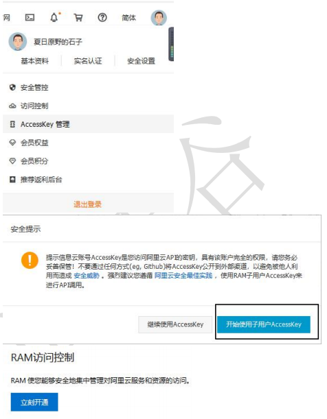
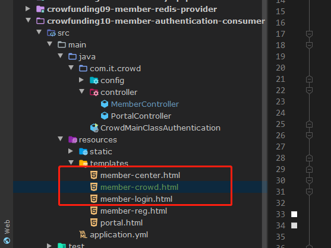
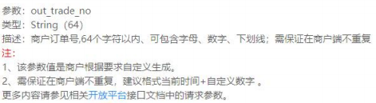

# 众筹网-前台会员系统

## 总目标

搭建环境

会员登录注册

发起众筹项目

展示众筹项目

支持众筹项目

​	订单

​	支付

## 系统架构图


## 需要创建的工程

父工程、聚合工程：crowfunding-member-parent（pom工程）

注册中心：crowfunding06-member-eureka

实体类模块：crowfunding07-member-entity

MySQL数据服务：crowfunding08-member-mysql-provider

Redis数据服务：crowfunding09-member-redis-provider

会员中心：crowfunding10-member-authentication-consumer

项目维护：crowfunding11-member-project-consumer

订单维护：crowfunding12-member-order-consumer

支付功能：crowfunding13-member-pay-provider

网关：crowfunding14-member-zuul

API模块：crowfunding15-member-api

## parent工程

```xml
<properties>
    <java.version>1.8</java.version>
    <spring-cloud.version>Hoxton.SR4</spring-cloud.version>
</properties>

<!--配置在父工程中要管理的依赖-->
<dependencyManagement>
    <dependencies>
        <dependency>
            <groupId>org.springframework.cloud</groupId>
            <artifactId>spring-cloud-dependencies</artifactId>
            <version>${spring-cloud.version}</version>
            <type>pom</type>
            <!--import范围表示将spring-cloud-dependencies包中的依赖信息导入-->
            <scope>import</scope>
        </dependency>
        <!--导入SpringBoot需要使用的依赖信息-->
        <dependency>
            <groupId>org.springframework.boot</groupId>
            <artifactId>spring-boot-dependencies</artifactId>
            <version>2.1.6.RELEASE</version>
            <type>pom</type>
            <scope>import</scope>
        </dependency>
        <dependency>
            <groupId>org.mybatis.spring.boot</groupId>
            <artifactId>mybatis-spring-boot-starter</artifactId>
            <version>2.1.0</version>
        </dependency>
        <dependency>
            <groupId>com.alibaba</groupId>
            <artifactId>druid</artifactId>
            <version>1.2.4</version>
        </dependency>
    </dependencies>
</dependencyManagement>
```

## 包名约定：

### 新创建的包都为com.it.crowd的子包

### 主启动类类名

CrowdMainClass

### 端口号

crowfunding06-member-eureka   1000

crowfunding08-member-mysql-provider   2000

crowfunding09-member-redis-provider    3000

crowfunding10-member-authentication-consumer   4000

crowfunding11-member-project-consumer  5000 

crowfunding12-member-order-consumer  7000 

crowfunding13-member-pay-provider  8000

crowfunding14-member-zuul  80

## eureka工程

### 依赖

```xml
<dependencies>
    <dependency>
        <groupId>org.springframework.cloud</groupId>
        <artifactId>spring-cloud-starter-netflix-eureka-server</artifactId>
    </dependency>
</dependencies>
```

### 主启动类

```java
@EnableEurekaServer
@SpringBootApplication
public class CrowdMainClass
{
    public static void main(String[] args)
    {
        SpringApplication.run(CrowdMainClass.class,args);
    }
}
```

### 配置yml

```yml
server:
  port: 1000
spring:
  application:
    name: atguigu-crowd-eureka
eureka:
  instance:
    hostname: localhost
  client:
    service-url:
      defaultZone: http://${eureka.instance.hostname}:${server.port}/eureka
    register-with-eureka: false
    fetch-registry: false
```

## entity工程

### 实体类的进一步细分

- VO

  View Object视图对象

  ​	用途1：接收浏览器发送过来的数据

  ​	用途2：把数据发送给浏览器去显示

- PO

  Persistent Object 持久化对象

  ​	用途1：将数据封装到po对象存入数据库

  ​	用途2：将数据库数据查出来存入po对象

- DO

  Data Object

  ​	用途1：从Redis查询得到数据封装为do对象

  ​	用途2：从ElasticSearch查询得到数据封装为do对象

  ​	用途3：从Solr查询得到数据封装为do对象

  从中间件或其他第三方接口查询到的数据封装为do对象

- DTO

  Data Transfer Object数据传输对象

  ​	用途1：从Consumer发送数据到Provider

  ​	用途2：Provider返回数据给Consumer

  

使用org.springframework.beans.BeanUtils.copyProperties(Object object)在不同实体类之间复制属性

MemberVO →复制属性→MemberPO

### 创建包

com.it.crowd.vo

com.it.crowd.po

### lombok

#### 效果


让我们在开发时不必编写 getXxx()、setXxx()、有参构造器、无参构造器等等这样具 备固定模式的代码。

#### lombok 原理

根据注解确定要生成的代码，然后将要生成的代码侵入到字节码文件中。


#### 注解

@Data：每一个字段都加入 getXxx()、setXxx()方法 

@NoArgsConstructor：无参构造器 

 @AllArgsConstructor：全部字段都包括的构造器 

@EqualsAndHashCode：equals 和 hashCode 方法 

@Getter 

​	类：所有字段都加入 getXxx()方法 

​	字段：当前字段加入 getXxx()方法 

@Setter 

​	类：所有字段都加入 setXxx()方法 

​	字段：当前字段加入 setXxx()方法

### 暴露接口


## MySQL工程-基础环境

### 创建数据库表

```mysql
DROP TABLE IF EXISTS `t_member`;
CREATE TABLE `t_member`  (
  `id` int(11) NOT NULL AUTO_INCREMENT,
  `loginacct` varchar(255) CHARACTER SET utf8 COLLATE utf8_general_ci NOT NULL,
  `userpswd` char(200) CHARACTER SET utf8 COLLATE utf8_general_ci NOT NULL,
  `username` varchar(255) CHARACTER SET utf8 COLLATE utf8_general_ci NULL DEFAULT NULL,
  `email` varchar(255) CHARACTER SET utf8 COLLATE utf8_general_ci NULL DEFAULT NULL,
  `authstatus` int(4) NULL DEFAULT NULL COMMENT '实名认证状态 0 - 未实名认证， 1 - 实名认证申请中， 2 - 已实名认证',
  `usertype` int(4) NULL DEFAULT NULL COMMENT ' 0 - 个人， 1 - 企业',
  `realname` varchar(255) CHARACTER SET utf8 COLLATE utf8_general_ci NULL DEFAULT NULL,
  `cardnum` varchar(255) CHARACTER SET utf8 COLLATE utf8_general_ci NULL DEFAULT NULL,
  `accttype` int(4) NULL DEFAULT NULL COMMENT '0 - 企业， 1 - 个体， 2 - 个人， 3 - 政府',
  PRIMARY KEY (`id`) USING BTREE,
  UNIQUE INDEX `loginacct`(`loginacct`) USING BTREE
) ENGINE = InnoDB AUTO_INCREMENT = 6 CHARACTER SET = utf8 COLLATE = utf8_general_ci ROW_FORMAT = Dynamic;

INSERT INTO `t_member` VALUES (1, 'jack', '$2a$10$O8n15OCjebejO8CUnOrwjON6bi0kj6fpbY3p.Qez7W7yZGfHSJEOm', ' 杰 克 ', 'jack@qq.com', 1, 1, '杰克', '123123', 2);
INSERT INTO `t_member` VALUES (2, 'tom', '1234', NULL, NULL, NULL, NULL, NULL, NULL, NULL);
INSERT INTO `t_member` VALUES (4, 'root', '$2a$10$6CWQZWx3UfBsMmKDmzEgWuRI2QgrmhZq4X/1fjOCaSlFi2WS4PHNa', 'nsu', '1822014927@qq.com', NULL, NULL, NULL, NULL, NULL);
```

### 逆向生成


### 依赖

```xml
<!-- 整合 MyBatis -->
<dependency>
    <groupId>org.mybatis.spring.boot</groupId>
    <artifactId>mybatis-spring-boot-starter</artifactId>
</dependency>
<!-- MySQL 驱动 -->
<dependency>
    <groupId>mysql</groupId>
    <artifactId>mysql-connector-java</artifactId>
</dependency>
<!-- 数据库连接池 -->
<dependency>
    <groupId>com.alibaba</groupId>
    <artifactId>druid</artifactId>
</dependency>
<!-- SpringBoot 测试 -->
<dependency>
    <groupId>org.springframework.boot</groupId>
    <artifactId>spring-boot-starter-test</artifactId>
    <scope>test</scope>
</dependency>
<!-- 对外暴露服务 -->
<dependency>
    <groupId>org.springframework.boot</groupId>
    <artifactId>spring-boot-starter-web</artifactId>
</dependency>
<!-- 作为客户端访问 Eureka 注册中心 -->
<dependency>
    <groupId>org.springframework.cloud</groupId>
    <artifactId>spring-cloud-starter-netflix-eureka-client</artifactId>
</dependency>
<!-- 为了能够使用实体类 -->
<dependency>
    <groupId>com.it.crowd</groupId>
    <artifactId>crowfunding07-member-entity</artifactId>
    <version>1.0-SNAPSHOT</version>
</dependency>
<!-- 为了能够使用工具类 -->
<dependency>
    <groupId>com.it</groupId>
    <artifactId>crowfunding04-common-util</artifactId>
    <version>1.0-SNAPSHOT</version>
</dependency>
```

### 主启动类

```java
// 扫描mybatis的mapper接口包
@MapperScan("com.it.crowd.mapper")
@SpringBootApplication
public class CrowdMainClassMySQL
{
    public static void main(String[] args)
    {
        SpringApplication.run(CrowdMainClassMySQL.class,args);
    }
}
```

### appliacation.yml

```yml
server:
  port: 2000
spring:
  application:
    name: crowd-mysql
  datasource:
    name: mydb
    type: com.alibaba.druid.pool.DruidDataSource
    url: jdbc:mysql://localhost:3306/crowfunding?serverTimezone=UTC
    username: root
    password: root
    driver-class-name: com.mysql.cj.jdbc.Driver
eureka:
  client:
    service-url:
      defaultZone: http://localhost:1000/eureka

mybatis:
  mapper-locations: classpath*:/mybatis/mapper/*Mapper.xml
logging:
  level:
    com.it.crowd.mapper: debug
    com.it.crowd.test: debug
```

### 测试类

```java
@RunWith(SpringRunner.class)
@SpringBootTest
public class MyBatisTest
{

    @Autowired
    private DataSource dataSource;

    @Autowired
    private MemberPOMapper memberPOMapper;

    private Logger logger = LoggerFactory.getLogger(MyBatisTest.class);


    @Test
    public void testMapper(){
        BCryptPasswordEncoder passwordEncoder = new BCryptPasswordEncoder();
        String source = "123123";
        String encode = passwordEncoder.encode(source);
        memberPOMapper.insert(new MemberPO(null,"jack",encode,"杰克","jack@qq.com",1,1,"杰克","123123",2));
    }
    @Test
    public void testConnection() throws SQLException
    {
        Connection connection = dataSource.getConnection();
        logger.debug(connection.toString());
    }
}
```

## MySQL工程-对外暴露服务

### api工程

#### 依赖

```xml
<dependency>
    <groupId>org.springframework.cloud</groupId>
    <artifactId>spring-cloud-starter-openfeign</artifactId>
</dependency>
<!-- 为了能够使用工具类 -->
<dependency>
    <groupId>com.it</groupId>
    <artifactId>crowfunding04-common-util</artifactId>
    <version>1.0-SNAPSHOT</version>
</dependency>
<dependency>
    <groupId>com.it.crowd</groupId>
    <artifactId>crowfunding07-member-entity</artifactId>
    <version>1.0-SNAPSHOT</version>
</dependency>
```

#### 创建接口

```java
@FeignClient("crowd-mysql")
public interface MySQLRemoteService
{
    @RequestMapping("/get/memberpo/by/login/acct/remote")
    ResultEntity<MemberPO> getMemberPOByLoginAcctRemote(@RequestParam("loginAcct") String loginAcct);
}
```

### MySQL工程

#### 创建组件


#### Controller

```java
@RestController
public class MemberProviderController
{

    @Autowired
    private MemberService memberService;

    @RequestMapping("/get/memberpo/by/login/acct/remote")
    ResultEntity<MemberPO> getMemberPOByLoginAcctRemote(@RequestParam("loginAcct") String loginAcct)
    {
        try
        {
            // 调用本地Service完成查询
            MemberPO memberPO =  memberService.getMemberPOByLoginAcct(loginAcct);
            // 如果没有抛异常，那么就返回成功的结果
            return ResultEntity.successWithData(memberPO);
        }
        catch (Exception e)
        {
            e.printStackTrace();
            // 如果捕获到异常则返回失败的结果
            return ResultEntity.fail(e.getMessage());
        }
    }
}
```

#### Service

```java
@Transactional(readOnly = true) // 在类上使用针对查询操作设置事务属性
@Service
public class MemberServiceImpl implements MemberService
{
    @Autowired
    private MemberPOMapper memberPOMapper;

    public MemberPO getMemberPOByLoginAcct(String loginAcct)
    {

        // 创建example对象
        MemberPOExample example = new MemberPOExample();
        // 创建Criteria对象
        MemberPOExample.Criteria criteria = example.createCriteria();
        // 封装查询条件
        criteria.andLoginacctEqualTo(loginAcct);
        // 执行查询
        List<MemberPO> list = memberPOMapper.selectByExample(example);
        return list.get(0);
    }
}
```

## Redis工程

### 目标

项目中所有访问Redis的操作。

### 依赖

```xml
<!-- 整合 Redis -->
<dependency>
    <groupId>org.springframework.boot</groupId>
    <artifactId>spring-boot-starter-data-redis</artifactId>
</dependency>
<!-- 测试 -->
<dependency>
    <groupId>org.springframework.boot</groupId>
    <artifactId>spring-boot-starter-test</artifactId>
    <scope>test</scope>
</dependency>
<!-- 对外暴露服务 -->
<dependency>
    <groupId>org.springframework.boot</groupId>
    <artifactId>spring-boot-starter-web</artifactId>
</dependency>
<!-- 作为客户端访问 Eureka 注册中心 -->
<dependency>
    <groupId>org.springframework.cloud</groupId>
    <artifactId>spring-cloud-starter-netflix-eureka-client</artifactId>
</dependency>
<!-- 为了能够使用实体类 -->
<dependency>
    <groupId>com.it.crowd</groupId>
    <artifactId>crowfunding07-member-entity</artifactId>
    <version>1.0-SNAPSHOT</version>
</dependency>
<!-- 为了能够使用工具类 -->
<dependency>
    <groupId>com.it</groupId>
    <artifactId>crowfunding04-common-util</artifactId>
    <version>1.0-SNAPSHOT</version>
</dependency>
```

### 主启动类

```java
@SpringBootApplication
public class CrowdMainClassRedis
{
    public static void main(String[] args)
    {
        SpringApplication.run(CrowdMainClassRedis.class,args);
    }
}

```

### 测试类

```java
@RunWith(SpringRunner.class)
@SpringBootTest
public class RedisTest
{
    private Logger logger = LoggerFactory.getLogger(RedisTest.class);

    @Autowired
    private StringRedisTemplate stringRedisTemplate;

    @Test
    public void testSet()
    {
        ValueOperations<String, String> operations = stringRedisTemplate.opsForValue();
        operations.set("apple","red");
    }
}
```

### Redis工程对外暴露服务

#### api工程创建接口

```java
@FeignClient("crowd-redis")
public interface RedisRemoteService
{
    @RequestMapping("/set/redis/key/value/remote")
    ResultEntity<String> setRedisKeyValueRemote(
            @RequestParam("key") String key,
            @RequestParam("value") String value);

    @RequestMapping("/set/redis/key/value/remote/with/timeout")
    ResultEntity<String> setRedisKeyValueRemoteWithTimeout (
            @RequestParam("key") String key,
            @RequestParam("value") String value,
            @RequestParam("time") Long time,
            @RequestParam("timeUnit")TimeUnit timeUnit);

    @RequestMapping("/get/redis/string/value/by/key")
    ResultEntity<String> getRedisStringValueByKeyRemote(@RequestParam("key")String key);

    @RequestMapping("/remove/redis/key/remote")
    ResultEntity<String> removeRedisKeyRemote(@RequestParam("key")String key);
}
```

#### Redis工程Controller

```java
@RestController
public class RedisController
{
    @Autowired
    private StringRedisTemplate redisTemplate;

        @RequestMapping("/set/redis/key/value/remote")
        ResultEntity<String> setRedisKeyValueRemote(
                @RequestParam("key") String key,
                @RequestParam("value") String value)
        {
            ValueOperations<String, String> operations = redisTemplate.opsForValue();
            try
            {
                operations.set(key,value);
                return ResultEntity.successWithoutData();
            }
            catch (Exception e)
            {
                e.printStackTrace();
                return ResultEntity.fail(e.getMessage());
            }
        }

        @RequestMapping("/set/redis/key/value/remote/with/timeout")
        ResultEntity<String> setRedisKeyValueRemoteWithTimeout (
                @RequestParam("key") String key,
                @RequestParam("value") String value,
                @RequestParam("time") Long time,
                @RequestParam("timeUnit") TimeUnit timeUnit)
        {
            ValueOperations<String, String> operations = redisTemplate.opsForValue();
            try
            {
                operations.set(key,value,time,timeUnit);
                return ResultEntity.successWithoutData();
            }
            catch (Exception e)
            {
                e.printStackTrace();
                return ResultEntity.fail(e.getMessage());
            }
        }

        @RequestMapping("/get/redis/string/value/by/key")
        ResultEntity<String> getRedisStringValueByKeyRemote(@RequestParam("key")String key)
        {
            ValueOperations<String, String> operations = redisTemplate.opsForValue();
            try
            {
                String value = operations.get(key);
                return ResultEntity.successWithData(value);
            }
            catch (Exception e)
            {
                e.printStackTrace();
                return ResultEntity.fail(e.getMessage());
            }
        }

        @RequestMapping("/remove/redis/key/remote")
        ResultEntity<String> removeRedisKeyRemote(@RequestParam("key")String key)
        {
            try
            {
                redisTemplate.delete(key);
                return ResultEntity.successWithoutData();
            }
            catch (Exception e)
            {
                e.printStackTrace();
                return ResultEntity.fail(e.getMessage());
            }
        }
}
```

## 认证工程显示首页-authentication-consumer

### 依赖

```xml
<dependency>
    <artifactId>crowfunding15-member-api</artifactId>
    <groupId>com.it.crowd</groupId>
    <version>1.0-SNAPSHOT</version>
</dependency>
<dependency>
    <groupId>org.springframework.boot</groupId>
    <artifactId>spring-boot-starter-web</artifactId>
</dependency>
<dependency>
    <groupId>org.springframework.boot</groupId>
    <artifactId>spring-boot-starter-thymeleaf</artifactId>
</dependency>
<dependency>
    <groupId>org.springframework.cloud</groupId>
    <artifactId>spring-cloud-starter-netflix-eureka-client</artifactId>
</dependency>
<dependency>
    <groupId>org.apache.httpcomponents</groupId>
    <artifactId>httpcore</artifactId>
</dependency>
<dependency>
    <groupId>org.springframework.boot</groupId>
    <artifactId>spring-boot-configuration-processor</artifactId>
    <optional>true</optional>
</dependency>
<!-- 引入 springboot&redis 整合场景 -->
<dependency>
    <groupId>org.springframework.boot</groupId>
    <artifactId>spring-boot-starter-data-redis</artifactId>
</dependency>
<!-- 引入 springboot&springsession 整合场景 -->
<dependency>
    <groupId>org.springframework.session</groupId>
    <artifactId>spring-session-data-redis</artifactId>
</dependency>
```

### 主启动类

```java
@SpringBootApplication
@EnableDiscoveryClient
public class CrowdMainClassAuthentication
{
    public static void main(String[] args)
    {
        SpringApplication.run(CrowdMainClassAuthentication.class,args);
    }
}
```

### application.yml

```yml
server:
  port: 4000
spring:
  application:
    name: crowd-auth
  thymeleaf:
    prefix: classpath:/templates/
    suffix: .html
eureka:
  client:
    service-url:
      defaultZone: http://localhost:1000/eureka
```

### 显示首页的Controller

```java
@Controller
public class PortalController
{
    @RequestMapping("/")
    public String showPortalPage(){
        // 实际开发中要去加载数据
        return "portal";
    }
}
```

### 加入静态资源

#### 静态资源加入位置


SpringBoot要求在static目录下存放静态资源

#### 调整portal.html页面


### 在common-util模块中增加发送短信功能

#### 尚硅谷的签名模板

尚硅谷签名编号：151003

模板编号：84683

#### 依赖

```xml
<!--以下是发送短信时调用的第三方API所需依赖-->
<dependency>
    <groupId>com.alibaba</groupId>
    <artifactId>fastjson</artifactId>
    <version>1.2.15</version>
</dependency>
<!--当前环境本身就有httpclient这里不写版本号就可以使用已有的版本，避免因为版本号不一致而产生冲突-->
<dependency>
    <groupId>org.apache.httpcomponents</groupId>
    <artifactId>httpclient</artifactId>
    <version>4.5.9</version>
</dependency>
<dependency>
    <groupId>org.eclipse.jetty</groupId>
    <artifactId>jetty-util</artifactId>
    <version>9.4.19.v20190610</version>
    <scope>compile</scope>
</dependency>
<dependency>
    <groupId>commons-lang</groupId>
    <artifactId>commons-lang</artifactId>
    <version>2.6</version>
</dependency>
```

### HttpUtils

```java
package com.it.crowd.util;

import java.io.UnsupportedEncodingException;
import java.net.URLEncoder;
import java.security.KeyManagementException;
import java.security.NoSuchAlgorithmException;
import java.security.cert.X509Certificate;
import java.util.ArrayList;
import java.util.List;
import java.util.Map;

import javax.net.ssl.SSLContext;
import javax.net.ssl.TrustManager;
import javax.net.ssl.X509TrustManager;

import org.apache.commons.lang.StringUtils;
import org.apache.http.HttpResponse;
import org.apache.http.NameValuePair;
import org.apache.http.client.HttpClient;
import org.apache.http.client.entity.UrlEncodedFormEntity;
import org.apache.http.client.methods.HttpDelete;
import org.apache.http.client.methods.HttpGet;
import org.apache.http.client.methods.HttpPost;
import org.apache.http.client.methods.HttpPut;
import org.apache.http.conn.ClientConnectionManager;
import org.apache.http.conn.scheme.Scheme;
import org.apache.http.conn.scheme.SchemeRegistry;
import org.apache.http.conn.ssl.SSLSocketFactory;
import org.apache.http.entity.ByteArrayEntity;
import org.apache.http.entity.StringEntity;
import org.apache.http.impl.client.DefaultHttpClient;
import org.apache.http.message.BasicNameValuePair;

public class HttpUtils {

    /**
     * get
     */
    public static HttpResponse doGet(String host, String path, String method,
                                     Map<String, String> headers,
                                     Map<String, String> querys)
            throws Exception {
        HttpClient httpClient = wrapClient(host);

        HttpGet request = new HttpGet(buildUrl(host, path, querys));
        for (Map.Entry<String, String> e : headers.entrySet()) {
            request.addHeader(e.getKey(), e.getValue());
        }

        return httpClient.execute(request);
    }

    /**
     * post form
     */
    public static HttpResponse doPost(String host, String path, String method,
                                      Map<String, String> headers,
                                      Map<String, String> querys,
                                      Map<String, String> bodys)
            throws Exception {
        HttpClient httpClient = wrapClient(host);

        HttpPost request = new HttpPost(buildUrl(host, path, querys));
        for (Map.Entry<String, String> e : headers.entrySet()) {
            request.addHeader(e.getKey(), e.getValue());
        }

        if (bodys != null) {
            List<NameValuePair> nameValuePairList = new ArrayList<NameValuePair>();

            for (String key : bodys.keySet()) {
                nameValuePairList.add(new BasicNameValuePair(key, bodys.get(key)));
            }
            UrlEncodedFormEntity formEntity = new UrlEncodedFormEntity(nameValuePairList, "utf-8");
            formEntity.setContentType("application/x-www-form-urlencoded; charset=UTF-8");
            request.setEntity(formEntity);
        }

        return httpClient.execute(request);
    }

    /**
     * Post String
     */
    public static HttpResponse doPost(String host, String path, String method,
                                      Map<String, String> headers,
                                      Map<String, String> querys,
                                      String body)
            throws Exception {
        HttpClient httpClient = wrapClient(host);

        HttpPost request = new HttpPost(buildUrl(host, path, querys));
        for (Map.Entry<String, String> e : headers.entrySet()) {
            request.addHeader(e.getKey(), e.getValue());
        }

        if (StringUtils.isNotBlank(body)) {
            request.setEntity(new StringEntity(body, "utf-8"));
        }

        return httpClient.execute(request);
    }

    /**
     * Post stream
     */
    public static HttpResponse doPost(String host, String path, String method,
                                      Map<String, String> headers,
                                      Map<String, String> querys,
                                      byte[] body)
            throws Exception {
        HttpClient httpClient = wrapClient(host);

        HttpPost request = new HttpPost(buildUrl(host, path, querys));
        for (Map.Entry<String, String> e : headers.entrySet()) {
            request.addHeader(e.getKey(), e.getValue());
        }

        if (body != null) {
            request.setEntity(new ByteArrayEntity(body));
        }

        return httpClient.execute(request);
    }

    /**
     * Put String
     */
    public static HttpResponse doPut(String host, String path, String method,
                                     Map<String, String> headers,
                                     Map<String, String> querys,
                                     String body)
            throws Exception {
        HttpClient httpClient = wrapClient(host);

        HttpPut request = new HttpPut(buildUrl(host, path, querys));
        for (Map.Entry<String, String> e : headers.entrySet()) {
            request.addHeader(e.getKey(), e.getValue());
        }

        if (StringUtils.isNotBlank(body)) {
            request.setEntity(new StringEntity(body, "utf-8"));
        }

        return httpClient.execute(request);
    }

    /**
     * Put stream
     */
    public static HttpResponse doPut(String host, String path, String method,
                                     Map<String, String> headers,
                                     Map<String, String> querys,
                                     byte[] body)
            throws Exception {
        HttpClient httpClient = wrapClient(host);

        HttpPut request = new HttpPut(buildUrl(host, path, querys));
        for (Map.Entry<String, String> e : headers.entrySet()) {
            request.addHeader(e.getKey(), e.getValue());
        }

        if (body != null) {
            request.setEntity(new ByteArrayEntity(body));
        }

        return httpClient.execute(request);
    }

    /**
     * Delete
     */
    public static HttpResponse doDelete(String host, String path, String method,
                                        Map<String, String> headers,
                                        Map<String, String> querys)
            throws Exception {
        HttpClient httpClient = wrapClient(host);

        HttpDelete request = new HttpDelete(buildUrl(host, path, querys));
        for (Map.Entry<String, String> e : headers.entrySet()) {
            request.addHeader(e.getKey(), e.getValue());
        }

        return httpClient.execute(request);
    }

    private static String buildUrl(String host, String path, Map<String, String> querys) throws UnsupportedEncodingException {
        StringBuilder sbUrl = new StringBuilder();
        sbUrl.append(host);
        if (!StringUtils.isBlank(path)) {
            sbUrl.append(path);
        }
        if (null != querys) {
            StringBuilder sbQuery = new StringBuilder();
            for (Map.Entry<String, String> query : querys.entrySet()) {
                if (0 < sbQuery.length()) {
                    sbQuery.append("&");
                }
                if (StringUtils.isBlank(query.getKey()) && !StringUtils.isBlank(query.getValue())) {
                    sbQuery.append(query.getValue());
                }
                if (!StringUtils.isBlank(query.getKey())) {
                    sbQuery.append(query.getKey());
                    if (!StringUtils.isBlank(query.getValue())) {
                        sbQuery.append("=");
                        sbQuery.append(URLEncoder.encode(query.getValue(), "utf-8"));
                    }
                }
            }
            if (0 < sbQuery.length()) {
                sbUrl.append("?").append(sbQuery);
            }
        }

        return sbUrl.toString();
    }

    private static HttpClient wrapClient(String host) {
        HttpClient httpClient = new DefaultHttpClient();
        if (host.startsWith("https://")) {
            sslClient(httpClient);
        }

        return httpClient;
    }

    private static void sslClient(HttpClient httpClient) {
        try {
            SSLContext ctx = SSLContext.getInstance("TLS");
            X509TrustManager tm = new X509TrustManager() {
                public X509Certificate[] getAcceptedIssuers() {
                    return null;
                }
                public void checkClientTrusted(X509Certificate[] xcs, String str) {

                }
                public void checkServerTrusted(X509Certificate[] xcs, String str) {

                }
            };
            ctx.init(null, new TrustManager[] { tm }, null);
            SSLSocketFactory ssf = new SSLSocketFactory(ctx);
            ssf.setHostnameVerifier(SSLSocketFactory.ALLOW_ALL_HOSTNAME_VERIFIER);
            ClientConnectionManager ccm = httpClient.getConnectionManager();
            SchemeRegistry registry = ccm.getSchemeRegistry();
            registry.register(new Scheme("https", 443, ssf));
        } catch (KeyManagementException ex) {
            throw new RuntimeException(ex);
        } catch (NoSuchAlgorithmException ex) {
            throw new RuntimeException(ex);
        }
    }
}
```

### CrowdUtil类中增加方法

```java
/**
 * 给远程第三方短信接口发送请求把验证码发送到用户手机上
 * @param host      短信接口调用的URL地址
 * @param path      具体发送短信东功能的地址
 * @param method    请求方式
 * @param phoneNum  接收验证码的手机号
 * @param appcode   用来调用第三方短信API的AppCode
 * @param sign      签名编号
 * @param skin      模板编号
 * @return      返回调用结果是否成功，成功：返回验证码   失败：返回失败消息
 *   状态码：200 正常  400 URL无效  401 appCode错误  403 次数用完  500 API网关错误
 */
public static ResultEntity<String> sendShortMessage(String host, String path, String method, String phoneNum, String appcode, String sign, String skin) {
    Map<String, String> headers = new HashMap<String, String>();
    //最后在header中的格式(中间是英文空格)为Authorization:APPCODE 83359fd73fe94948385f570e3c139105
    headers.put("Authorization", "APPCODE " + appcode);
    // 生成验证码
    StringBuilder builder = new StringBuilder();
    for (int i = 0; i < 4; i++) {
        int random = (int) (Math.random() * 10);
        builder.append(random);
    }
    String code = builder.toString();
    Map<String, String> querys = new HashMap<String, String>();
    querys.put("param", code);
    querys.put("phone", phoneNum);
    querys.put("sign", sign);
    querys.put("skin", skin);
    try {
        HttpResponse response = HttpUtils.doGet(host, path, method, headers, querys);
        //System.out.println(response.toString());如不输出json, 请打开这行代码，打印调试头部状态码。
        //状态码: 200 正常；400 URL无效；401 appCode错误； 403 次数用完； 500 API网管错误
        //获取response的body
        StatusLine statusLine = response.getStatusLine();
        int statusCode = statusLine.getStatusCode();
        String reasonPhrase = statusLine.getReasonPhrase();
        if (statusCode == 200) {
            return ResultEntity.successWithData(code);
        }
        return ResultEntity.fail(reasonPhrase);
    } catch (Exception e) {
        e.printStackTrace();
        return ResultEntity.fail(e.getMessage());
    }
}
```

### 发送验证码流程

#### 目标

1. 目标1：将验证码发送到用户手机上
2. 目标2：将验证码存入Redis中

#### 思路


#### 实现

##### 创建view-controller

```java
@Configuration
public class CrowdWebMvcConfig implements WebMvcConfigurer
{
    public void addViewControllers(ViewControllerRegistry registry)
    {
        // 浏览器访问的地址
        String urlPath = "auth/member/to/reg/page.html";
        // 目标视图的名称  将来拼前 prefix: classpath:/templates/ 后 suffix: .html缀
        String viewName = "member-reg";
        registry.addViewController(urlPath).setViewName(viewName);
    }
}
```

##### 在portal页面中修改注册超链接

```html
<li><a href="reg.html" th:href="@{/auth/member/to/reg/page}">注册</a></li>
```

##### 准备注册页面


##### 点击按钮发送验证码

###### 设置button按钮

```html
<button type="button" id="sendBtn" class="btn btn-lg btn-success btn-block"> 获取验证码</button>
```

###### **绑定单击响应函数**

```js
$(function () {
    $("#sendBtn").click(function () {
        // 1.获取接收短信的手机号
        var phoneNum = $.trim($("[name=phoneNum]").val());
        // 2.发送请求
        $.ajax({
            // 链接中的.json可以不写但是一定要对应起来
            "url": "auth/member/send/short/message.json",
            "type": "post",
            "data": {
                "phoneNum": phoneNum
            },
            "dataType": "json",
            "success": function (response) {
                var result = response.result;
                if (result == "SUCCESS"){
                    layer.msg("发送成功")
                }
                if (result == "FAILED"){
                    layer.msg("发送失败！请再试一次！")
                }
            },
            "error": function (response) {
                layer.msg(response.status + " " + response.statusText)
            },
        });
    });
});
```

##### 在yml中配置管理调用发送短息接口时的参数

```yml
short:
  message:
    host: https://feginesms.market.alicloudapi.com
    path: /codeNotice
    method: GET
    appCode: 7f40e7****9a79b87f53
    sign: 151003
    skin: 84683
```

###### ShortMessageProperties类

```java
@NoArgsConstructor
@AllArgsConstructor
@Data
@ConfigurationProperties(prefix = "short.message")
@Component
public class ShortMessageProperties
{
    private String host;

    private String path;

    private String method;

    private String appCode;

    private String sign;

    private String skin;
}
```

##### 在consumer中启用Feign客户端的功能

```java
@EnableFeignClients // 在主启动类中加 启用feign客户端的功能
```

##### Controller

```java
@Controller
public class MemberController
{
    @Autowired
    private ShortMessageProperties properties;

    @Autowired
    private RedisRemoteService redisRemoteService;

    @ResponseBody
    @RequestMapping("/auth/member/send/short/message.json")
    public ResultEntity<String> sendMessage(@RequestParam("phoneNum")String phoneNum)
    {
        // 1.发送验证码到phoneNum这个手机
        ResultEntity<String> sendMessageResultEntity = CrowdUtil.sendShortMessage(properties.getHost(), properties.getPath(), properties.getMethod(), phoneNum, properties.getAppCode(), properties.getSign(), properties.getSkin());
        // 2.判断短信发送的一个结果
        if (ResultEntity.SUCCESS.equals(sendMessageResultEntity.getResult()))
        {
            // 3.如果发送成功则将验证码存入Redis
            // 从上一步结果中获取随机生成的验证码
            String code = sendMessageResultEntity.getData();
            // 拼接一个用于在Redis中存储的数据的key
            String key = CrowdConstant.REDIS_CODE_PREFIX + phoneNum;
            // 验证码过期时间，在Redis中存入的时间（默认单位分钟）
            Long time = Long.valueOf(15);
            // 调用远程的接口存入Redis
            ResultEntity<String> saveCodeResultEntity = redisRemoteService.setRedisKeyValueRemoteWithTimeout(key, code, time, TimeUnit.MINUTES);
            // 判断结果
            if (ResultEntity.SUCCESS.equals(saveCodeResultEntity.getResult()))
            {
                return ResultEntity.successWithoutData();
            }else {
                return saveCodeResultEntity;
            }
        }else
        {
            return sendMessageResultEntity;
        }
    }
}
```

### 执行注册的流程

#### 目标

如果针对注册操作所做的各项验证能够通过，则将Member信息存入数据库。

#### 思路


#### 给t_member表增加唯一约束

```mysql
alter table t_member add unique index(loginacct);
```

#### 实现

##### 在FeignClient接口中声明新的方法

```java
@RequestMapping("/save/member/remote")
ResultEntity<String> saveMember(@RequestBody MemberPO memberPO);
```

##### 在mysql-provider中创建远程接口 

###### Contoller方法

```java
@RequestMapping("/save/member/remote")
public ResultEntity<String> saveMember(MemberPO memberPO)
{
    try
    {
        memberService.saveMember(memberPO);
        return ResultEntity.successWithoutData();
    }
    catch (Exception e)
    {
        if (e instanceof DuplicateKeyException)
        {
            return ResultEntity.fail(CrowdConstant.MESSAGE_LOGIN_ACCT_ALREADY_IN_USE);
        }
        return ResultEntity.fail(e.getMessage());
    }
}
```

###### Service方法

```java
@Override
@Transactional(propagation = Propagation.REQUIRES_NEW,rollbackFor = Exception.class)
public void saveMember(MemberPO memberPO)
{
    memberPOMapper.insertSelective(memberPO);
}
```

#### 创建MemberVO的实体类

```java
@Data
@AllArgsConstructor
@NoArgsConstructor
public class MemberVO
{
    private String loginacct;

    private String userpswd;

    private String username;

    private String email;
    
    private String phoneNum;
    
    private String code;
}
```

#### 在auth-consumer工程执行注册

```java
@Autowired
private MySQLRemoteService mySQLRemoteService;

@RequestMapping("/auth/do/member/register")
public String register(MemberVO memberVO, Model model)
{
    // 1. 获取用户输入的手机号
    String phoneNum = memberVO.getPhoneNum();
    // 2. 拼Redis中存储验证码的key
    String key = CrowdConstant.REDIS_CODE_PREFIX + phoneNum;
    // 3. 从Redis读取key对应的value
    ResultEntity<String> resultEntity = redisRemoteService.getRedisStringValueByKeyRemote(key);
    // 4. 检查查询操作是否有效
    String result = resultEntity.getResult();

    if (ResultEntity.FAILED.equals(result))
    {
        model.addAttribute(CrowdConstant.ATTR_NAME_MESSAGE,resultEntity.getMessage());
        return "member-reg";
    }
    String redisCode = resultEntity.getData();

    if (redisCode == null)
    {
        model.addAttribute(CrowdConstant.ATTR_NAME_MESSAGE,CrowdConstant.MESSAGE_CODE_NOT_EXISTS);
        return "member-reg";
    }

    // 5. 如果从Redis中能够查询到value则比较表单验证码和Redis验证码
    String formCode = memberVO.getCode();
    if (!Objects.equals(formCode,redisCode))
    {
        model.addAttribute(CrowdConstant.ATTR_NAME_MESSAGE,CrowdConstant.MESSAGE_CODE_INVALID);
        return "member-reg";
    }
    // 6. 如果验证码一致，则从Redis删除
    redisRemoteService.removeRedisKeyRemote(key);
    // 7. 执行密码加密
    BCryptPasswordEncoder passwordEncoder = new BCryptPasswordEncoder();
    String userpswdBeforeEncode = memberVO.getUserpswd();
    String userpswdAfterencode = passwordEncoder.encode(userpswdBeforeEncode);
    memberVO.setUserpswd(userpswdAfterencode);
    // 8. 执行保存
    // 创建空的MemberPO对象
    MemberPO memberPO = new MemberPO();
    // 复制属性
    BeanUtils.copyProperties(memberVO,memberPO);
    // 调用远程方法
    ResultEntity<String> saveMemberResultEntity = mySQLRemoteService.saveMember(memberPO);

    if (resultEntity.FAILED.equals(saveMemberResultEntity.getResult()))
    {
        model.addAttribute(CrowdConstant.ATTR_NAME_MESSAGE,saveMemberResultEntity.getMessage());
        return "member-reg";
    }
    // 使用重定向避免刷新浏览器导致重新执行
    return "redirect:/auth/member/to/login/page";
}
```

#### 关于第一次请求的超时

由于在第一次请求中需要建立缓存、建立连接、操作较多，所以比较耗时。如果按照默认的ribbon超时时间来工作，第一次请求会超过这个时间导致超时报错。

为了避免这个问题，把ribbon的超时时间延长。

配置方式是在application.yml 中加入如下配置：

```yml
ribbon:
  ReadTimeout: 10000
  ConnectTimeout: 10000
```

### 会员登录

#### 目标

检查账号密码正确后将用户信息存入Session，表示用户已登录。

#### 思路


#### 实现

##### 创建MemberLoginVO类

```java
@Data
@AllArgsConstructor
@NoArgsConstructor
public class MemberLoginVO
{
    private Integer id;
    
    private String loginacct;

    private String userpswd;
}
```

##### 修正mysql-provider中的代码

```java
public MemberPO getMemberPOByLoginAcct(String loginAcct)
{

    // 创建example对象
    MemberPOExample example = new MemberPOExample();
    // 创建Criteria对象
    MemberPOExample.Criteria criteria = example.createCriteria();
    // 封装查询条件
    criteria.andLoginacctEqualTo(loginAcct);
    // 执行查询
    List<MemberPO> list = memberPOMapper.selectByExample(example);
    // 获取结果（修正部分）
    if(list == null || list.size() == 0)
        return null;
    return list.get(0);
}
```

##### auth-consumer执行登陆

```java
@RequestMapping("/auth/member/do/login")
public String login(@RequestParam("loginacct")String loginacct,
                    @RequestParam("userpswd") String userpswd,
                    Model model,
                    HttpSession session)
{
    // 1. 调用远程接口根据登陆账号查询MemberPO对象
    ResultEntity<MemberPO> resultEntity = mySQLRemoteService.getMemberPOByLoginAcctRemote(loginacct);
    if (resultEntity.FAILED.equals(resultEntity.getResult()))
    {
        model.addAttribute(CrowdConstant.ATTR_NAME_MESSAGE,resultEntity.getMessage());
        return "member-login";
    }
    MemberPO memberPO = resultEntity.getData();
    if (memberPO == null)
    {
        model.addAttribute(CrowdConstant.ATTR_NAME_MESSAGE,CrowdConstant.MESSAGE_LOGIN_FAILED);
        return "member-login";
    }

    // 比较密码
    String userPswdDataBase = memberPO.getUserpswd();
    BCryptPasswordEncoder passwordEncoder = new BCryptPasswordEncoder();
    boolean matcheResult = passwordEncoder.matches(userpswd, userPswdDataBase);
    if (!matcheResult)
    {
        model.addAttribute(CrowdConstant.ATTR_NAME_MESSAGE,CrowdConstant.MESSAGE_LOGIN_FAILED);
        return "member-login";
    }
    // 创建MemberLoginVO对象存入session域
    MemberLoginVO memberLoginVO = new MemberLoginVO(memberPO.getId(),memberPO.getUsername(),memberPO.getUserpswd());
    session.setAttribute(CrowdConstant.ATTR_NAME_LOGIN_MEMBER,memberLoginVO);
    return "redirect:/auth/member/to/center/page";
}
```

##### 修改登陆按钮

```html
<li><a href="login.html" th:href="@{/auth/member/to/login/page}">登录</a></li>
```

##### 调整登陆页面

```html
<html html lang="zh-CN" xmlns:th="http://www.thymeleaf.org">
<head>
    <meta charset="UTF-8">
    <meta http-equiv="X-UA-Compatible" content="IE=edge">
    <meta name="viewport" content="width=device-width, initial-scale=1">
    <meta name="description" content="">
    <meta name="keys" content="">
    <meta name="author" content="">
    <base th:href="@{/}">
    <link rel="stylesheet" href="bootstrap/css/bootstrap.min.css">
    <link rel="stylesheet" href="css/font-awesome.min.css">
    <link rel="stylesheet" href="css/login.css">
    <script src="jquery/jquery-2.1.1.min.js"></script>
    <script src="bootstrap/js/bootstrap.min.js"></script>
</head>
```

```html
<form action="auth/member/do/login" method="post" class="form-signin" role="form">
    <h2 class="form-signin-heading"><i class="glyphicon glyphicon-log-in"></i> 用户登录</h2>
    <p th:text="${message}">这里显示登录失败的提示消息 </p>
    <p th:text="${session.message}">这里显示登录检查后不允许访问的的提示消息 </p>
    <div class="form-group has-success has-feedback">
        <input type="text" name="loginacct" class="form-control" id="inputSuccess1" placeholder="请输入登录账号" autofocus>
        <span class="glyphicon glyphicon-user form-control-feedback"></span>
    </div>
    <div class="form-group has-success has-feedback">
        <input type="text" name="userpswd" class="form-control" id="inputSuccess2" placeholder="请输入登录密码" style="margin-top:10px;">
        <span class="glyphicon glyphicon-lock form-control-feedback"></span>
    </div>
    <div class="checkbox" style="text-align:right;"><a th:href="@{/auth/member/to/reg/page}" href="reg.html">我要注册</a></div>
    <button class="btn btn-lg btn-success btn-block" type="submit">登录</button>
</form>
```

### 退出登录

```java
@RequestMapping("/auth/member/logout")
public String logout(HttpSession session)
{
    session.invalidate();
    return "redirect:/";
}
```

### 注意@RequestBody


### 登录延伸-Session共享问题


#### 目标

使用Session共享技术解决Session不互通的问题

#### Cookie 的工作机制

服务器端返回 Cookie 信息给浏览器 

​	Java 代码：response.addCookie(cookie 对象); 

​	HTTP 响应消息头：Set-Cookie: Cookie 的名字=Cookie 的值

浏览器接收到服务器端返回的 Cookie，以后的每一次请求都会把 Cookie 带上

​	HTTP 请求消息头：Cookie： Cookie 的名字=Cookie 的值

#### Session 的工作机制

获取 Session 对象：request.getSession() 

​	检查当前请求是否携带了 JSESSIONID 这个 Cookie

​		带了：根据这个 JSESSIONID 在服务器端查找对应的 Session 对象

​			能找到：就把找到的 Session 对象返回

​			没找到：新建 Session 对象返回，同时返回 JSESSIONID 的 Cookie 

​		没带：新建 Session 对象返回，同时返回 JSESSIONID 的 Cookie

#### Session 共享

在分布式和集群环境下，每个具体模块运行在单独的 Tomcat 上，而 Session 是被不同 Tomcat 所“区隔”的，所以不能互通，会导致程序运行时，用户会话数据发生错误。有的服务器上有，有的服务器上没有。


#### 解决方案探索

##### Session 同步


问题 1：造成 Session 在各个服务器上“同量”保存。TomcatA 保存了 1G 的 Session 数据，TomcatB 也需要保存 1G 的 Session 数据。数据量太大的会导 致 Tomcat 性能下降。 

问题 2：数据同步对性能有一定影响。

##### 将 Session 数据存储在 Cookie 中

做法：所有会话数据在浏览器端使用 Cookie 保存，服务器端不存储任何会话数据。 

​	好处：服务器端大大减轻了数据存储的压力。不会有 Session 不一致问题 

​	缺点： 

​		Cookie 能够存储的数据非常有限。一般是 4KB。不能存储丰富的数据。 

​		Cookie 数据在浏览器端存储，很大程度上不受服务器端控制，如果浏览器端清理 Cookie，相关数据会丢失

##### 反向代理 hash 一致性


问题 1：具体一个浏览器，专门访问某一个具体服务器，如果服务器宕机， 会丢失数据。存在单点故障风险。 

问题 2：仅仅适用于集群范围内，超出集群范围，负载均衡服务器无效。

##### 后端统一存储 Session 数据

后端存储 Session 数据时，一般需要使用 Redis 这样的内存数据库，而一 般不采用 MySQL 这样的关系型数据库。原因如下： 

​	Session 数据存取比较频繁。内存访问速度快。 

​	Session 有过期时间，Redis 这样的内存数据库能够比较方便实现过期释放。


优点

​	访问速度比较快。虽然需要经过网络访问，但是现在硬件条件已经能够达 到网络访问比硬盘访问还要快。 

​		硬盘访问速度：200M/s 

​		网络访问速度：1G/s 

Redis 可以配置主从复制集群，不担心单点故障。

### SpringSession 使用

以下文档针对在 SpringBoot 环境下使用

##### 引入依赖

```xml
<!-- 引入 springboot&redis 整合场景 -->
<dependency>
    <groupId>org.springframework.boot</groupId>
    <artifactId>spring-boot-starter-data-redis</artifactId>
</dependency>
<!-- 引入 springboot&springsession 整合场景 -->
<dependency>
    <groupId>org.springframework.session</groupId>
    <artifactId>spring-session-data-redis</artifactId>
</dependency>
```

##### 编写配置

```yml
# redis 配置
spring:
  redis:
    host: 192.168.56.103
spring:
  redis:
    jedis:
      pool:
        max-idle: 100
# springsession 配置
spring:
  session:
    store-type: redis
```

==注意：存入 Session 域的实体类对象需要支持序列化！！！==

##### Spring Session 基本原理

Spring Session 从底层全方位“接管”了 Tomcat 对 Session 的管理。

###### Spring Session 需要完成的任务


###### SessionRepositoryFilter

利用 Filter 原理 ， 在每次请求到达目标方法之前 ， 将原生 HttpServletRequest/HttpServletResponse 对象包装 为 SessionRepositoryRequest/ResponseWrapper。 

包装 request 对象时要做到：包装后和包装前类型兼容。所谓类型兼容：“包装得到的对象 instanceof 包装前类型”返回 true。 

只有做到了类型的兼容，后面使用包装过的对象才能够保持使用方法不变。包装过的对象类型兼容、使用方法不变，才能实现“偷梁换柱”。 

但是如果直接实现 HttpServletRequest 接口，我们又不知道如何实现各个抽象方法。这个问题可以借助原始被包装的对象来解决。


想要修改行为的方法，按照我们自己的需求编写代码即可。

```java
@Override
protected void doFilterInternal(HttpServletRequest request, HttpServletResponse response, FilterChain filterChain)
throws ServletException, IOException {
    request.setAttribute(SESSION_REPOSITORY_ATTR, this.sessionRepository);
    // 包装对象并不是凭空创建一个相同类型的对象，而是借助原生对象的主体功能，修改有特殊需要的功能。
    SessionRepositoryRequestWrapper wrappedRequest = new
    SessionRepositoryRequestWrapper(
    request, response, this.servletContext);
    SessionRepositoryResponseWrapper wrappedResponse = new
    SessionRepositoryResponseWrapper(
    wrappedRequest, response);
    HttpServletRequest strategyRequest = this.httpSessionStrategy
    .wrapRequest(wrappedRequest, wrappedResponse);
    HttpServletResponse strategyResponse = this.httpSessionStrategy
    .wrapResponse(wrappedRequest, wrappedResponse);
    try {
    	filterChain.doFilter(strategyRequest, strategyResponse);
    }
    finally {
    	wrappedRequest.commitSession();
    }
}
```

###### HttpSessionStrategy

封装 Session 的存取策略；cookie 还是 http headers 等方式


###### SessionRepository

指定存取/删除/过期 session 操作的 repository


###### RedisOperationsSessionRepository

使用 Redis 将 session 保存维护起来


### 星图


## 网关工程-zuul

### 依赖

```xml
<dependency>
    <groupId>org.springframework.cloud</groupId>
    <artifactId>spring-cloud-starter-netflix-eureka-client</artifactId>
</dependency>
<dependency>
    <groupId>org.springframework.cloud</groupId>
    <artifactId>spring-cloud-starter-netflix-zuul</artifactId>
</dependency>
```

### 主启动类

```java
@SpringBootApplication
@EnableZuulProxy // 启动Zuul代理功能
public class CrowdMainClassZuul
{
    public static void main(String[] args)
    {
        SpringApplication.run(CrowdMainClassZuul.class,args);
    }
}
```

### application.yml

```yml
server:
  port: 80
spring:
  application:
    name: crowd-zuul
eureka:
  client:
    service-url:
      defaultZone: http://localhost:1000/eureka
zuul:
  routes: # 自定义路由规则
    crowd-portal: # 自定义路由规则名称
      service-id: crowd-auth # 针对crowd-auth微服务设置路由规则
      path: /** # 通过 /** 访问crowd-auth，这里一定是/**,不然/路径后面的多层路径将无法访问
  ignored-services: "*"  # 忽略原本微服务名
  sensitive-headers: "*"  # 在Zuul向其他微服务重定向时保持原本头信息（请求头、响应头）
```

通过修改hosts可以改变访问链接中的localhost

### 登录检查

#### 目标

把项目中必须登录才能访问的功能保护起来，如果没有登录就访问则跳转到登录页面。

#### 思路


#### 实现

##### 设置Session共享

###### zuul工程

**加入依赖**

```xml
<!-- 引入 springboot&redis 整合场景 -->
<dependency>
    <groupId>org.springframework.boot</groupId>
    <artifactId>spring-boot-starter-data-redis</artifactId>
</dependency>
<!--引入 springboot&springsession 整合场景-->
<dependency>
    <groupId>org.springframework.session</groupId>
    <artifactId>spring-session-data-redis</artifactId>
</dependency>
```

**yml配置**

```yml
redis:
  host: 192.168.56.103
  session:
    store-type: redis
```

###### auth-consumer工程

**加入依赖**

```xml
<!-- 引入 springboot&redis 整合场景 -->
<dependency>
    <groupId>org.springframework.boot</groupId>
    <artifactId>spring-boot-starter-data-redis</artifactId>
</dependency>
<!--引入 springboot&springsession 整合场景-->
<dependency>
    <groupId>org.springframework.session</groupId>
    <artifactId>spring-session-data-redis</artifactId>
</dependency>
```

**yml配置**

```yml
redis:
  host: 192.168.56.103
  session:
    store-type: redis
```

##### 准备不需要登录检查的资源

###### 准备好可以放行的资源

```java
/**
 * @description  不需要登录检查的资源
 */
public class AccessPassResources
{
    public static final Set<String> PASS_RES_SET = new HashSet<>();

    static
    {
        PASS_RES_SET.add("/");
        PASS_RES_SET.add("/auth/member/to/reg/page");
        PASS_RES_SET.add("/auth/do/member/register");
        PASS_RES_SET.add("/auth/member/do/login");
        PASS_RES_SET.add("/auth/member/logout");
        PASS_RES_SET.add("/auth/member/to/login/page");
        PASS_RES_SET.add("/auth/member/send/short/message.json");

    }

    public static final Set<String> STATIC_RES_SET = new HashSet<>();

    static
    {
        STATIC_RES_SET.add("bootstrap");
        STATIC_RES_SET.add("css");
        STATIC_RES_SET.add("fonts");
        STATIC_RES_SET.add("img");
        STATIC_RES_SET.add("jquery");
        STATIC_RES_SET.add("layer");
        STATIC_RES_SET.add("script");
        STATIC_RES_SET.add("ztree");
    }
}
```

###### 判断当前请求是否为静态资源的请求

```java
/**
 * 用于判断某个servletPath值是否对应一个静态资源
 * @param servletPath
 * @return
 * true：是静态资源  false：不是静态资源
 */
public static boolean judgeCurrentServletPathWeatherStaticResource(String servletPath)
{
    // 排除字符串无效的情况
    if (servletPath == null || servletPath.length() == 0)
    {
        throw new RuntimeException(CrowdConstant.MESSAGE_STRING_INVALIDATE);
    }
    // 拆分servletPath字符串
    String[] split = servletPath.split("/");
    // 考虑到第一个斜杠左边经过拆分之后得到一个空字符串是数据的第一个元素。所以需要使用下标1取第二个元素
    String firstLevelPath = split[1];
    // 判断是否在集合中
    return STATIC_RES_SET.contains(firstLevelPath);
}
```

##### 在zuul工程中实现ZuulFilter

###### 创建ZuulFilter类


###### shouldFilter()

```java
@Override
public boolean shouldFilter()
{
    // 1.获取RequestContext对象
    RequestContext requestContext = RequestContext.getCurrentContext();
    // 2.通过RequestContext对象获取当前请求对象（框架底层是借助ThreadLocal从当前线程上获取事先绑定的Request对象）
    HttpServletRequest request = requestContext.getRequest();
    // 3.获取servletPath的值
    String servletPath = request.getServletPath();
    // 4.根据servletPath判断当前请求是否对应可以直接放行的特定功能
    boolean containsResult = AccessPassResources.PASS_RES_SET.contains(servletPath);
    if (containsResult)
    {
        // 如果当前请求是可以直接放行的特定功能请求则返回false就行
        return false;
    }
    // 判断当前请求是否为静态资源
    // 工具方法返回true：说明当前请求是静态资源请求，取反为false表示放行不做登录检查
    // 工具方法返回false：说明当前请求不是可以放行的特定请求也不是静态资源，取反为true表示需要做登陆检查
    return !AccessPassResources.judgeCurrentServletPathWeatherStaticResource(servletPath);
}
```

######  run()

```java
 @Override
public Object run() throws ZuulException
{
    // 1.获取当前请求的对象
    RequestContext requestContext = RequestContext.getCurrentContext();
    HttpServletRequest request = requestContext.getRequest();
    // 2.获取当前Session对象
    HttpSession session = request.getSession();
    // 3.尝试从Session对象中获取已登录的用户
    Object loginMember = session.getAttribute(CrowdConstant.ATTR_NAME_LOGIN_MEMBER);
    // 4.判断loginMember是否为空
    if (loginMember == null)
    {
        // 5. 从RequestContext对象中获取Response对象
        HttpServletResponse response = requestContext.getResponse();

        // 6. 将提示消息存入Session中
        		session.setAttribute(CrowdConstant.ATTR_NAME_MESSAGE,CrowdConstant.MESSAGE_ACCESS_FORBIDDEN);

        // 7. 重定向到auth-consumer工程中的登陆页面
        try
        {
            response.sendRedirect("/auth/member/to/login/page");
        }
        catch (IOException e)
        {
            e.printStackTrace();
        }
    }
    return null;
}
```

###### filterType()

```java
@Override
public String filterType()
{
    // 这里返回pre意思是在目标微服务前执行过滤
    return "pre";
}
```

###### filterOrder()

```java
@Override
public int filterOrder()
{
    return 0;
}
```

###### 登陆页面读取Session域


###### Zuul中的特殊设置


为了能够让整个过程中保持session工作正常，需要加入配置：

```yml
zuul:
  sensitive-headers: "*"  # 在Zuul向其他微服务重定向时保持原本头信息（请求头、响应头）
```

## 阿里云的 OSS 对象存储

### 提出问题

#### 以前上传文件时保存位置


#### 问题 1：Web 应用重新部署导致文件丢失

重新部署 Web 应用时，卸载（删除）旧的 Web 应用，连同用户上传的文件一 起删除。重新加载新的 Web 应用后以前用户上传的文件不会自动恢复。

危害总结：Web 应用重新部署会导致用户上传的文件丢失。

#### 问题 2：集群环境下文件难以同步


#### 问题 3：Tomcat 被拖垮

用户上传的文件如果数据量膨胀到了一个非常庞大的体积，那么就会严重影响 Tomcat 的运行效率。

#### 问题 4：服务器存储自动扩容问题


危害总结：手动对服务器进行扩容，有可能导致项目中其他地方需要进行连带修改。

### 解决方案

#### 自己搭建文件服务器

举例：FastDFS 

好处：服务器可以自己维护、自己定制。 

缺点：需要投入的人力、物力更多。 

适用：规模比较大的项目，要存储海量的文件。

#### 使用第三方云服务

举例：阿里云提供的 OSS 对象存储服务。 

好处：不必自己维护服务器的软硬件资源。直接调用相关 API 即可操作，更加 轻量级。 

缺点：数据不在自己手里。服务器不由自己维护。 

适用：较小规模的应用，文件数据不是绝对私密。

### 开通 OSS 服务步骤

注册阿里云账号 

完成实名认证


登录后在左侧边栏找到对象存储 OSS


### OSS 使用

创建 Bucket


### Java 程序调用 OSS 服务接口


#### [参考文档地址](https://help.aliyun.com/product/31815.html?spm=a2c4g.11186623.6.540.5e9a58
d5ZnuSyZ)

#### 官方介绍

阿里云对象存储服务（Object Storage Service，简称 OSS），是阿里云提供的海 量、安全、低成本、高可靠的云存储服务。您可以通过调用 API，在任何应用、任 何时间、任何地点上传和下载数据，也可以通过 Web 控制台对数据进行简单的管 理。OSS 适合存放任意类型的文件，适合各种网站、开发企业及开发者使用。按 实际容量付费真正使您专注于核心业务。

#### 创建 AccessKey

##### 介绍

阿里云账号、密码→登录后在网页上操作 

AccessKey→Java 程序登录 OSS 进行操作

访问密钥 AccessKey（AK）相当于登录密码，只是使用场景不同。AccessKey 用于程序方式调用云服务 API，而登录密码用于登录控制台。如果您不需要调用 API，那么就不需要创建 AccessKey。 

您可以使用 AccessKey 构造一个 API 请求（或者使用云服务 SDK）来操作资源。AccessKey 包括 AccessKeyId 和 AccessKeySecret。 

AccessKeyId 用于标识用户，相当于账号。 

AccessKeySecret 是用来验证用户的密钥。AccessKeySecret 必须保密。 

警告禁止使用主账号AK，因为主账号AK泄露会威胁您所有资源的安全。请使用子账号（RAM 用户）AK 进行操作，可有效降低 AK 泄露的风险。

##### 创建子账号 AK 的操作步骤

1.使用主账号登录 RAM 管理控制台。 

2.如果未创建 RAM 用户，在左侧导航栏，单击用户管理，然后单击新建用户，创建 RAM 用 户。如果已创建 RAM 用户，跳过此步骤。 

3.在左侧导航栏，单击用户管理，然后单击需要创建 AccessKey 的用户名，进入用户详情页 面。 

4.在用户 AccessKey 区域，单击创建 AccessKey。 

5.完成手机验证后，在新建用户 AccessKey 页面，展开 AccessKey 详情，查看 AcessKeyId 和 AccessKeySecret。然后单击保存 AK 信息，下载 AccessKey 信息。 注意 AccessKey 创建后，无法再通过控制台查看。请您妥善保存 AccessKey，谨防泄露。 

6.单击该 RAM 用户对应的授权，给 RAM 用户授予相关权限，例如 AliyunOSSFullAccess 将给 RAM 用户授予 OSS 的管理权限。

##### 操作步骤截图




### 将 OSS 引入项目

#### 准备 OSSProperties 类

```java
@Data
@NoArgsConstructor
@AllArgsConstructor
@Component
@ConfigurationProperties(prefix = "aliyun.oss")
public class OSSProperties {
    private String endPoint;
    private String bucketName;
    private String accessKeyId;
    private String accessKeySecret;
    private String bucketDomain;
}
```

#### 将OOS代码中的属性在project-consumer工程中配置application.yml

```yml
server:
  port: 5000
spring:
  application:
    name: crowd-project
  redis:
    host: 192.168.56.103
    session:
      store-type: redis
  thymeleaf:
    prefix: classpath:/templates/
    suffix: .html
eureka:
  client:
    service-url:
      defaultZone: http://localhost:1000/eureka
aliyun:
  oss:
    access-key-id: LTAI4GA4L1h1issdCCdBQ58R
    access-key-secrct: IyDMZ7G0sUaqPIcFXyQCNFN3zukBZ2
    bucket-domain: http://crowd201227.oss-cn-hangzhou.aliyuncs.com
    bucket-name: crowd201227
    end-point: http://oss-cn-hangzhou.aliyuncs.com
```

#### 工具方法

##### 在admin-util中加入依赖

```xml
<!-- OSS 客户端 SDK -->
<dependency>
    <groupId>com.aliyun.oss</groupId>
    <artifactId>aliyun-sdk-oss</artifactId>
    <version>3.5.0</version>
</dependency>
```

##### 工具方法

```java
/**
 * 专门负责上传文件到 OSS 服务器的工具方法
 * @param endpoint OSS 参数
 * @param accessKeyId OSS 参数
 * @param accessKeySecret OSS 参数
 * @param inputStream 要上传的文件的输入流
 * @param bucketName OSS 参数
 * @param bucketDomain OSS 参数
 * @param originalName 要上传的文件的原始文件名
 * @return 包含上传结果以及上传的文件在 OSS 上的访问路径
 */
public static ResultEntity<String> uploadFileToOss(
        String endpoint, String accessKeyId, String accessKeySecret, InputStream inputStream, String bucketName, String bucketDomain, String originalName) {
    // 创建 OSSClient 实例。
    OSS ossClient = new OSSClientBuilder().build(endpoint, accessKeyId, accessKeySecret);
    // 生成上传文件的目录
    String folderName = new SimpleDateFormat("yyyyMMdd").format(new Date());
    // 生成上传文件在 OSS 服务器上保存时的文件名
    // 原始文件名：beautfulgirl.jpg
    // 生成文件名：wer234234efwer235346457dfswet346235.jpg
    // 使用 UUID 生成文件主体名称
    String fileMainName = UUID.randomUUID().toString().replace("-", "");
    // 从原始文件名中获取文件扩展名
    String extensionName = originalName.substring(originalName.lastIndexOf("."));
    // 使用目录、文件主体名称、文件扩展名称拼接得到对象名称
    String objectName = folderName + "/" + fileMainName + extensionName;
    try {
        // 调用 OSS 客户端对象的方法上传文件并获取响应结果数据
        PutObjectResult putObjectResult = ossClient.putObject(bucketName, objectName,
                inputStream);
        // 从响应结果中获取具体响应消息
        ResponseMessage responseMessage = putObjectResult.getResponse();
        // 根据响应状态码判断请求是否成功
        if(responseMessage == null) {
            // 拼接访问刚刚上传的文件的路径
            String ossFileAccessPath = bucketDomain + "/" + objectName;
            // 当前方法返回成功
            return ResultEntity.successWithData(ossFileAccessPath);
        } else {
            // 获取响应状态码
            int statusCode = responseMessage.getStatusCode();
            // 如果请求没有成功，获取错误消息
            String errorMessage = responseMessage.getErrorResponseAsString();
            // 当前方法返回失败
            return ResultEntity.fail("当前响应状态码="+statusCode+"错误消息="+errorMessage);
        }
    } catch (Exception e) {
        e.printStackTrace();
        // 当前方法返回失败
        return ResultEntity.fail(e.getMessage());
    } finally {
        if(ossClient != null) {
            // 关闭 OSSClient。
            ossClient.shutdown();
        }
    }
}
```

#### 今后项目中重定向的问题

##### 描述问题

http://localhost:4000

http://localhost:80

是两个不同的网站，浏览器工作时不会使用相同的cookie。

##### 解决问题

以后重定向的地址都按照通过zuul访问的方式写地址。

```java
return "redirect:http://localhost/auth/member/to/center/page";
```

#### 在zuul工程中依赖entity工程

##### 问题描述

通过Zuul网关访问所有工程，在成功登录之后，要前往会员中心的页面。

这时，zuulFilter中需要从Session域读取MemberLoginVO对象，SpringSession会从Redis中加载相关信息。

相关信息中包含了MemberLoginVO的全类名。

需要根据这个全类名找到MemberLoginVO类，用来反序列化。

可是之前没有让Zuul工程依赖entity工程，所以找不到MemberLoginVO类。抛找不到类的异常。

##### 解决：在zuul工程中依赖entity工程

```xml
<dependency>
    <groupId>com.it.crowd</groupId>
    <artifactId>crowfunding07-member-entity</artifactId>
    <version>1.0-SNAPSHOT</version>
</dependency>
```

#### 从个人中心跳转到发起项目的表单页面

#### 点击我的众筹


#### 配置view-controller


#### 创建member-crowd页面


#### 对memberLoginVO进行序列化

```java
@Data
@AllArgsConstructor
@NoArgsConstructor
public class MemberLoginVO implements Serializable
{
    private static final long serialVersionUID = 1L;
```

##### 准备member-crowd页面



## project工程

### 引入依赖

```xml
<dependency>
    <groupId>com.it.crowd</groupId>
    <artifactId>crowfunding15-member-api</artifactId>
    <version>1.0-SNAPSHOT</version>
</dependency>
<!-- OSS 客户端 SDK -->
<dependency>
    <groupId>com.aliyun.oss</groupId>
    <artifactId>aliyun-sdk-oss</artifactId>
    <version>3.5.0</version>
</dependency>
<dependency>
    <groupId>org.springframework.boot</groupId>
    <artifactId>spring-boot-starter-web</artifactId>
</dependency>
<dependency>
    <groupId>org.springframework.boot</groupId>
    <artifactId>spring-boot-starter-thymeleaf</artifactId>
</dependency>
<dependency>
    <groupId>org.springframework.cloud</groupId>
    <artifactId>spring-cloud-starter-netflix-eureka-client</artifactId>
</dependency>
<!-- 测试 -->
<dependency>
    <groupId>org.springframework.boot</groupId>
    <artifactId>spring-boot-starter-test</artifactId>
    <scope>test</scope>
</dependency>
<!-- 引入 springboot&redis 整合场景 -->
<dependency>
    <groupId>org.springframework.boot</groupId>
    <artifactId>spring-boot-starter-data-redis</artifactId>
</dependency>
<!-- 引入 springboot&springsession 整合场景 -->
<dependency>
    <groupId>org.springframework.session</groupId>
    <artifactId>spring-session-data-redis</artifactId>
</dependency>
```

### application.yml

```yml
server:
  port: 5000
spring:
  application:
    name: crowd-project
  redis:
    host: 192.168.56.103
    session:
      store-type: redis
  thymeleaf:
    prefix: classpath:/templates/
    suffix: .html
eureka:
  client:
    service-url:
      defaultZone: http://localhost:1000/eureka
aliyun:
  oss:
    access-key-id: LTAI4GA4L1h1issdCCdBQ58R
    access-key-secrct: IyDMZ7G0sUaqPIcFXyQCNFN3zukBZ2
    bucket-domain: http://crowd201227.oss-cn-hangzhou.aliyuncs.com
    bucket-name: crowd201227
    end-point: http://oss-cn-hangzhou.aliyuncs.com
```

### 发起项目功能

#### 创建数据库表

##### 分类表

```mysql
CREATE TABLE `t_type` (
  `id` int(11) NOT NULL AUTO_INCREMENT,
  `name` varchar(255) DEFAULT NULL COMMENT '分类名称',
  `remark` varchar(255) DEFAULT NULL COMMENT '分类介绍',
  PRIMARY KEY (`id`) USING BTREE
) ENGINE=InnoDB AUTO_INCREMENT=5 DEFAULT CHARSET=utf8 ROW_FORMAT=DYNAMIC;
```

##### 项目分类中间表

```mysql
CREATE TABLE `t_project_type` (
  `id` int(11) NOT NULL AUTO_INCREMENT,
  `projectid` int(11) DEFAULT NULL,
  `typeid` int(11) DEFAULT NULL,
  PRIMARY KEY (`id`) USING BTREE
) ENGINE=InnoDB AUTO_INCREMENT=9 DEFAULT CHARSET=utf8 ROW_FORMAT=DYNAMIC;
```

##### 标签表

```mysql
CREATE TABLE `t_tag` (
  `id` int(11) NOT NULL AUTO_INCREMENT,
  `pid` int(11) DEFAULT NULL,
  `name` varchar(255) DEFAULT NULL,
  PRIMARY KEY (`id`) USING BTREE
) ENGINE=InnoDB DEFAULT CHARSET=utf8 ROW_FORMAT=DYNAMIC;
```

##### 项目标签中间表

```mysql
CREATE TABLE `t_project_tag` (
  `id` int(11) NOT NULL AUTO_INCREMENT,
  `projectid` int(11) DEFAULT NULL,
  `tagid` int(11) DEFAULT NULL,
  PRIMARY KEY (`id`) USING BTREE
) ENGINE=InnoDB AUTO_INCREMENT=14 DEFAULT CHARSET=utf8 ROW_FORMAT=DYNAMIC;
```

##### 项目表

```mysql
CREATE TABLE `t_project` (
  `id` int(11) NOT NULL AUTO_INCREMENT,
  `project_name` varchar(255) DEFAULT NULL COMMENT '项目名称',
  `project_description` varchar(255) DEFAULT NULL COMMENT '项目描述',
  `money` bigint(11) DEFAULT NULL COMMENT '筹集金额',
  `day` int(11) DEFAULT NULL COMMENT '筹集天数',
  `status` int(4) DEFAULT NULL COMMENT '0-即将开始，1-众筹中，2-众筹成功，3-众筹失败',
  `deploydate` varchar(10) DEFAULT NULL COMMENT '项目发起时间',
  `supportmoney` bigint(11) DEFAULT NULL COMMENT '已筹集到的金额',
  `supporter` int(11) DEFAULT NULL COMMENT '支持人数',
  `completion` int(3) DEFAULT NULL COMMENT '百分比完成度',
  `memberid` int(11) DEFAULT NULL COMMENT '发起人的会员 id',
  `createdate` varchar(19) DEFAULT NULL COMMENT '项目创建时间',
  `follower` int(11) DEFAULT NULL COMMENT '关注人数',
  `header_picture_path` varchar(255) DEFAULT NULL COMMENT '头图路径',
  PRIMARY KEY (`id`) USING BTREE
) ENGINE=InnoDB AUTO_INCREMENT=5 DEFAULT CHARSET=utf8 ROW_FORMAT=DYNAMIC;
```

##### 项目表详情图片表

```mysql
CREATE TABLE `t_project_item_pic` (
  `id` int(11) NOT NULL AUTO_INCREMENT,
  `projectid` int(11) DEFAULT NULL,
  `item_pic_path` varchar(255) DEFAULT NULL,
  PRIMARY KEY (`id`) USING BTREE
) ENGINE=InnoDB AUTO_INCREMENT=3 DEFAULT CHARSET=utf8 ROW_FORMAT=DYNAMIC;
```

##### 项目发起人信息表

```mysql
CREATE TABLE `t_member_launch_info` (
  `id` int(11) NOT NULL AUTO_INCREMENT,
  `memberid` int(11) DEFAULT NULL COMMENT '会员 id',
  `description_simple` varchar(255) DEFAULT NULL COMMENT '简单介绍',
  `description_detail` varchar(255) DEFAULT NULL COMMENT '详细介绍',
  `phone_num` varchar(255) DEFAULT NULL COMMENT '联系电话',
  `service_num` varchar(255) DEFAULT NULL COMMENT '客服电话',
  PRIMARY KEY (`id`) USING BTREE
) ENGINE=InnoDB AUTO_INCREMENT=3 DEFAULT CHARSET=utf8 ROW_FORMAT=DYNAMIC;
```

##### 回报信息表

```mysql
CREATE TABLE `t_return` (
  `id` int(11) NOT NULL AUTO_INCREMENT,
  `projectid` int(11) DEFAULT NULL,
  `type` int(4) DEFAULT NULL COMMENT '0 - 实物回报， 1 虚拟物品回报',
  `supportmoney` int(11) DEFAULT NULL COMMENT '支持金额',
  `content` varchar(255) DEFAULT NULL COMMENT '回报内容',
  `count` int(11) DEFAULT NULL COMMENT '回报产品限额，“0”为不限回报数量',
  `signalpurchase` int(11) DEFAULT NULL COMMENT '是否设置单笔限购',
  `purchase` int(11) DEFAULT NULL COMMENT '具体限购数量',
  `freight` int(11) DEFAULT NULL COMMENT '运费，“0”为包邮',
  `invoice` int(4) DEFAULT NULL COMMENT '0 - 不开发票， 1 - 开发票',
  `returndate` int(11) DEFAULT NULL COMMENT '项目结束后多少天向支持者发送回报',
  `describ_pic_path` varchar(255) DEFAULT NULL COMMENT '说明图片路径',
  PRIMARY KEY (`id`) USING BTREE
) ENGINE=InnoDB AUTO_INCREMENT=3 DEFAULT CHARSET=utf8 ROW_FORMAT=DYNAMIC;
```

##### 发起人确认信息表

```mysql
CREATE TABLE `t_member_confirm_info` (
  `id` int(11) NOT NULL AUTO_INCREMENT,
  `memberid` int(11) DEFAULT NULL COMMENT '会员 id',
  `paynum` varchar(200) DEFAULT NULL COMMENT '易付宝企业账号',
  `cardnum` varchar(200) DEFAULT NULL COMMENT '法人身份证号',
  PRIMARY KEY (`id`) USING BTREE
) ENGINE=InnoDB AUTO_INCREMENT=3 DEFAULT CHARSET=utf8 ROW_FORMAT=DYNAMIC;
```

#### 逆向工程生成PO对象

#### 创建VO对象

##### ProjectVO对象

```java
@Data
@AllArgsConstructor
@NoArgsConstructor
public class ProjectVO implements Serializable {

    private static final long serialVersionUID = 1L;

    // 分类 id 集合
    private List<Integer> typeIdList;

    // 标签 id 集合
    private List<Integer> tagIdList;

    // 项目名称
    private String projectName;

    // 项目描述
    private String projectDescription;

    // 计划筹集的金额
    private Integer money;

    // 筹集资金的天数
    private Integer day;

    // 创建项目的日期
    private String createdate;

    // 头图的路径
    private String headerPicturePath;

    // 详情图片的路径
    private List<String> detailPicturePathList;

    // 发起人信息
    private MemberLaunchInfoVO memberLauchInfoVO;
    // 回报信息集合
    private List<ReturnVO> returnVOList;
    // 发起人确认信息
    private MemberConfirmInfoVO memberConfirmInfoVO;

}
```

##### MemberLaunchInfoVO对象

```java
@Data
@AllArgsConstructor
@NoArgsConstructor
public class MemberLaunchInfoVO implements Serializable {

    private static final long serialVersionUID = 1L;

    // 简单介绍
    private String descriptionSimple;

    // 详细介绍
    private String descriptionDetail;

    // 联系电话
    private String phoneNum;

    // 客服电话
    private String serviceNum;
}
```

##### MemberConfirmInfoVO对象

```java
@Data
@AllArgsConstructor
@NoArgsConstructor
public class MemberConfirmInfoVO implements Serializable {

    private static final long serialVersionUID = 1L;

    // 易付宝账号
    private String paynum;

    // 法人身份证号
    private String cardnum;
}
```

##### ReturnVO对象

```java
@Data
@AllArgsConstructor
@NoArgsConstructor
public class ReturnVO implements Serializable {

    private static final long serialVersionUID = 1L;

    // 回报类型：0 - 实物回报， 1 虚拟物品回报
    private Integer type;

    // 支持金额
    private Integer supportmoney;

    // 回报内容介绍
    private String content;

    // 总回报数量，0 为不限制
    private Integer count;

    // 是否限制单笔购买数量，0 表示不限购，1 表示限购
    private Integer signalpurchase;

    // 如果单笔限购，那么具体的限购数量
    private Integer purchase;

    // 运费，“0”为包邮
    private Integer freight;

    // 是否开发票，0 - 不开发票， 1 - 开发票
    private Integer invoice;

    // 众筹结束后返还回报物品天数
    private Integer returndate;

    // 说明图片路径
    private String describPicPath;
}
```

#### 总目标

将各个表单页面提交的数据汇总到一起保存到数据库

#### 思路


#### 实现

##### 跳转页面

###### 配置访问project-consumer工程的路由规则


###### 在project-consumer工程配置view-controller

```java
@Configuration
public class CrowdWebMvcConfig implements WebMvcConfigurer
{
    public void addViewControllers(ViewControllerRegistry registry)
    {
        // 浏览器访问的地址
        String urlPath = "/agree/protocol/page";
        // 目标视图的名称  将来拼前 prefix: classpath:/templates/ 后 suffix: .html缀
        String viewName = "project-agree";
        // view-controller是在project-consumer工程内部定义的，这个路径前面不加路由规则中定义的前缀“/project”
        registry.addViewController(urlPath).setViewName(viewName);

        // 浏览器访问的地址
        urlPath = "/agree/protocol/page";
        // 目标视图的名称  将来拼前 prefix: classpath:/templates/ 后 suffix: .html缀
        viewName = "project-launch";
        registry.addViewController(urlPath).setViewName(viewName);
    }
}
```

###### 页面上写地址需要注意

前面要写上域名（如果没有配置域名，写localhost一样），确保通过Zuul访问具体功能。

因为必须通过Zuul访问具体功能才能保持cookie，进而保持session一致。


###### 接收表单数据

```java
@Controller
public class ProjectConsumerController
{

    @Autowired
    private OSSProperties ossProperties;

    @RequestMapping("/create/project/information")
    public String saveProjectBasicInfo(
            ProjectVO projectVO, // 接收除了上传图片之外的其他普通数据
            MultipartFile headerPicture, // 接收上传的头图
            List<MultipartFile> detailPictureList, // 接收上传的详情图片
            HttpSession session, // 用来将收集了一部分数据的ProjectVO对象存入session域
            Model model) throws IOException // 用来在当前操作失败后返回上一个表单页面时携带提示消息
    {
        // 一、完成头图上传
        // 1.获取当前headerPicture是否为空
        boolean headerPictureIsEmpty = headerPicture.isEmpty();
        if (headerPictureIsEmpty)
        {
            // 2.如果没有上传头图则返回到表单页面并显示错误消息
            model.addAttribute(CrowdConstant.ATTR_NAME_MESSAGE, CrowdConstant.MESSAGE_HEADER_PIC_EMPTY);
            return "project-launch";
        }
        // 3. 如果用户确实上传了有内容的文件，则执行上传
        ResultEntity<String> uploadHeaderPicResultEntity = CrowdUtil.uploadFileToOss(
                ossProperties.getEndPoint(),
                ossProperties.getAccessKeyId(),
                ossProperties.getAccessKeySecret(),
                headerPicture.getInputStream(),
                ossProperties.getBucketName(),
                ossProperties.getBucketDomain(),
                headerPicture.getOriginalFilename());
        String result = uploadHeaderPicResultEntity.getResult();

        // 4.判断头图是否上传成功
        if (ResultEntity.SUCCESS.equals(result))
        {
            // 5.如果成功从返回的数据中获取图片的路径
            String headerPicturePath = uploadHeaderPicResultEntity.getData();
            // 6.存入projectVO对象中
            projectVO.setHeaderPicturePath(headerPicturePath);
        }else
        {
            // 7.如果上传失败则返回到表单页面并显示错误消息
            model.addAttribute(CrowdConstant.ATTR_NAME_MESSAGE,CrowdConstant.MESSAGE_HEADER_PIC_UPLOAD_FAILED);
            return "project-launch";
        }
        // 二、上传详情图片
        // 1.创建一个用来存放详情图片路径的集合
        List<String> detailPicturePathList = new ArrayList<>();

        // 2检查detailPictureList是否有效
        if (detailPictureList == null || detailPictureList.size() == 0)
        {
            model.addAttribute(CrowdConstant.ATTR_NAME_MESSAGE, CrowdConstant.MESSAGE_DETAIL_PIC_EMPTY);
            return "project-launch";
        }

        // 3.遍历detailPictureList集合
        for (MultipartFile detailPicture : detailPictureList)
        {
            // 4.当前detailPicture是否为空

            if (detailPicture.isEmpty())
            {
                // 5.检测到详情图片中单个文件为空也是回去显示错误消息
                model.addAttribute(CrowdConstant.ATTR_NAME_MESSAGE, CrowdConstant.MESSAGE_DETAIL_PIC_EMPTY);
                return "project-launch";
            }
            // 6.执行上传
            ResultEntity<String> detailUploadResultEntity = CrowdUtil.uploadFileToOss(
                    ossProperties.getEndPoint(),
                    ossProperties.getAccessKeyId(),
                    ossProperties.getAccessKeySecret(),
                    detailPicture.getInputStream(),
                    ossProperties.getBucketName(),
                    ossProperties.getBucketDomain(),
                    detailPicture.getOriginalFilename());
            // 7.检查上传结果
            String detailUploadResult = detailUploadResultEntity.getResult();
            if (ResultEntity.SUCCESS.equals(detailUploadResult))
            {
                String detailPicturePath = detailUploadResultEntity.getData();
                // 8.收集刚刚上传的图片的访问路径
                detailPicturePathList.add(detailPicturePath);
            }else
            {
                // 9.如果上传失败则返回到表单页面并显示错误消息
                model.addAttribute(CrowdConstant.ATTR_NAME_MESSAGE, CrowdConstant.MESSAGE_DETAIL_PIC_UPLOAD_FAILED);
                return "project-launch";
            }
        }
        // 10.将存放了详情图片访问路径的集合存入到projectVO中
        projectVO.setDetailPicturePathList(detailPicturePathList);

        // 三、后续操作
        // 1.将projectVO对象存入session
        session.setAttribute(CrowdConstant.ATTR_NAME_TEMPLE_PROJECT,projectVO);
        // 2.以完整的访问路径前往下一个收集回报信息的页面
        return "redirect:http://localhost/project/return/info/page";
    }
}
```

###### 遇到问题

**InvalidCredentialsException: Secret access key should not be null or empt**

解决：修改配置属性类，将其属性值与配置进行绑定

```java
@Value("${aliyun.oss.access-key-secrct}")
private String accessKeySecret;
```

**ClassNotFoundException: javax.servlet.http.HttpServletRequest**

解决：修改servlet-api依赖的scope为provided → complie

**NoClassDefFoundError: com/aliyun/oss/OSSClientBuilder**

解决：在project-consumer工程中引入依赖

```xml
<!-- OSS 客户端 SDK -->
<dependency>
    <groupId>com.aliyun.oss</groupId>
    <artifactId>aliyun-sdk-oss</artifactId>
    <version>3.5.0</version>
</dependency>
```

##### 收集回报信息

###### 注意：上传图片和提交表单时分开的


###### 接收页面异步上传的图片

```java
// formData.append("returnPicture", file);
// returnPicture请求参数的名字
// file是请求参数的值，也就是要上传的文件
@ResponseBody // 把返回值作为当前请求的响应，不跳转任何页面所以要加这个注解
@RequestMapping("/create/upload/return/picture.json")
public ResultEntity<String> uploadReturnPicture(
        @RequestParam("returnPicture") MultipartFile returnPicture) throws IOException// 接收用户上传的文件
{
    ResultEntity<String> uploadReturnPicResultEntity = CrowdUtil.uploadFileToOss(
            ossProperties.getEndPoint(),
            ossProperties.getAccessKeyId(),
            ossProperties.getAccessKeySecret(),
            returnPicture.getInputStream(),
            ossProperties.getBucketName(),
            ossProperties.getBucketDomain(),
            returnPicture.getOriginalFilename());
    // 返回上传结果
    return uploadReturnPicResultEntity;
}
```

###### 接收整个回报信息数据

```java
@ResponseBody
@RequestMapping("/create/save/return.json")
public ResultEntity<String> saveReturn(ReturnVO returnVO,HttpSession session)
{
    try
    {
        // 1.从session域读取之前缓存的projectVO
        ProjectVO projectVO = (ProjectVO) session.getAttribute(CrowdConstant.ATTR_NAME_TEMPLE_PROJECT);
        // 2.判断projectVO是否为null
        if (projectVO == null)
        {
            return ResultEntity.fail(CrowdConstant.MESSAGE_TEMPLE_PROJECT_MISSING);
        }
        // 3.从projectVO获取存储回报信息的集合
        List<ReturnVO> returnVOList = projectVO.getReturnVOList();

        // 4.判断returnVOList集合是否有效
        if (returnVOList == null || returnVOList.size() == 0)
        {
            // 5.创建集合对象对returnVOList进行初始化
            returnVOList = new ArrayList<>();
            // 6.为了让以后能够正常使用这个集合，设置到projectVO对象中
            projectVO.setReturnVOList(returnVOList);
        }
        // 7.将收集了表单数据的returnVO对象存入集合
        returnVOList.add(returnVO);
        // 8.将projectVO对象重新存入session域，以确保新的数据最终能够存入Redis
        session.setAttribute(CrowdConstant.ATTR_NAME_TEMPLE_PROJECT,projectVO);
        // 9.所有操作完成返回成功
        return ResultEntity.successWithoutData();
    }
    catch (Exception e)
    {
        e.printStackTrace();
        return ResultEntity.fail(e.getMessage());
    }
}
```

##### 跳转页面

从收集回报信息页面跳转到确认信息页面

###### 页面上修改下一步按钮


###### 添加一个view-controller

```java
// 浏览器访问的地址
urlPath = "/project/create/confirm/page";
// 目标视图的名称  将来拼前 prefix: classpath:/templates/ 后 suffix: .html缀
viewName = "project-confirm";
registry.addViewController(urlPath).setViewName(viewName);
```

###### 调整project-confirm页面


##### 收集确认信息

###### 调整表单


###### 点击提交按钮去提交表单


##### 收集表单数据执行保存

###### project-consumer

```java
@Autowired
private MySQLRemoteService mySQLRemoteService;

@RequestMapping("/create/confirm")
public String saveConfirmInfo(Model model,HttpSession session, MemberConfirmInfoVO memberConfirmInfoVO)
{
    // 1.从session读取之前临时存储的projectVO对象
    ProjectVO projectVO = (ProjectVO) session.getAttribute(CrowdConstant.ATTR_NAME_TEMPLE_PROJECT);
    // 2.判断projectVO是否为null
    if (projectVO == null)
    {
        throw new RuntimeException(CrowdConstant.MESSAGE_TEMPLE_PROJECT_MISSING);
    }
    // 3.确认信息数据设置到projectVO对象中
    projectVO.setMemberConfirmInfoVO(memberConfirmInfoVO);
    // 4.从session域读取当前登录的用户
    MemberLoginVO memberLoginVO = (MemberLoginVO) session.getAttribute(CrowdConstant.ATTR_NAME_LOGIN_MEMBER);

    Integer memberId = memberLoginVO.getId();
    // 5.调用远程方法保存projectVO对象
    ResultEntity<String> saveResultEntity = mySQLRemoteService.saveProjectVORemote(projectVO,memberId);
    // 6.判断远程保存操作是否成功
    String result = saveResultEntity.getResult();
    if (ResultEntity.FAILED.equals(result))
    {
        model.addAttribute(CrowdConstant.ATTR_NAME_MESSAGE,saveResultEntity.getMessage());
        return "project-confirm";
    }

    // 7.将临时的ProjectVO对象从session域移除
    session.removeAttribute(CrowdConstant.ATTR_NAME_TEMPLE_PROJECT);

    // 8.如果远程保存成功，则跳转到最终完成页面
    return "redirect:http://localhost/project/create/success";
}
```

###### 声明MySQL-provider的Feign接口

```java
@RequestMapping("/save/project/vo/remote")
    ResultEntity<String> saveProjectVORemote(@RequestBody ProjectVO projectVO,@RequestParam("memberId") Integer memberId);
```

##### MySQL-provider工程执行数据库保存

###### 需要在保存projecPO之后获取自增的主键值


###### 在mysql-provider工程中执行具体操作

```java
@RestController
public class ProjectProviderController {

    @Autowired
    private ProjectService projectService;

    @RequestMapping("/save/project/vo/remote")
    public ResultEntity<String> saveProjectVORemote(
            @RequestBody ProjectVO projectVO,
            @RequestParam Integer memberId)
    {
        try
        {
            // 调用本地service执行保存
            projectService.saveProject(projectVO,memberId);
            return ResultEntity.successWithoutData();
        }
        catch (Exception e)
        {
            e.printStackTrace();
            return ResultEntity.fail(e.getMessage());
        }
    }

}
```

###### 在mysql-provider的Service方法中执行保存

###### 相关SQL

**ProjectPOMapper.xml**

```xml
<!--void insertTypeRelationShip(@Param("typeIdList") List<Integer> typeIdList,@Param("projectId") Integer projectId);-->
<insert id="insertTypeRelationShip">
    insert into t_project_type(projectid,typeid) values
    <foreach collection="typeIdList" item="typeId" separator=",">
        (#{projectId},#{typeId})
    </foreach>
</insert>

<!--void insertTagRelationShip(@Param("tagIdList") List<Integer> tagIdList, @Param("projectId") Integer projectId);-->
<insert id="insertTagRelationShip">
    insert into t_project_tag(projectid,tagid) values
    <foreach collection="tagIdList" item="tagId" separator=",">
        (#{projectId},#{tagId})
    </foreach>
</insert>
```

**ProjectItemPicPOMapper.xml**

```xml
<!--void insertPathList(@Param("projectId") Integer projectId,@Param("detailPicturePathList") List<String> detailPicturePathList);-->
<insert id="insertPathList">
  insert into t_project_item_pic (projectid, item_pic_path) values
  <foreach collection="detailPicturePathList" item="detailPath" separator=",">
    (#{projectId},#{detailPath})
  </foreach>
</insert>
```

**ReturnPOMapper.xml**

```xml
<!--void insertReturnPOBatch(@Param("returnPOList") List<ReturnPO> returnPOList,@Param("projectId") Integer projectId);-->
<insert id="insertReturnPOBatch">
  insert into t_return(
    projectid, type,
    supportmoney, content, count,
    signalpurchase, purchase, freight,
    invoice, returndate, describ_pic_path
    ) values
    <foreach collection="returnPOList" item="returnPO" separator=",">
      (#{projectId},#{returnPO.type}, #{returnPO.supportmoney}, #{returnPO.content},
      #{returnPO.count},#{returnPO.signalpurchase}, #{returnPO.purchase},#{returnPO.freight},
      #{returnPO.invoice},#{returnPO.returndate},#{returnPO.describPicPath},)
    </foreach>
</insert>
```

### 展示项目

#### 首页显示项目数据

##### 目标

在首页上加载真实保存到数据库的项目数据，按分类显示。

##### 思路


##### 操作步骤

- 创建实体类
  - PortalTypeVO
  - PortalProjectVO

- mysql-provider微服务暴露数据查询接口
  - ProjecPOMapper.xml中编写查询数据的sql语句
  - 在ProjectPOMapper接口中声明查询数据的方法
  - 在ProjectService中调用Mapper方法拿到数据
  - 在ProjectController中调用Service方法拿到数据
- 在member-api中声明Feign接口
- 在auth-consumer中调用mysql-provider暴露的接口拿到数据存入模型
- 在portal.html中显示模型中的数据

##### 创建实体类

```java
@Data
@AllArgsConstructor
@NoArgsConstructor
public class PortalTypeVO
{
    private Integer id;

    private String name;

    private String remark;

    private List<PortalProjectVO> portalProjectVOList;
}
```

```java
@Data
@AllArgsConstructor
@NoArgsConstructor
public class PortalProjectVO
{
    private Integer projectId;

    private String projectName;

    private String headerPicturePath;

    private Integer money;

    private String deployDate;

    private Integer percentage;
    
    private Integer supporter;
}
```

##### 查询分类sql

```xml
<resultMap id="loadPortalProjectListResultMap" type="com.it.crowd.vo.PortalTypeVO">
  <!--分类数据的常规属性-->
  <id column="id" property="id"/>
  <result column="name" property="name"/>
  <result column="remark" property="remark"/>
  <!--分类数据中包含的项目数据的list-->
  <!--property：对应分类数据中的项目数据的List属性-->
  <!--column：查询项目时需要用到分类id-->
  <!--ofType：项目数据的实体类型-->
  <collection column="id" property="portalProjectVOList" ofType="com.it.crowd.vo.PortalProjectVO" select="com.it.crowd.mapper.ProjectPOMapper.selectPortalProjectVOList"></collection>
</resultMap>
<select id="selectPortalTypeVOList" resultMap="loadPortalProjectListResultMap">
  select id,name,remark from t_type
</select>
<select id="selectPortalProjectVOList" resultType="com.it.crowd.vo.PortalProjectVO">
  select
  t_project.id projectId,
  project_name projectName,
  money,
  deploydate deployDate,
  supporter,
  supportmoney/money*100 percentage,
  header_picture_path headerPicturePath
  from t_project left join t_project_type on t_project.id = t_project_type.projectid
  where t_project_type.typeid=#{id}
  order by t_project.id desc
  limit 0,4
</select>
```

##### 暴露mysql-provider的接口

###### Service方法

```java
@Override
public List<PortalTypeVO> getPortalTypeVO()
{
    return projectPOMapper.selectPortalTypeVOList();
}
```

###### Controller方法

```java
@RequestMapping("/get/portal/type/project/data")
public ResultEntity<List<PortalTypeVO>> getPortalTypeProjectDataRemote()
{
    try
    {
        List<PortalTypeVO> portalTypeVO = projectService.getPortalTypeVO();
        return ResultEntity.successWithData(portalTypeVO);
    }
    catch (Exception e)
    {
        e.printStackTrace();
        return ResultEntity.fail(e.getMessage());
    }
}
```

###### api工程中mysqlRemoteService创建Feign接口

```java
@RequestMapping("/get/portal/type/project/data")
ResultEntity<List<PortalTypeVO>> getPortalTypeProjectDataRemote();
```

###### 调用mysql-provider接口

```java
@Controller
public class PortalController
{
    @Autowired
    private MySQLRemoteService mySQLRemoteService;

    @RequestMapping("/")
    public String showPortalPage(Model model){
        // 1.调用MySQLRemoteService提供的方法查询首页要显示的数据
        ResultEntity<List<PortalTypeVO>> resultEntity = mySQLRemoteService.getPortalTypeProjectDataRemote();
        // 2.检查查询结果
        String result = resultEntity.getResult();
        if (ResultEntity.SUCCESS.equals(result))
        {
            // 获取查询结果数据
            List<PortalTypeVO> list = resultEntity.getData();
            model.addAttribute(CrowdConstant.ATTR_NAME_PORTAL_DATA,list);
        }
        return "portal";
    }
}
```

###### 修改首页标签显示数据

```html
<div th:if="${#strings.isEmpty(portal_data)}">没有加载到任何分类的信息</div>
<div th:if="${not #strings.isEmpty(portal_data)}">
    <div th:each="type : ${portal_data}" class="container">
        <div class="row clearfix">
            <div class="col-md-12 column">
                <div class="box ui-draggable" id="mainBox">
                    <div class="mHd" style="">
                        <div class="path">
                            <a href="projects.html">更多...</a>
                        </div>
                        <h3>
                            <label th:text="${type.name}">科技</label>
                            <small style="color:#FFF;"th:text="${type.remark}">开启智慧未来</small>
                        </h3>
                    </div>
                    <div class="mBd" style="padding-top:10px;">
                        <div class="row">
                            <div th:if="${#strings.isEmpty(type.portalProjectVOList)}">该分类下还没有任何的项目</div>
                            <div th:if="${not #strings.isEmpty(type.portalProjectVOList)}">
                                <div th:each="project : ${type.portalProjectVOList}" class="col-md-3">
                                    <div class="thumbnail">
                                        
                                        <div  class="caption">
                                            <h3 class="break">
                                                <a th:href="'http://localhost:81/project/get/project/detail/'+${project.projectId}" th:text="${project.projectName}" href="project.html">活性富氢净水直饮机</a>
                                            </h3>
                                            <p>
                                            <div style="float:left;"><i class="glyphicon glyphicon-screenshot" title="目标金额" ></i>
                                                $<span th:text="${project.money}">20,000</span>
                                            </div>
                                            <div style="float:right;"><i title="截至日期" class="glyphicon glyphicon-calendar"></i> <span th:text="${project.deployDate}">2017-20-20</span> </div>
                                            </p>
                                            <br>
                                            <div class="progress" style="margin-bottom: 4px;">
                                                <div class="progress-bar progress-bar-success" role="progressbar"
                                                     aria-valuenow="40" th:aria-valuenow="${project.percentage}" aria-valuemin="0" aria-valuemax="100"
                                                     th:style="'width: '+${project.percentage}+'%'" style="width: 40%">
                                                    <span th:text="${project.percentage}+'%'">40% </span>
                                                </div>
                                            </div>
                                            <div><span style="float:right;"><i
                                                    class="glyphicon glyphicon-star-empty"></i></span> <span><i
                                                    class="glyphicon glyphicon-user" title="支持人数"></i> <span th:text="${project.supporter}">12345</span></span>
                                            </div>
                                        </div>
                                    </div>
                                </div>
                            </div>
                        </div>
                    </div>
                </div>
            </div>
        </div>
    </div>
</div>
```

#### 显示项目详情

##### 目标

显示项目详情

##### 思路


##### 创建实体类

```java
@Data
@AllArgsConstructor
@NoArgsConstructor
public class DetailReturnVO
{
    // 回报信息主键
    private Integer id;

    // 当前档位支持的金额
    private Integer supportMoney;

    // 单笔限购，取值为0时无限额，取值为1时有限额
    private Integer signalPurchase;

    // 具体限额数量
    private Integer purchase;

    // 当前档位支持者数量
    private Integer supporterCount;

    // 运费取值为0时表示包邮
    private Integer freight;

    // 众筹成功后多少天发货
    private Integer returnDate;

    // 回报内容
    private String content;
}
```

```java
@Data
@AllArgsConstructor
@NoArgsConstructor
public class DetailProjectVO
{
    private Integer projectId;

    private String projectName;

    private String projectDesc;

    private Integer followerCount;

    private Integer status;

    private String statusText;
    
    private Integer day;

    private Integer money;

    private Integer supportMoney;

    private Integer percentage;

    private String deployDate;

    private Integer lastDay;

    private Integer supporterCount;

    private String headerPicturePath;

    private List<String> detailPicturePathList;

    private List<DetailReturnVO> detailReturnVOList;
}
```

##### mysql-provider暴露接口

###### sql

```xml
<resultMap id="loadProjectDetailResultMap" type="com.it.crowd.vo.DetailProjectVO">
  <id column="id" property="projectId"/>
  <result column="project_name" property="projectName"/>
  <result column="project_description" property="projectDesc"/>
  <result column="money" property="money"/>
  <result column="status" property="status"/>
  <result column="deploydate" property="deployDate"/>
  <result column="supportmoney" property="supportMoney"/>
  <result column="supporter" property="supporterCount"/>
  <result column="follower" property="followerCount"/>
  <result column="header_picture_path" property="headerPicturePath"/>
  <collection
          property="detailPicturePathList"
          select="com.it.crowd.mapper.ProjectPOMapper.selectDetailPicturePath"
          column="id"/>
  <collection
          property="detailReturnVOList"
          select="com.it.crowd.mapper.ProjectPOMapper.selectDetailReturnVO"
          column="id"/>
</resultMap>
<select id="selectDetailReturnVO" resultType="com.it.crowd.vo.DetailReturnVO">
  select
  id returnId,
  supportmoney supportMoney,
  signalpurchase signalPurchase,
  purchase,
  content,
  freight,
  returndate returnDate
  from t_return
  where projectid = #{id}
</select>
<select id="selectDetailPicturePath" resultType="java.lang.String">
  select item_pic_path from t_project_item_pic where projectid=#{id}
</select>
<select id="selectDetailProjectVO" resultMap="loadProjectDetailResultMap">
  select
      id,
      project_name,
      project_description,
      money ,
      status,
      deploydate,
      supportmoney,
      supporter,
      supportmoney/money*100 percentage,
      follower,
      header_picture_path
  from t_project
  where id=#{projectId}
</select>
```

###### Service方法

```java
@Override
public DetailProjectVO getDetailProjectVO(Integer id)
{
    // 1.查询得到DetailProjectVO对象
    DetailProjectVO detailProjectVO = projectPOMapper.selectDetailProjectVO(id);
    // 2.根据status确定statusText
    Integer status = detailProjectVO.getStatus();
    switch (status)
    {
        case 0:
            detailProjectVO.setStatusText("审核中");
            break;
        case 1:
            detailProjectVO.setStatusText("众筹中");
            break;
        case 2:
            detailProjectVO.setStatusText("已关闭");
            break;
        default:
            break;
    }
    // 3.根据deployDate计算lastDay
    String deployDate = detailProjectVO.getDeployDate();
    // 获取当前日期
    Date currentDate = new Date();
    // 把众筹日志解析为Date类型
    SimpleDateFormat simpleDateFormat = new SimpleDateFormat("yyyy-MM-dd");
    try
    {
        Date deployDay = simpleDateFormat.parse(deployDate);
        // 获取当前日期的时间戳
        long currentTimeStamp = currentDate.getTime();
        // 获取众筹日期时间戳
        long deployTimeStamp = deployDay.getTime();

        // 两个事件戳相减
        long pastDays = (currentTimeStamp - deployTimeStamp)/1000/60/60/24;
        // 获取总的众筹天数
        Integer totalDays = detailProjectVO.getDay();
        // 总天数减去使用的天数
        Integer lastDay = Math.toIntExact((int) totalDays - pastDays);

        detailProjectVO.setLastDay(lastDay);
    }
    catch (ParseException e)
    {
        e.printStackTrace();
    }

    return detailProjectVO;
}
```

###### Controller方法

```java
@RequestMapping("/get/project/detail/remote/{id}")
public ResultEntity<DetailProjectVO> getDetailProjectVORemote(@PathVariable("id") Integer id)
{
    try
    {
        DetailProjectVO detailProjectVO = projectService.getDetailProjectVO(id);
        return ResultEntity.successWithData(detailProjectVO);
    }
    catch (Exception e)
    {
        e.printStackTrace();
        return ResultEntity.fail(e.getMessage());
    }
}
```

###### api工程中mysqlRemoteService创建Feign接口

```java
@RequestMapping("/get/project/detail/remote/{id}")
ResultEntity<DetailProjectVO> getDetailProjectVORemote(@PathVariable("id") Integer id);
```

###### project-consumer调用接口方法

```java
@RequestMapping("/get/project/detail/{projectId}")
public String getProjectDetail(@PathVariable("projectId") Integer projectId, Model model)
{
    ResultEntity<DetailProjectVO> resultEntity = mySQLRemoteService.getDetailProjectVORemote(projectId);
    if (ResultEntity.SUCCESS.equals(resultEntity.getResult()))
    {
        DetailProjectVO detailProjectVO = resultEntity.getData();
        model.addAttribute("detailProjectVO",detailProjectVO);
    }

    return "project-show-detail";
}
```

###### 修改页面标签数据

```html
<div class="container">
    <div class="row clearfix">
        <div class="col-md-12 column">
            <div class="row clearfix">
                <div class="col-md-8 column" th:if="${#strings.isEmpty(detailProjectVO.detailPicturePathList)}">
                    加载详情信息失败
                </div>
                <div class="col-md-8 column"
                     th:if="${not #strings.isEmpty(detailProjectVO.detailPicturePathList)}">
                    
                    
                </div>
                <div class="col-md-4 column">
                    <div class="panel panel-default" style="border-radius: 0px;">
                        <div class="panel-heading"
                             style="background-color: #fff; border-color: #fff;">
                            <span class="label label-success"><i
                                                                 class="glyphicon glyphicon-tag"></i> [[${detailProjectVO.statusText}]]</span>
                        </div>
                        <div class="panel-body">
                            <h3>已筹资金：￥[[${detailProjectVO.supportMoney}]]</h3>
                            <p>
                                <span>目标金额 ： [[${detailProjectVO.money}]]</span><span style="float: right;">达成
                                ： [[${detailProjectVO.percentage}]]%</span>
                            </p>
                            <div class="progress"
                                 style="height: 10px; margin-bottom: 5px;">
                                <div class="progress-bar progress-bar-success"
                                     role="progressbar" aria-valuenow="[[${detailProjectVO.percentage}]]"
                                     aria-valuemin="0"
                                     aria-valuemax="100" style="width: 60%;"
                                     th:style="'width: '+${detailProjectVO.percentage}+'%;'"></div>
                            </div>
                            <p>剩余 [[${detailProjectVO.lastDay}]] 天</p>
                            <div>
                                <p>
                                    <span>已有[[${detailProjectVO.supporterCount}]]人支持该项目</span>
                                </p>
                                <button type="button"
                                        class="btn  btn-warning btn-lg btn-block"
                                        data-toggle="modal" data-target="#myModal">立即支持
                                </button>
                            </div>
                        </div>
                        <div class="panel-footer"
                             style="background-color: #fff; border-top: 1px solid #ddd; border-bottom-right-radius: 0px; border-bottom-left-radius: 0px;">
                            <div class="container-fluid">
                                <div class="row clearfix">
                                    <div class="col-md-3 column" style="padding: 0;">
                                        
                                    </div>
                                    <div class="col-md-9 column">
                                        <div class="">
                                            <h4>
                                                <b>福建省南安厨卫</b> <span
                                                                     style="float: right; font-size: 12px;"
                                                                     class="label label-success">已认证</span>
                                            </h4>
                                            <p style="font-size: 12px">
                                                酷驰是一家年轻的厨卫科技公司，我们有一支朝气蓬勃，有激情、有想法、敢实践的团队。</p>
                                            <p style="font-size: 12px">客服电话:0595-86218855</p>
                                        </div>
                                    </div>
                                </div>
                            </div>
                        </div>
                    </div>
                    <div th:if="${#strings.isEmpty(detailProjectVO.detailReturnVOList)}">没有加载到项目回报信息</div>
                    <div th:if="${not #strings.isEmpty(detailProjectVO.detailReturnVOList)}">
                        <div th:each="return : ${detailProjectVO.detailReturnVOList}"
                             class="panel panel-default" style="border-radius: 0px;">
                            <div class="panel-heading">
                                <h3>
                                    ￥[[${return.supportMoney}]]
                                    <span th:if="${return.signalPurchase == 0}"
                                          style="float: right; font-size: 12px;">无限额，447位支持者</span>
                                    <span th:if="${return.signalPurchase == 1}"
                                          style="float: right; font-size: 12px;">限额[[${return.purchase}]]位，剩余1966位</span>
                                </h3>
                            </div>
                            <div class="panel-body">
                                <p th:if="${return.freight==0}">配送费用：包邮</p>
                                <p th:if="${return.freight>0}">配送费用：[[${return.freight}]]</p>
                                <p>预计发放时间：项目筹款成功后的[[${return.returnDate}]]天内</p>
                                <a th:href="'http://localhost:81/order/confirm/return/info/'+${detailProjectVO.projectId}+'/'+${return.returnId}"
                                   class="btn btn-warning btn-lg">支持</a>
                                <br>
                                <br>
                                <p th:text="${return.content}">
                                    感谢您的支持，在众筹开始后，您将以79元的优惠价格获得“遇见彩虹?”智能插座一件（参考价208元）。</p>
                            </div>
                        </div>
                    </div>
                    <div class=" panel panel-default" style="border-radius: 0px;">
                        <div class="panel-heading">
                            <h3>风险提示</h3>
                        </div>
                        <div class="panel-body">
                            <p>
                                1.众筹并非商品交易，存在一定风险。支持者根据自己的判断选择、支持众筹项目，与发起人共同实现梦想并获得发起人承诺的回报。<br>
                                2.众筹平台仅提供平台网络空间及技术支持等中介服务，众筹仅存在于发起人和支持者之间，使用众筹平台产生的法律后果由发起人与支持者自行承担。<br>
                                3.本项目必须在2017-06-09之前达到￥10000.00
                                的目标才算成功，否则已经支持的订单将取消。订单取消或募集失败的，您支持的金额将原支付路径退回。<br>
                                4.请在支持项目后15分钟内付款，否则您的支持请求会被自动关闭。<br>
                                5.众筹成功后由发起人统一进行发货，售后服务由发起人统一提供；如果发生发起人无法发放回报、延迟发放回报、不提供回报后续服务等情况，您需要直接和发起人协商解决。<br>
                                6.如您不同意上述风险提示内容，您有权选择不支持；一旦选择支持，视为您已确认并同意以上提示内容。
                            </p>
                        </div>
                    </div>

                    <div>
                        <h2>为你推荐</h2>
                        <hr>
                    </div>
                    <div class="prjtip panel panel-default"
                         style="border-radius: 0px;">
                        <div class="panel-body">
                            
                        </div>
                    </div>

                    <div class="prjtip panel panel-default"
                         style="border-radius: 0px;">
                        <div class="panel-body">
                            
                        </div>
                    </div>
                </div>
            </div>
        </div>
    </div>
</div>
```

###### 功能起点


```html
<a th:href="'http://localhost/project/get/project/detail/'+${project.projectId}" th:text="${project.projectName}" href="project.html">活性富氢净水直饮机</a>
```

这里记得加上域名，因为我们是从一个微服务访问另外一个微服务。


### 支付案例

#### 支付宝开放平台网址

首页：https://open.alipay.com 

文档中心首页：https://docs.open.alipay.com 

文档分类网址：https://docs.open.alipay.com/catalog


本案例介绍请看==doc/尚筹网-前台-支付案例.pdf==文档

## order工程

### 搭建环境

参照project工程

### 在zuul中配置order-consumer的路由规则

```yml
zuul:
  routes: # 自定义路由规则
    crowd-portal: # 自定义路由规则名称
      service-id: crowd-auth # 针对crowd-auth微服务设置路由规则
      path: /** # 通过 /** 访问crowd-auth，这里一定是/**,不然/路径后面的多层路径将无法访问
    crowd-project:
      service-id: crowd-project
      path: /project/**
    crowd-order:
      service-id: crowd-order
      path: /order/**
```

### 建模 

#### 结构


#### 物理建模

##### 订单表

```mysql
CREATE TABLE `t_order` (
  `id` int(11) NOT NULL AUTO_INCREMENT COMMENT '主键',
  `order_num` char(100) DEFAULT NULL COMMENT '订单号',
  `pay_order_num` char(100) DEFAULT NULL COMMENT '支付宝流水号',
  `order_amount` double(10,5) DEFAULT NULL COMMENT '订单金额',
  `invoice` int(11) DEFAULT NULL COMMENT '是否开发票（0 不开，1 开）',
  `invoice_title` char(100) DEFAULT NULL COMMENT '发票抬头',
  `order_remark` char(100) DEFAULT NULL COMMENT '订单备注',
  `address_id` char(100) DEFAULT NULL COMMENT '收货地址 id',
  PRIMARY KEY (`id`) USING BTREE
) ENGINE=InnoDB DEFAULT CHARSET=utf8 ROW_FORMAT=DYNAMIC;
```

##### 收货地址表

```mysql
CREATE TABLE `t_address` (
  `id` int(11) NOT NULL AUTO_INCREMENT COMMENT '主键',
  `receive_name` char(100) DEFAULT NULL COMMENT '收件人',
  `phone_num` char(100) DEFAULT NULL COMMENT '手机号',
  `address` char(200) DEFAULT NULL COMMENT '收货地址',
  `member_id` int(11) DEFAULT NULL COMMENT '用户 id',
  PRIMARY KEY (`id`) USING BTREE
) ENGINE=InnoDB AUTO_INCREMENT=3 DEFAULT CHARSET=utf8 ROW_FORMAT=DYNAMIC;
```

##### 项目信息表

```mysql
CREATE TABLE `t_order_project` (
  `id` int(11) NOT NULL AUTO_INCREMENT COMMENT '主键',
  `project_name` char(200) DEFAULT NULL COMMENT '项目名称',
  `launch_name` char(100) DEFAULT NULL COMMENT '发起人',
  `return_content` char(200) DEFAULT NULL COMMENT '回报内容',
  `return_count` int(11) DEFAULT NULL COMMENT '回报数量',
  `support_price` int(11) DEFAULT NULL COMMENT '支持单价',
  `freight` int(11) DEFAULT NULL COMMENT '配送费用',
  `order_id` int(11) DEFAULT NULL COMMENT '订单表的主键',
  PRIMARY KEY (`id`) USING BTREE
) ENGINE=InnoDB DEFAULT CHARSET=utf8 ROW_FORMAT=DYNAMIC;
```

#### 逆向工程

#### 目标1：确认回报内容

##### 思路


##### 操作起点


修改project-consumer的project-show-detail.html页面

```html
<a th:href="'http://localhost/order/confirm/return/info/'+${detailProjectVO.projectId}+'/'+${return.returnId}"
   class="btn btn-warning btn-lg">支持</a>
```

注意 1：因为需要从 project-consumer 跳转到 order-consumer，所以要通过域名经 过网关进行访问，以保证能够保持会话状态。 

注意 2：需要携带项目 id 和回报 id 便于查询数据

##### 创建OrderProjectVO实体类

```java
@Data
@AllArgsConstructor
@NoArgsConstructor
public class OrderProjectVO implements Serializable
{
    private static final long serialVersionUID = 1L;
    
    private Integer id;

    private String projectName;

    private String launchName;

    private String returnContent;

    private Integer returnCount;

    private Integer supportPrice;

    private Integer freight;

    private Integer orderId;

    private Integer signalPurchase;

    private Integer purchase;
}
```

##### 调用接口

```java
@Controller
public class OrderController
{
    @Autowired
    private MySQLRemoteService mySQLRemoteService;

    @RequestMapping("/confirm/return/info/{projectId}/{returnId}")
    public String showReturnConfirmInfo(@PathVariable("projectId") Integer projectId,
                                        @PathVariable("returnId")Integer returnId,
                                        Model model)
    {
        ResultEntity<OrderProjectVO> resultEntity = mySQLRemoteService.getOrderProjectVORemote(projectId,returnId);
        if (ResultEntity.SUCCESS.equals(resultEntity.getResult()))
        {
            OrderProjectVO orderProjectVO = resultEntity.getData();
            model.addAttribute("orderProjectVO",orderProjectVO);
        }
        return "confirm-return";
    }
}
```

##### Feign接口

```java
@RequestMapping("/get/order/project/vo/remote")
ResultEntity<OrderProjectVO> getOrderProjectVORemote(
    @RequestParam("projectId") Integer projectId,
    @RequestParam("returnId") Integer returnId);
```

##### 暴露接口

###### Controller

```java
@Controller
public class OrderController
{
    @Autowired
    private MySQLRemoteService mySQLRemoteService;

    @RequestMapping("/confirm/return/info/{projectId}/{returnId}")
    public String showReturnConfirmInfo(@PathVariable("projectId") Integer projectId,
                                        @PathVariable("returnId")Integer returnId,
                                        HttpSession session)
    {
        ResultEntity<OrderProjectVO> resultEntity = mySQLRemoteService.getOrderProjectVORemote(projectId,returnId);
        if (ResultEntity.SUCCESS.equals(resultEntity.getResult()))
        {
            OrderProjectVO orderProjectVO = resultEntity.getData();
            // 为了能够在后续操作中保持orderProjectVO数据，存入Session域
            session.setAttribute("orderProjectVO",orderProjectVO);
        }
        return "confirm-return";
    }
}
```

###### Service

```java
@Override
public OrderProjectVO getOrderProjectVO(Integer projectId, Integer returnId)
{
    return orderProjectPOMapper.selectOrderProjectVO(returnId);
}
```

###### SQL-OrderProjectPOMapper.xml

```xml
<select id="selectOrderProjectVO" resultType="com.it.crowd.vo.OrderProjectVO">
  select distinct
      project_name projectName,
      content returnContent,
      description_simple launchName,
      t_return.supportmoney supportPrice,
      freight,
      `count` returnCount,
      signalpurchase signalPurchase,
      purchase
  from t_project
      left join t_member_launch_info on t_project.memberid=t_member_launch_info.memberid
      left join t_return on t_project.id=t_return.projectid
  where t_return.id=#{returnId}
</select>
```

##### 完成页面confirm-return.html

##### 跳转页面

```html
<button id="submitBtn" type="button" class="btn btn-warning btn-lg"
        style="float: right;">
    <i class="glyphicon glyphicon-credit-card"></i> 去结算
</button>
```

```js
$("#submitBtn").click(function(){
    var returnCount = $("#returnCountInput").val();
    window.location.href = "order/confirm/order/"+returnCount;
});
```

#### 目标2：确认订单

##### 思路


##### 创建AdressVO

```java
@Data
@NoArgsConstructor
@AllArgsConstructor
public class AddressVO implements Serializable
{
    private static final long serialVersionUID = 1L;

    private Integer id;

    private String receiveName;

    private String phoneNum;

    private String address;

    private Integer memberId;
}
```

##### Session 域合并回报数量

```java
@RequestMapping("/confirm/order/{returnCount}")
public String showConfirmOrderInfo(@PathVariable("returnCount") Integer returnCount,HttpSession session)
{
    // 1.把接收到的回报数量合并到session域
    OrderProjectVO orderProjectVO = (OrderProjectVO) session.getAttribute("orderProjectVO");

    orderProjectVO.setReturnCount(returnCount);
    session.setAttribute("orderProjectVO",orderProjectVO);
    // 2.获取当前已登录用户的id
    MemberLoginVO loginMember = (MemberLoginVO) session.getAttribute(CrowdConstant.ATTR_NAME_LOGIN_MEMBER);
    // 3.查询目前的收货地址数据
    ResultEntity<List<AddressVO>> resultEntity = mySQLRemoteService.getAddressVORemote(loginMember.getId());

    if (ResultEntity.SUCCESS.equals(resultEntity.getResult()))
    {
        List<AddressVO> list = resultEntity.getData();
        session.setAttribute("addressVOList",list);
    }
    return "confirm-order";
}
```

##### Feign接口

```java
@RequestMapping("/get/address/vo/remote")
ResultEntity<List<AddressVO>> getAddressVORemote(@RequestParam("memberId") Integer memberId);
```

##### 暴露接口

###### Controller

```java
@RequestMapping("/get/address/vo/remote")
ResultEntity<List<AddressVO>> getAddressVORemote(@RequestParam("memberId") Integer memberId)
{
    try
    {
        List<AddressVO> addressVOList = orderService.getAddressVOList(memberId);
        return ResultEntity.successWithData(addressVOList);
    }
    catch (Exception e)
    {
        e.printStackTrace();
        return ResultEntity.fail(e.getMessage());
    }
}
```

###### Service

```java
@Override
public List<AddressVO> getAddressVOList(Integer memberId)
{
    AddressPOExample example = new AddressPOExample();
    AddressPOExample.Criteria criteria = example.createCriteria();
    criteria.andMemberIdEqualTo(memberId);
    List<AddressPO> addressPOList = addressPOMapper.selectByExample(example);
    List<AddressVO> addressVOList = new ArrayList<>();
    for (AddressPO addressPO : addressPOList)
    {
        AddressVO addressVO = new AddressVO();
        BeanUtils.copyProperties(addressPO,addressVO);
        addressVOList.add(addressVO);
    }
    return addressVOList;
}
```

##### 页面显示-confirm-order.html

保存新地址后重新进入当前页面！！！


###### 表单

```html
<form action="order/save/address" method="post" class="form-horizontal">
    <input type="hidden" name="memberId" th:value="${session.loginMember.id}" />
    <div class="form-group">
        <label class="col-sm-2 control-label">收货人（*）</label>
        <div class="col-sm-10">
            <input type="text" name="receiveName" class="form-control"
                   style="width: 200px;" placeholder="姓名：xxxx">
        </div>
    </div>
    <div class="form-group">
        <label class="col-sm-2 control-label">手机（*）</label>
        <div class="col-sm-10">
            <input class="form-control" name="phoneNum" type="text"
                   style="width: 200px;" placeholder="请填写11位手机号码"></input>
        </div>
    </div>
    <div class="form-group">
        <label class="col-sm-2 control-label">地址（*）</label>
        <div class="col-sm-10">
            <input class="form-control" name="address" type="text"
                   style="width: 400px;" placeholder="请填写11位手机号码"></input>
        </div>
    </div>
    <div class="form-group">
        <label for="inputEmail3" class="col-sm-2 control-label"></label>
        <div class="col-sm-10">
            <button type="submit" class="btn btn-primary">确认配送信息</button>
        </div>
    </div>
</form>
```

###### 调用接口

```java
@RequestMapping("/save/address")
public String saveAddress(AddressVO addressVO,HttpSession session)
{
    // 执行信息保存
    ResultEntity<String> resultEntity = mySQLRemoteService.saveAddress(addressVO);
    logger.debug("地址保存处理结果：" + resultEntity.getResult());
    // 从Session域获取OrderProjectVO对象
    OrderProjectVO orderProjectVO = (OrderProjectVO) session.getAttribute("orderProjectVO");
    // 从OrderProjectVO对象中获取returnCount
    Integer returnCount = orderProjectVO.getReturnCount();
    // 重定向到指定的地址，重新进入确认订单页面
    return "rediect:http://localhost/order/confirm/order/" + returnCount;
}
```

###### Feign接口

```java
@RequestMapping("/save/address/remote")
ResultEntity<String> saveAddress(@RequestBody AddressVO addressVO);
```

###### 暴露接口

==Controller方法==

```java
@RequestMapping("/save/address/remote")
ResultEntity<String> saveAddressRemote(@RequestBody AddressVO addressVO)
{
    try
    {
        orderService.saveAddress(addressVO);
        return ResultEntity.successWithoutData();
    }
    catch (Exception e)
    {
        e.printStackTrace();
        return ResultEntity.fail(e.getMessage());
    }
}
```

==Service方法==

```java
@Override
@Transactional(rollbackFor = Exception.class,propagation = Propagation.REQUIRES_NEW,readOnly = false)
    public void saveAddress(AddressVO addressVO)
    {
        AddressPO addressPO = new AddressPO();
        BeanUtils.copyProperties(addressVO,addressPO);
        addressPOMapper.insert(addressPO);
    }
```

##### 控制立即付款按钮是否有效

勾选“我已了解风险和规则”多选框：按钮有效 

未勾“我已了解风险和规则”多选框：按钮无效

```html
<li style="margin-top: 10px;">
    <button id="payButton" disabled="disabled" type="button"
            class="btn btn-warning btn-lg"
            onclick="window.location.href='pay-step-3.html'">
        <i class="glyphicon glyphicon-credit-card"></i> 立即付款
    </button>
</li>
<li style="margin-top: 10px;">
    <div class="checkbox">
        <label>
            <input id="knowRoleCheckBox" type="checkbox">我已了解风险和规则
        </label>
    </div>
</li>
```

```js
$("#knowRoleCheckBox").click(function(){
    var currentStatus = this.checked;
    if(currentStatus) {
        $("#payButton").prop("disabled", "");
    }else{
        $("#payButton").prop("disabled","disabled");
    }
});
```

### 支付pay-provider

#### 在Zuul工程中配置路由规则

```yml
zuul:
  host:
    connect-timeout-millis: 15000 #HTTP连接超时大于Hystrix的超时时间
    socket-timeout-millis: 60000   #socket超时
  routes: # 自定义路由规则
    crowd-pay:
      service-id: crowd-pay
      path: /pay/**
```

#### 创建OrderVO

```java
@Data
@AllArgsConstructor
@NoArgsConstructor
public class OrderVO implements Serializable
{
    private static final long serialVersionUID = 1L;
    
    // 主键
    private Integer id;

    // 订单号
    private String orderNum;

    // 支付宝流水单号
    private String payOrderNum;

    // 订单金额
    private Double orderAmount;

    // 是否开发票
    private Integer invoice;

    // 发票抬头
    private String invoiceTitle;

    // 备注
    private String orderRemark;

    private String addressId;

    private OrderProjectVO orderProjectVO;
}
```

#### 支付功能流程

##### 思路


##### 操作第一步：搭建环境

###### 基础环境

参照order-consumer

###### 支付接口调用所需环境

```xml
<dependency>
    <groupId>com.alipay.sdk</groupId>
    <artifactId>alipay-sdk-java</artifactId>
    <version>3.3.49.ALL</version>
</dependency>
```

###### 创建 PayProperties 类维护支付接口参数

```java
@Data
@NoArgsConstructor
@AllArgsConstructor
@Component
@ConfigurationProperties(prefix = "ali.pay")
public class PayProperties
{
    private String appId;

    private String merchantPrivateKey;

    private String alipayPublicKey;

    private String notifyUrl;

    private String returnUrl;

    private String signType;

    private String charset;

    private String gatewayUrl;
}
```

###### application.yml配置参数

```yml
ali:
  pay:
    alipay-public-key: *****
    app-id: ****5
    charset: utf-8
    gateway-url: https://***/gateway.do
    merchant-private-key: ****
    notify-url: http://***/pay/notify
    return-url: http://****/pay/return
    sign-type: RSA2
```

##### 操作第二步：提交订单表单

###### 构造页面不可见的表单

```html
<!-- 为了收集当前页面中的所有数据，构造空表单 -->
<form id="summaryForm" action="pay/generate/order" method="post"></form>
```

###### 给“立即付款”按钮绑定单击响应函数

```java
$("#payButton").click(function(){

    // 1.收集所有要提交的表单项的数据
    var addressId = $("[name=addressId]:checked").val();
    var invoice = $("[name=invoiceRadio]:checked").val();
    var invoiceTitle = $.trim($("[name=invoiceTitle]").val());
    var remark = $.trim($("[name=remark]").val());

    // 2.将上面收集到的表单数据填充到空表单中并提交
    $("#summaryForm")
        .append("<input type='hidden' name='addressId' value='"+addressId+"'/>")
        .append("<input type='hidden' name='invoice' value='"+invoice+"'/>")
        .append("<input type='hidden' name='invoiceTitle' value='"+invoiceTitle+"'/>")
        .append("<input type='hidden' name='orderRemark' value='"+remark+"'/>")
        .submit();
});
```

##### 操作第三步：生成订单号

###### 支付宝对订单号的要求

https://opensupport.alipay.com/support/knowledge/20582/201602075893?ant_source=zsearch



###### 格式设计

当前时间（年月日小时分秒）+用户 ID 

时间格式：yyyyMMddHHmmss 

用户 ID：通过 UUID 生成

###### Controller方法

```java
@Controller
public class PayController
{
    @Autowired
    private PayProperties payProperties;

    private Logger logger = LoggerFactory.getLogger(PayController.class);

    @Autowired
    private MySQLRemoteService mySQLRemoteService;


    @RequestMapping("/notify")
    public void notifyUrlMethod(HttpServletRequest request) throws AlipayApiException, UnsupportedEncodingException
    {

        //获取支付宝POST过来反馈信息
        Map<String, String> params = new HashMap<String, String>();
        Map<String, String[]> requestParams = request.getParameterMap();
        for (Iterator<String> iter = requestParams.keySet().iterator(); iter.hasNext(); ) {
            String name = (String) iter.next();
            String[] values = (String[]) requestParams.get(name);
            String valueStr = "";
            for (int i = 0; i < values.length; i++) {
                valueStr = (i == values.length - 1) ? valueStr + values[i]
                        : valueStr + values[i] + ",";
            }
            //乱码解决，这段代码在出现乱码时使用
            valueStr = new String(valueStr.getBytes("ISO-8859-1"), "utf-8");
            params.put(name, valueStr);
        }

        boolean signVerified = AlipaySignature.rsaCheckV1(
                params,
                payProperties.getAlipayPublicKey(),
                payProperties.getCharset(),
                payProperties.getSignType()); //调用SDK验证签名

        //——请在这里编写您的程序（以下代码仅作参考）——

        /* 实际验证过程建议商户务必添加以下校验：
        1、需要验证该通知数据中的out_trade_no是否为商户系统中创建的订单号，
        2、判断total_amount是否确实为该订单的实际金额（即商户订单创建时的金额），
        3、校验通知中的seller_id（或者seller_email) 是否为out_trade_no这笔单据的对应的操作方（有的时候，一个商户可能有多个seller_id/seller_email）
        4、验证app_id是否为该商户本身。
        */
        if (signVerified) {//验证成功
            //商户订单号
            String out_trade_no = new String(request.getParameter("out_trade_no").getBytes("ISO-8859-1"), "UTF-8");

            //支付宝交易号
            String trade_no = new String(request.getParameter("trade_no").getBytes("ISO-8859-1"), "UTF-8");

            //交易状态
            String trade_status = new String(request.getParameter("trade_status").getBytes("ISO-8859-1"), "UTF-8");
            logger.info("trade_status=" + trade_status);
            logger.info("out_trade_no=" + out_trade_no);
            logger.info("trade_no=" + trade_no);
        } else {
            logger.info("验证失败");
        }
    }


    @ResponseBody
    @RequestMapping("/return")
    public String returnUrlMethod(
            HttpServletRequest request,
            HttpSession session) throws AlipayApiException, UnsupportedEncodingException {
        //获取支付宝GET过来反馈信息
        Map<String, String> params = new HashMap<String, String>();
        Map<String, String[]> requestParams = request.getParameterMap();
        for (Iterator<String> iter = requestParams.keySet().iterator(); iter.hasNext(); ) {
            String name = (String) iter.next();
            String[] values = (String[]) requestParams.get(name);
            String valueStr = "";
            for (int i = 0; i < values.length; i++) {
                valueStr = (i == values.length - 1) ? valueStr + values[i]
                        : valueStr + values[i] + ",";
            }
            //乱码解决，这段代码在出现乱码时使用
            valueStr = new String(valueStr.getBytes("ISO-8859-1"), "utf-8");
            params.put(name, valueStr);
        }

        boolean signVerified = AlipaySignature.rsaCheckV1(
                params,
                payProperties.getAlipayPublicKey(),
                payProperties.getCharset(),
                payProperties.getSignType()); //调用SDK验证签名

        //——请在这里编写您的程序（以下代码仅作参考）——
        if (signVerified) {
            //商户订单号
            String orderNum = new String(request.getParameter("out_trade_no").getBytes("ISO-8859-1"), "UTF-8");

            //支付宝交易号
            String payOrderNum = new String(request.getParameter("trade_no").getBytes("ISO-8859-1"), "UTF-8");

            //付款金额
            String orderAmount = new String(request.getParameter("total_amount").getBytes("ISO-8859-1"), "UTF-8");
            // 保存到数据库
            // 1.从Session获取OrderVO对象
            OrderVO orderVO = (OrderVO) session.getAttribute("orderVO");

            // 2.将支付宝交易号设置到orderVO对象中
            orderVO.setPayOrderNum(payOrderNum);
            // 3.发送给mysql远程接口
            ResultEntity<String> resultEntity = mySQLRemoteService.saveOrderRemote(orderVO);
            logger.info("Order save result=" + resultEntity.getResult());
            return "trade_no:" + payOrderNum + "<br/>out_trade_no:" + orderNum + "<br/>total_amount:" + orderAmount;
        } else {
            // 页面显示信息，验签失败
            return "验签失败";
        }
    }
    
    // 这里必须加@ResponseBody 注解，让当前方法的返回值成为响应体，在浏览器界面上显示支付宝支付界面
    @ResponseBody
    @RequestMapping("/pay/generate/order")
    public String generateOrder(HttpSession session, OrderVO orderVO) throws AlipayApiException
    {

        // 1.从Session域获取OrderProjectVO对象
        OrderProjectVO orderProjectVO = (OrderProjectVO) session.getAttribute("orderProjectVO");
        // 2.将orderProjectVO对象和orderVO对象组装到一起
        orderVO.setOrderProjectVO(orderProjectVO);
        // 3.生成订单号并设置到OrderVO对象中
        // 根据当前日期时间生成字符串
        String time = new SimpleDateFormat("yyyyMMddHHmmss").format(new Date());

        // 使用UUID生成用户ID部分
        String user = UUID.randomUUID().toString().replace("-", "").toUpperCase();
        // 组装
        String orderNum = time + user;

        // 设置到orderVO对象中
        orderVO.setOrderNum(orderNum);
        // 4.计算订单总金额
        Double orderAmount = (double) orderProjectVO.getSupportPrice() * orderProjectVO.getReturnCount() + orderProjectVO.getFreight();
        orderVO.setOrderAmount(orderAmount);
        // 将OrderVO对象存入Session域
        session.setAttribute("orderVO",orderVO);
        // 5.调用专门封装好的方法给支付宝接口发送请求
        return sendRequestToAliPay(orderNum,orderAmount,orderProjectVO.getProjectName(),orderProjectVO.getReturnContent());
    }

    /**
     * 为了调用支付宝接口专门封装的方法
     *
     * @param outTradeNo  外部订单号，也就是商户订单号，也就是我们生成的订单号
     * @param totalAmount 订单的总金额
     * @param subject     订单的标题，这里可以使用项目名称
     * @param body        商品的描述，这里可以使用回报描述
     * @return 返回到页面上显示的支付宝登录界面
     * @throws AlipayApiException
     */
    private String sendRequestToAliPay(String outTradeNo, Double totalAmount, String subject, String body) throws AlipayApiException
    {
        //获得初始化的 AlipayClient
        AlipayClient alipayClient = new DefaultAlipayClient(
                payProperties.getGatewayUrl(),
                payProperties.getAppId(),
                payProperties.getMerchantPrivateKey(),
                "json",
                payProperties.getCharset(),
                payProperties.getAlipayPublicKey(),
                payProperties.getSignType());
        //设置请求参数
        AlipayTradePagePayRequest alipayRequest = new AlipayTradePagePayRequest();
        alipayRequest.setReturnUrl(payProperties.getReturnUrl());
        alipayRequest.setNotifyUrl(payProperties.getNotifyUrl());
        alipayRequest.setBizContent("{\"out_trade_no\":\"" + outTradeNo + "\","
                + "\"total_amount\":\"" + totalAmount + "\","
                + "\"subject\":\"" + subject + "\","
                + "\"body\":\"" + body + "\","
                + "\"product_code\":\"FAST_INSTANT_TRADE_PAY\"}");
        // 若 想 给 BizContent 增 加 其 他 可 选 请 求 参 数 ， 以 增 加 自 定 义 超 时 时 间 参 数timeout_express 来举例说明
        //alipayRequest.setBizContent("{\"out_trade_no\":\""+ out_trade_no +"\","
        // + "\"total_amount\":\""+ total_amount +"\","
        // + "\"subject\":\""+ subject +"\","
        // + "\"body\":\""+ body +"\","
        // + "\"timeout_express\":\"10m\","
        // + "\"product_code\":\"FAST_INSTANT_TRADE_PAY\"}");
        //请求参数可查阅【电脑网站支付的 API 文档-alipay.trade.page.pay-请求参数】章节
        //请求
        return alipayClient.pageExecute(alipayRequest).getBody();
    }
}
```

### 订单信息保存到数据库

#### 思路


#### 调用接口


```java
@ResponseBody
@RequestMapping("/return")
public String returnUrlMethod(
    HttpServletRequest request,
    HttpSession session) throws AlipayApiException, UnsupportedEncodingException {
    //获取支付宝GET过来反馈信息
    Map<String, String> params = new HashMap<String, String>();
    Map<String, String[]> requestParams = request.getParameterMap();
    for (Iterator<String> iter = requestParams.keySet().iterator(); iter.hasNext(); ) {
        String name = (String) iter.next();
        String[] values = (String[]) requestParams.get(name);
        String valueStr = "";
        for (int i = 0; i < values.length; i++) {
            valueStr = (i == values.length - 1) ? valueStr + values[i]
                : valueStr + values[i] + ",";
        }
        //乱码解决，这段代码在出现乱码时使用
        valueStr = new String(valueStr.getBytes("ISO-8859-1"), "utf-8");
        params.put(name, valueStr);
    }
    boolean signVerified = AlipaySignature.rsaCheckV1(
        params,
        payProperties.getAlipayPublicKey(),
        payProperties.getCharset(),
        payProperties.getSignType()); //调用SDK验证签名

    //——请在这里编写您的程序（以下代码仅作参考）——
    if (signVerified) {
        //商户订单号
        String orderNum = new String(request.getParameter("out_trade_no").getBytes("ISO-8859-1"), "UTF-8");

        //支付宝交易号
        String payOrderNum = new String(request.getParameter("trade_no").getBytes("ISO-8859-1"), "UTF-8");

        //付款金额
        String orderAmount = new String(request.getParameter("total_amount").getBytes("ISO-8859-1"), "UTF-8");
        /*
        // 保存到数据库
        // 1.从Session获取OrderVO对象
        OrderVO orderVO = (OrderVO) session.getAttribute("orderVO");
        // 2.将支付宝交易号设置到orderVO对象中
        orderVO.setPayOrderNum(payOrderNum);
        // 3.发送给mysql远程接口
        ResultEntity<String> resultEntity = mySQLRemoteService.saveOrderRemote(orderVO);
        logger.info("Order save result=" + resultEntity.getResult());
        return "trade_no:" + payOrderNum + "<br/>out_trade_no:" + orderNum + "<br/>total_amount:" + orderAmount;*/
    } else {
        // 页面显示信息，验签失败
        return "验签失败";
    }
}
```
#### Feign接口

```java
@RequestMapping("/save/order/remote")
ResultEntity<String> saveOrderRemote(@RequestBody OrderVO orderVO);
```

#### 暴露接口

##### Controller

```java
@RequestMapping("/save/order/remote")
ResultEntity<String> saveOrderRemote(@RequestBody OrderVO orderVO)
{
    try
    {
        orderService.saveOrderVO(orderVO);
        return ResultEntity.successWithoutData();
    }
    catch (Exception e)
    {
        e.printStackTrace();
        return ResultEntity.fail(e.getMessage());
    }
}
```

##### Service

```java
@Override
@Transactional(rollbackFor = Exception.class,propagation = Propagation.REQUIRES_NEW,readOnly = false)
public void saveOrderVO(OrderVO orderVO)
{
    OrderPO orderPO = new OrderPO();
    BeanUtils.copyProperties(orderVO,orderPO);
    OrderProjectPO orderProjectPO = new OrderProjectPO();
    BeanUtils.copyProperties(orderVO.getOrderProjectVO(),orderProjectPO);
    // 保存orderPO自动生成的主键是orderProjectPO需要用到的外键
    orderPOMapper.insert(orderPO);
    // 从orderPO中获取orderId
    Integer id = orderPO.getId();
    // 将orderId设置到orderProjectPO中
    orderProjectPO.setOrderId(id);
    orderProjectPOMapper.insert(orderProjectPO);
}
```

##### SQL 设置

关键点：保存 OrderPO 时获取自增主键

```xml
<insert id="insert" useGeneratedKeys="true" keyProperty="id" parameterType="com.it.crowd.po.OrderPO" >
  insert into t_order (id, order_num, pay_order_num, 
    order_amount, invoice, invoice_title, 
    order_remark, address_id)
  values (#{id,jdbcType=INTEGER}, #{orderNum,jdbcType=CHAR}, #{payOrderNum,jdbcType=CHAR}, 
    #{orderAmount,jdbcType=DOUBLE}, #{invoice,jdbcType=INTEGER}, #{invoiceTitle,jdbcType=CHAR}, 
    #{orderRemark,jdbcType=CHAR}, #{addressId,jdbcType=CHAR})
</insert>
```